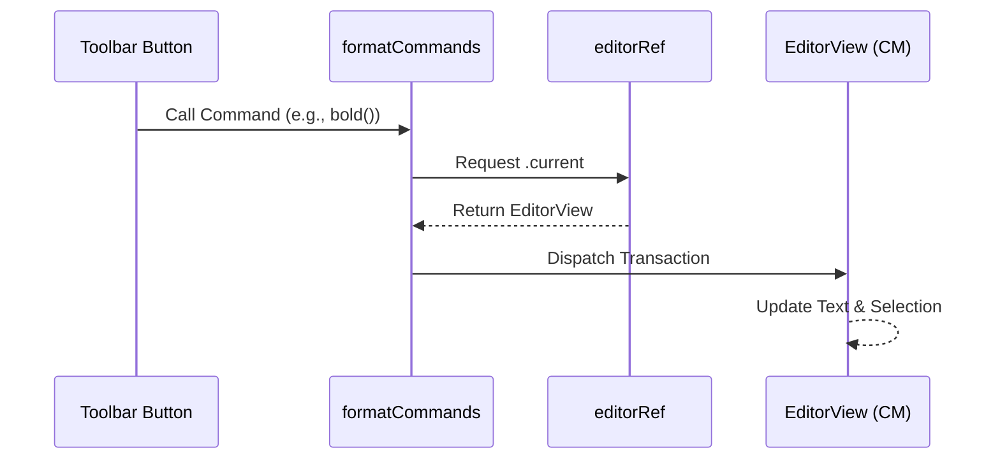

# Editor Commands and Manipulations

The **Editor Commands and Manipulations** module serves as the bridge between the user interface (specifically the Ribbon toolbar) and the underlying CodeMirror editor instance. Its primary responsibility is to translate high-level formatting intents—such as "make this text bold" or "convert this line to a heading"—into precise programmatic transactions that modify the document's text content.

Rather than relying on complex state synchronization, this module uses an imperative approach to interact with the editor, ensuring that formatting changes are instantaneous and maintain the user's cursor position and selection state.

### Architectural Role

In the Markeon architecture, the editor's internal state is managed by CodeMirror. To allow external UI components (which live outside the CodeMirror lifecycle) to trigger changes, Markeon employs a shared reference pattern.

| Component | Role | Responsibility |
| :--- | :--- | :--- |
| `editorRef` | The Bridge | A mutable reference holding the active `EditorView` instance. |
| `formatCommands` | The Logic | A library of functions that calculate text changes based on current selection. |
| `EditorView` | The Target | The CodeMirror instance that executes the final transactions and updates the DOM. |

### The Bridge: `editorRef`

Because the editor view is created and destroyed dynamically as the user switches files or views, the application requires a reliable way to access the current instance without drilling props through the entire component tree.

`src/lib/editorRef.js` provides a shared mutable ref:

```javascript
// Shared mutable ref to the active CodeMirror EditorView instance.
// EditorPane writes to this when the view is created/destroyed.
// Any toolbar panel can read .current to dispatch transactions.
```

This pattern allows any toolbar button to simply import `editorRef` and call `editorRef.current` to gain full access to the editor's API.

### Interaction Workflow

When a user clicks a formatting button in the toolbar, the following sequence occurs:



### Manipulation Patterns

The `formatCommands.js` module implements several distinct strategies for modifying text, depending on whether the command is inline, line-based, or structural.

#### 1. Wrapping Selections
Used for inline styles like **bold**, *italic*, and `inline code`. The `wrapSelection` utility checks if text is selected; if so, it wraps it in markers. If not, it inserts the markers and places the cursor in the middle.

```javascript
function wrapSelection(before, after = before) {
  const view = getView();
  // ... logic to calculate selection boundaries ...
  // Inserts 'before' at start and 'after' at end of selection
}
```

#### 2. Line Prefixing
Used for block-level elements like blockquotes and lists. The `toggleLinePrefix` function targets the current line (or all selected lines) and toggles the existence of a specific Markdown prefix.

```javascript
function toggleLinePrefix(prefix) {
  const view = getView();
  // ... logic to identify the line and toggle the prefix string ...
}
```

#### 3. Structural Overwrites
For headings (`#`, `##`, `###`), the system uses `setHeading(level)`. Unlike simple wrapping, this command is destructive to existing heading prefixes on the same line to prevent "stacking" multiple heading levels (e.g., preventing `## # Heading`).

```javascript
function setHeading(level) {
  const view = getView();
  // 1. Removes any existing heading prefix first
  // 2. Applies the new level prefix (e.g., '### ')
}
```

#### 4. Direct Insertion
For non-wrapping elements like horizontal rules (`---`) or tables, the `insertAtCursor` function is used to inject a specific string directly into the document at the current selection point.

### Command Map

The following table maps the exported commands to their internal implementation logic:

| Command | Logic Pattern | Markdown Result |
| :--- | :--- | :--- |
| `bold`, `italic`, `strikethrough` | `wrapSelection` | `**text**`, `*text*`, `~~text~~` |
| `inlineCode` | `wrapSelection` | `` `text` `` |
| `codeBlock` | `wrapSelection` | ` ```text``` ` |
| `h1`, `h2`, `h3` | `setHeading` | `#`, `##`, `###` |
| `blockquote` | `toggleLinePrefix` | `> ` |
| `bulletList`, `orderedList` | `toggleLinePrefix` | `- `, `1. ` |
| `horizontalRule`, `table` | `insertAtCursor` | `---`, `| Col | ...` |
| `link` | Custom Wrapper | `[text](url)` |