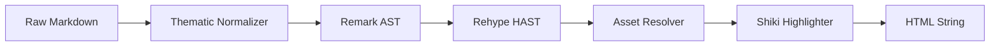

# Core Processing Engine

The Core Processing Engine constitutes the foundational utility layer of Markeon, providing the low-level primitives required for document transformation, persistent storage, and unique identifier generation. It operates as a stateless processing pipeline for markdown-to-HTML conversion and a stateful interface for browser-based data persistence.

## System Role & Architectural Position

The engine resides at the lowest tier of the application stack, serving as the primary data provider for the Client State Orchestration layer and the rendering source for the Interface Orchestration layer. It abstracts the complexities of the `unified` ecosystem and the `IndexedDB` API into a set of high-level asynchronous primitives.

### Technical Specifications & Dependencies

| Component | Responsibility | Core Dependencies | Key Constraint |
| :--- | :--- | :--- | :--- |
| **Markdown Pipeline** | AST transformation & HTML serialization | `unified`, `remark-parse`, `rehype-shiki` | Asynchronous rendering |
| **Persistence Layer** | Client-side document and config storage | `idb` (IndexedDB wrapper) | ACID compliant transactions |
| **Syntax Highlighter** | Thematic code tokenization | `shiki` | Singleton instance loading |
| **ID Generator** | Collision-resistant identifier creation | `crypto.getRandomValues` | Zero-dependency implementation |

## Core Execution & Data Flow Mechanics

The processing engine employs a linear transformation pipeline for document rendering, augmenting the standard Markdown specification with custom protocols for asset resolution and layout control.

### Markdown Transformation Pipeline



### Execution Sequence

1.  **Thematic Normalization**: The `normalizeThematicLines` function performs a pre-pass on raw text to disambiguate between Setext-style underlines and thematic breaks (horizontal rules), preventing parser collisions.
2.  **AST Generation**: `remark-parse` and `remark-gfm` convert the normalized text into a Markdown Abstract Syntax Tree (MDAST).
3.  **HAST Transformation**: `remark-rehype` maps the MDAST to a Hypertext Abstract Syntax Tree (HAST), allowing for HTML-specific manipulations.
4.  **Custom Asset Resolution**: The `rehypeMarkeonImages` transformer intercepts `img` nodes. It identifies the `markeon://img/{id}` protocol, queries the IndexedDB `attachments` store, and injects the binary data as a base64-encoded Data URI.
5.  **Thematic Line Correction**: `rehypeThematicLineParagraphs` identifies overflow paragraphs containing only thematic characters and coerces them into `<hr>` elements.
6.  **Syntax Highlighting**: The Shiki highlighter processes code blocks using the `one-dark-pro` theme, applying inline styles to tokens.

## Implementation Deep Dive

### The Unified Processing Pipeline

The `getProcessor` function implements a singleton pattern to ensure the heavy `unified` pipeline and Shiki highlighter are initialized only once.

```javascript title="src/lib/markdown.js"
async function getProcessor() {
  if (_processor) return _processor
  const highlighter = await getHighlighter()
  _processor = unified()
    .use(remarkParse)
    .use(remarkGfm)
    .use(remarkMath)
    .use(remarkRehype, { allowDangerousHtml: true })
    .use(rehypeRaw)
    .use(rehypeKatex)
    .use(rehypeSlug)
    .use(rehypeThematicLineParagraphs)
    .use(rehypeMarkeonImages)
    .use(rehypeShikiFromHighlighter, highlighter, {
      theme: 'one-dark-pro',
      ignoreMissing: true,
    })
    .use(rehypeStringify)
  return _processor
}
```
- **`allowDangerousHtml`**: Enabled via `remarkRehype` to permit the `rehypeRaw` plugin to parse HTML within markdown.
- **`rehypeShikiFromHighlighter`**: Integrates the pre-initialized Shiki instance to avoid redundant loading of language grammars.
- **`rehypeSlug`**: Automatically generates `id` attributes for headings to support internal document linking.

### Async Asset Resolution Logic

The engine implements a custom URI scheme (`markeon://`) to decouple image references from the physical storage of binary blobs in IndexedDB.

```javascript title="src/lib/markdown.js"
function rehypeMarkeonImages() {
  return async function transformer(tree) {
    const tasks = []
    visit(tree, 'element', (node) => {
      if (node.tagName !== 'img' || !node.properties?.src) return
      const src = String(node.properties.src)
      if (!src.startsWith('markeon://img/')) return
      const id = src.slice('markeon://img/'.length)
      tasks.push(
        getAttachment(id).then((att) => {
          if (!att?.data) return
          node.properties.src = `data:${att.mimeType};base64,${arrayBufferToBase64(att.data)}`
        })
      )
    })
    await Promise.all(tasks)
  }
}
```
- **`visit`**: Traverses the HAST to isolate `img` elements.
- **`ArrayBuffer` Conversion**: Binary data from IndexedDB is converted to a base64 string via `btoa` and `Uint8Array` mapping.
- **Concurrency**: All image lookups are pushed into a `tasks` array and resolved via `Promise.all` to prevent sequential blocking of the rendering pipeline.

### Persistence Layer Schema

The `db.js` module manages an IndexedDB instance with a versioned upgrade path to ensure data integrity across application updates.

```javascript title="src/lib/db.js"
async function getDB() {
  if (db) return db

  db = await openDB(DB_NAME, DB_VERSION, {
    upgrade(database, oldVersion) {
      if (!database.objectStoreNames.contains('files')) {
        const fileStore = database.createObjectStore('files', { keyPath: 'id' })
        fileStore.createIndex('order', 'order')
      }
      // ... other stores
      if (oldVersion < 2 && !database.objectStoreNames.contains('attachments')) {
        const store = database.createObjectStore('attachments', { keyPath: 'id' })
        store.createIndex('fileId', 'fileId')
      }
    },
  })
  return db
}
```
- **KeyPath Strategy**: Every store uses a unique `id` as the primary key, generated via the `nanoid` utility.
- **Indexing**: The `files` store utilizes an `order` index to maintain document sequencing, while `attachments` uses a `fileId` index for cascading deletes.

## Method / State Reference & Error Recovery

### Database Store Definitions

| Store Name | Primary Key | Indices | Purpose |
| :--- | :--- | :--- | :--- |
| `files` | `id` | `order` | Document content and metadata |
| `attachments` | `id` | `fileId` | Binary blobs for images/assets |
| `themes` | `id` | N/A | User-defined CSS theme configurations |
| `fonts` | `id` | N/A | Registered font-face definitions |
| `meta` | `key` | N/A | Global application settings (KV store) |

### Rendering API Contract

| Method | Parameters | Returns | Complexity |
| :--- | :--- | :--- | :--- |
| `renderMarkdown` | `content: string` | `Promise<string>` | $O(N)$ where $N$ is content length |
| `normalizeThematicLines` | `content: string` | `string` | $O(L)$ where $L$ is number of lines |
| `extractHeadingsFromPreview` | `root: HTMLElement` | `Array<{id, level, text}>` | $O(H)$ where $H$ is number of headings |

### Failure Modes & Recovery

- **IndexedDB Blocked**: Occurs if multiple tabs are open with different database versions. The system relies on `idb`'s internal promise handling; however, the application may require a hard refresh if `openDB` fails to resolve.
- **Shiki Load Timeout**: Since Shiki loads language grammars asynchronously, `getHighlighter` returns a promise. The rendering pipeline awaits this promise, effectively pausing output until the highlighter is ready.
- **Broken Asset Link**: If `getAttachment(id)` returns `null`, the `rehypeMarkeonImages` transformer silently fails for that specific node, leaving the original `markeon://` URI in the `src` attribute, which results in a standard broken image icon in the browser.