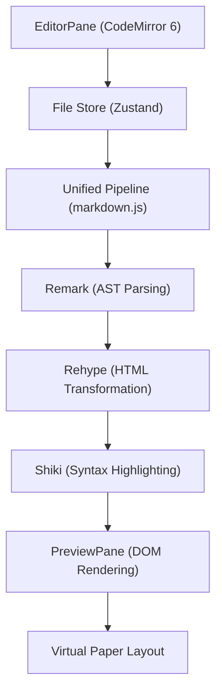

# The Editor Engine

The Markeon editor engine is built on a decoupled architecture that separates the raw text manipulation from the high-fidelity visual representation. It leverages a professional-grade editing core and a sophisticated transformation pipeline to provide a "What You See Is What You Get" (WYSIWYG) experience without sacrificing the flexibility of Markdown.

## Architecture Overview

The engine operates as a unidirectional data flow: changes in the editor update a centralized state, which then triggers a re-rendering process through a unified parsing pipeline to update the preview.




## The Editor Layer

The `EditorPane` is powered by **CodeMirror 6**, chosen for its modularity and accessibility. Unlike traditional text areas, the editor is a collection of extensions that manage state and behavior.

### Key Implementation Details
- **State Management**: The editor utilizes `EditorState` and `EditorView` to handle document content. A `debouncedSave` mechanism (400ms) ensures that the file store is not overwhelmed by every single keystroke, optimizing performance during rapid typing.
- **Markdown Integration**: The `@codemirror/lang-markdown` extension provides native syntax highlighting and structural awareness within the editor itself.
- **Custom Event Handling**: A specialized `domEventHandlers` implementation intercepts paste events. When an image is detected in the clipboard, the engine diverts the flow to `handleImagePaste`, converting the binary data into a `markeon://img/` internal URI.

## The Parsing Pipeline

The transformation from Markdown to visual HTML is handled by a `unified` processor. This pipeline allows Markeon to inject custom logic at various stages of the AST (Abstract Syntax Tree) transformation.

### The Transformation Chain
1. **Remark**: Parses raw Markdown into a Markdown AST (mdast) using `remark-parse` and `remark-gfm`.
2. **Remark-Rehype**: Converts the mdast into a Hypertext AST (hast).
3. **Custom Transformers**:
   - **Thematic Lines**: A custom visitor ensures that long rows of symbols (`===` or `---`) are converted to `<hr>` elements rather than overflowing paragraphs.
   - **Image Resolution**: `rehypeMarkeonImages` intercepts internal URIs (`markeon://img/`) and resolves them to base64 data URIs from the local database.
4. **Rehype-Shiki**: Uses the **Shiki** highlighter to provide an accurate, VS Code-like syntax highlighting experience by transforming code blocks into styled HTML.
5. **Rehype-Katex**: Processes mathematical notation into rendered LaTeX.

## The Preview Layer

The `PreviewPane` does not simply render HTML; it simulates a physical document.

### Virtual Paper Simulation
To achieve print-perfect previews, the engine converts physical dimensions (mm) to pixels based on a 96 DPI standard.

```javascript
const MM_TO_PX = 96 / 25.4;
// A4: 210mm x 297mm -> converted to px via MM_TO_PX
```

### Dynamic Styling and Pagination
- **CSS Variables**: Themes are injected into the document head as a set of CSS variables (e.g., `--color-accent`, `--font-body`). This allows for real-time theme switching without re-rendering the entire DOM tree.
- **Page Breaking**: The engine scans the rendered HTML for `<!-- pagebreak -->` comments and replaces them with `<div class="page-break">`. The `splitIntoPages` function then slices the resulting HTML string into an array, allowing the UI to render each page as a separate, shadow-casted "sheet" of paper.
- **Reading Mode**: A specialized zoom system handles both `ResizeObserver` scaling (to fit the page to the screen width) and user-driven pinch-to-zoom/wheel-zoom logic for detailed review.

## Synchronization Flow

Synchronization is achieved through a reactive loop:
1. **Input**: User types in `EditorPane`.
2. **Update**: `EditorView.updateListener` triggers `debouncedSave`.
3. **Store**: `useFileStore` updates the active file content.
4. **Render**: `PreviewPane` detects the content change, awaits `renderMarkdown()`, and updates the `pages` state.
5. **Post-Process**: Once the DOM is updated, `mermaid.js` is invoked to find and render any diagrams within the newly created HTML nodes.