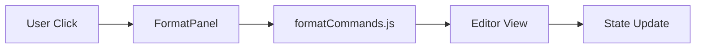
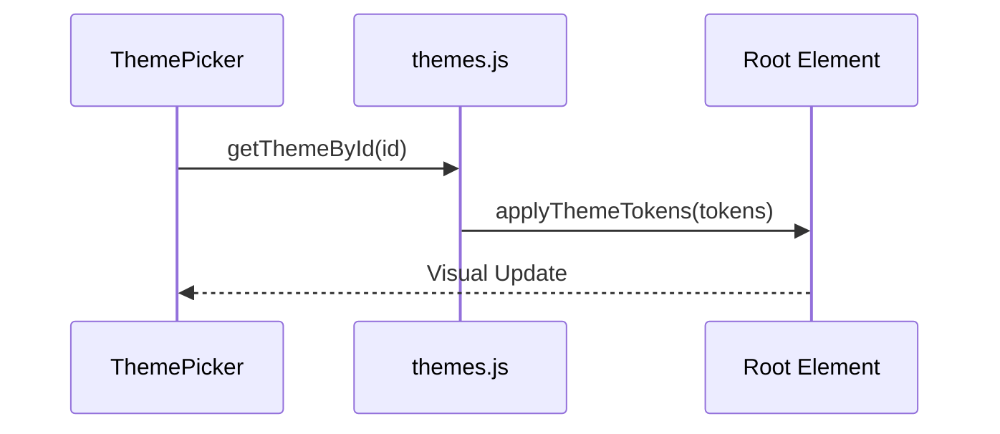

# Interface & Command System

The Interface & Command System serves as the primary interaction layer between the user and the Markdown editor. It abstracts complex text manipulation into a set of discrete commands triggered by a ribbon toolbar and manages the visual state of the application via a token-based theme system.

## Command Execution Pipeline

The system decouples the UI components from the text manipulation logic. When a user interacts with the `FormatPanel`, it invokes a command from `formatCommands.js`, which directly manipulates the editor's selection and content.



### Text Manipulation Primitives

The core logic relies on three primary primitives: `wrapSelection`, `toggleLinePrefix`, and `insertAtCursor`. These functions handle the coordinate math and string concatenation required to modify Markdown content without destroying the user's cursor position.

```js title="src/lib/formatCommands.js"
function wrapSelection(before, after = before) {
  const view = getView();
  const { selection } = view;
  const text = view.getValue();
  const { anchor, head } = selection;
  
  const start = Math.min(anchor, head);
  const end = Math.max(anchor, head);
  const selectedText = text.slice(start, end);
  
  const newText = text.slice(0, start) + before + selectedText + after + text.slice(end);
  view.setValue(newText);
  // Selection logic to keep cursor inside markers...
}
```

**Logic Breakdown:**
- `wrapSelection`: Used for inline styles (Bold, Italic, Inline Code). It calculates the start/end of the selection and injects markers around the text.
- `toggleLinePrefix`: Used for block-level elements (Bullet lists, Blockquotes). It iterates through selected lines and toggles the presence of a prefix.
- `setHeading`: Specifically handles the removal of existing `#` prefixes before applying the requested level (1-3).

### Command Mapping Table

| Command | Function | Markdown Marker | Behavior |
| :--- | :--- | :--- | :--- |
| `bold` | `wrapSelection` | `**` | Wraps selection in double asterisks |
| `italic` | `wrapSelection` | `*` | Wraps selection in single asterisks |
| `h1`-`h3` | `setHeading` | `#` to `###` | Replaces line prefix with heading level |
| `bulletList`| `toggleLinePrefix`| `- ` | Toggles dash prefix on every selected line |
| `codeBlock` | `wrapSelection` | ` ``` ` | Wraps selection in triple backticks |

## Ribbon Toolbar Architecture

The `RibbonToolbar` acts as the top-level layout container, orchestrating the filename management, formatting tools, and theme selection.

```tsx title="src/components/toolbar/RibbonToolbar.jsx"
export default function RibbonToolbar() {
  return (
    <div className="ribbon-toolbar">
      <div className="left">
        <FormatPanel />
      </div>
      <div className="center">
        {/* Filename editing logic: startEditing -> commitRename */}
        <FilenameEditor />
      </div>
      <div className="right">
        <ThemePicker />
        <ExportButton onClick={handleExport} />
      </div>
    </div>
  );
}
```

### FormatPanel Composition
The `FormatPanel` organizes commands into logical groups using `GroupLabel` and `Sep` (separator) components. Each `FmtButton` is a thin wrapper that executes a specific function from `formatCommands.js`.

```tsx title="src/components/toolbar/FormatPanel.jsx"
function FmtButton({ label, onClick, active }) {
  return (
    <button className={`fmt-btn ${active ? 'active' : ''}`} onClick={onClick}>
      {label}
    </button>
  );
}

export default function FormatPanel() {
  return (
    <>
      <GroupLabel label="Text" />
      <FmtButton label="B" onClick={() => bold()} />
      <FmtButton label="I" onClick={() => italic()} />
      <Sep />
      <GroupLabel label="Block" />
      <FmtButton label="H1" onClick={() => h1()} />
      {/* ... other buttons */}
    </>
  );
}
```

## Dynamic Theme System

Markeon utilizes a token-based theme system that applies CSS custom properties (variables) to the document root or specific containers, allowing for instant visual updates without re-rendering the entire DOM tree.



### Theme Application Logic

Themes are defined as sets of tokens (key-value pairs). The `applyThemeTokens` function iterates through these tokens and injects them as CSS variables.

```js title="src/lib/themes.js"
export function applyThemeTokens(tokens) {
  const root = document.documentElement;
  Object.entries(tokens).forEach(([key, value]) => {
    root.style.setProperty(`--mk-${key}`, value);
  });
}

export function clearThemeTokens(tokens) {
  const root = document.documentElement;
  Object.keys(tokens).forEach(key => {
    root.style.removeProperty(`--mk-${key}`);
  });
}
```

**Implementation Details:**
- **Token Namespace**: All theme variables are prefixed with `--mk-` to avoid collisions with other styles.
- **`ThemePicker` Interaction**: The `ThemePicker` component provides a dropdown or list of available themes. When a selection changes, it calls `getThemeById(id)` and immediately passes the resulting tokens to `applyThemeTokens`.
- **Persistence**: While the theme is applied to the DOM, the selected theme ID is typically mirrored in the global state (Zustand) to ensure consistency across sessions.