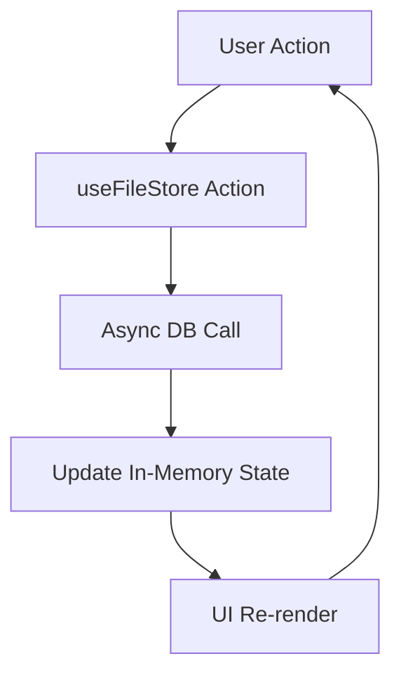
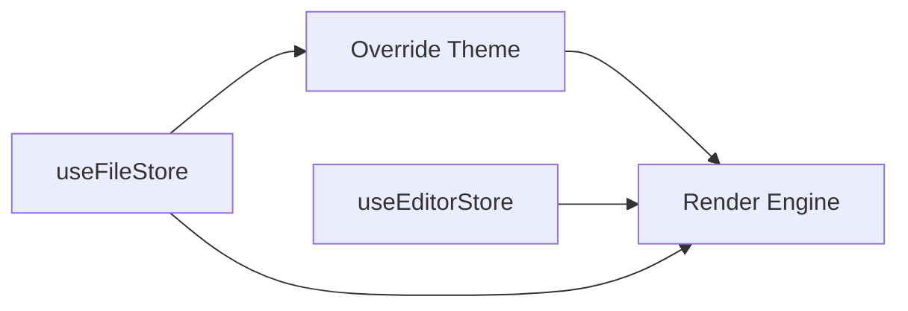

# State Management and Persistence

The state management architecture of Markeon is implemented using a decoupled, store-based approach (utilizing Zustand), dividing the application's global state into three primary domains: interface configuration (`useEditorStore`), document lifecycle and persistence (`useFileStore`), and visual identity (`useThemeStore`). This separation ensures that UI-only changes (like toggling line numbers) do not trigger unnecessary re-renders of the file system logic or theme calculations.

The architecture prioritizes a "Single Source of Truth" for the active document while allowing for granular, per-file overrides for styling and layout. Persistence is handled asynchronously, bridging the in-memory state with a data layer (likely IndexedDB or a remote API) to ensure that user progress is maintained across browser sessions.

### Core State Modules Summary

| Module | Primary Responsibility | Key Dependencies | Persistence Strategy |
| :--- | :--- | :--- | :--- |
| `useEditorStore` | Editor UI state, zoom levels, and layout toggles | React, Zustand | LocalStorage / Session |
| `useFileStore` | CRUD operations for `.md` files and document metadata | Async Storage API | Persistent Database |
| `useThemeStore` | Global color modes and CSS variable overrides | CSS-in-JS / Variables | LocalStorage |

---

## Architecture, State & Data Flow

Markeon employs a unidirectional data flow. When a user interacts with the UI (e.g., renaming a file), an action is dispatched to the corresponding store. The store updates the state and, if the action involves persistence, triggers an asynchronous call to the data layer.

### Document Lifecycle Flow
The `useFileStore` acts as the orchestrator for document management. The flow from file creation to persistence is as follows:



### State Interdependency Map
While the stores are decoupled, they interact to determine the final rendered state of the editor. The `useFileStore` can dictate theme preferences that override the `useThemeStore` global settings.



---

## In-Depth Code Walkthrough & Implementation Details

### 1. File Lifecycle and Persistence
The `useFileStore` manages the most critical data in the application. It uses asynchronous functions to ensure that the UI remains responsive while performing I/O operations.

```js title="src/store/useFileStore.js"
async createFile(name = 'untitled.md') {
  const file = makeFile(name);
  await db.files.add(file);
  set((s) => ({
    files: [...s.files, file],
    activeFileId: file.id
  }));
  return file;
},

async updateContent(id, content) {
  await db.files.update(id, { content });
  set((s) => ({
    files: s.files.map(f => f.id === id ? { ...f, content } : f)
  }));
}
```

In the `createFile` method, the store first generates a file object via the `makeFile` helper. It performs an `await` on the database addition before updating the local state. This ensures that the application does not acknowledge the file's existence until it is safely persisted. The `updateContent` method follows a similar pattern: it updates the database first and then maps through the `files` array in the state to replace the content of the target file, triggering a targeted re-render of the editor pane.

### 2. Interface State Mutations
The `useEditorStore` focuses on synchronous UI toggles. It utilizes a functional update pattern to ensure state consistency.

```js title="src/store/useEditorStore.js"
toggleWordWrap: () => set((s) => ({
  wordWrap: !s.wordWrap
})),

setReadingZoom: (readingZoom) => set({
  readingZoom: clampReadingZoom(readingZoom)
}),

setMargin: (side, value) => set((s) => ({
  margins: { ...s.margins, [side]: value }
}))
```

The `toggleWordWrap` function is a standard boolean flip. However, `setReadingZoom` introduces a safety mechanism: `clampReadingZoom`. This helper function prevents the zoom level from reaching extremes (e.g., 0% or 500%) that would crash the browser's rendering engine or make the text invisible. The `setMargin` function demonstrates a partial state update, using computed property names (`[side]`) to update specific margins (left, right, top, bottom) without overwriting the entire margins object.

### 3. Theme Overrides and Partialization
The `useThemeStore` manages global aesthetics but includes a mechanism for specific key overrides.

```js title="src/store/useThemeStore.js"
setThemeOverride: (key, value) => set((s) => ({
  overrides: { ...s.overrides, [key]: value }
})),

partialize: (state) => ({
  mode: state.mode,
  activeThemeId: state.activeThemeId,
  overrides: state.overrides
})
```

The `setThemeOverride` function allows the application to inject specific CSS variable values dynamically, bypassing the default theme palette. The `partialize` function is a critical performance and storage optimization used with Zustand's `persist` middleware. Instead of serializing the entire store (which might contain volatile runtime data), `partialize` explicitly defines which keys (`mode`, `activeThemeId`, `overrides`) should be written to `localStorage`.

---

## API / Method Reference

### `useEditorStore`
| Method | Parameters | Return | Description |
| :--- | :--- | :--- | :--- |
| `setLayout` | `layout: string` | `void` | Sets the editor layout mode (e.g., split, focus). |
| `setFontSize` | `fontSize: number` | `void` | Updates global editor font size. |
| `toggleWordWrap` | `none` | `void` | Toggles the `wordWrap` boolean. |
| `toggleLineNumbers`| `none` | `void` | Toggles visibility of line numbers in the gutter. |
| `setReadingZoom` | `readingZoom: number`| `void` | Sets zoom level, passed through `clampReadingZoom`. |
| `setMargin` | `side: string, value: number`| `void` | Updates specific margin (top/bottom/left/right). |

### `useFileStore`
| Method | Parameters | Return | Description |
| :--- | :--- | :--- | :--- |
| `loadFiles` | `none` | `Promise<void>` | Fetches all saved documents from the data layer. |
| `setActiveFile` | `id: string` | `void` | Updates `activeFileId` to switch the current document. |
| `createFile` | `name: string` | `Promise<File>` | Creates a new `.md` file and persists it. |
| `updateContent` | `id: string, content: string`| `Promise<void>`| Persists content changes for a specific file. |
| `renameFile` | `id: string, name: string`| `Promise<void>`| Updates file metadata in DB and state. |
| `deleteFile` | `id: string` | `Promise<void>`| Removes file from DB and filters it out of state. |
| `setFileTheme` | `id: string, themeId: string`| `Promise<void>`| Assigns a specific theme to a specific document. |

### `useThemeStore`
| Method | Parameters | Return | Description |
| :--- | :--- | :--- | :--- |
| `setMode` | `mode: 'light' \| 'dark'`| `void` | Switches the global color mode. |
| `toggleMode` | `none` | `void` | Flips between light and dark modes. |
| `setActiveTheme` | `id: string` | `void` | Sets the active theme palette ID. |
| `setThemeOverride`| `key: string, value: string`| `void` | Sets a custom value for a specific theme variable. |
| `clearThemeOverrides`| `none` | `void` | Resets all overrides to theme defaults. |

---

## Error Handling, Edge Cases & Performance

### Concurrency and Race Conditions
Since `useFileStore` relies on asynchronous updates, there is a potential for race conditions if `updateContent` is called rapidly (e.g., on every keystroke). Markeon mitigates this by:
1. **Atomic State Updates**: Using the functional `set((s) => ...)` pattern to ensure updates are based on the most recent state.
2. **Optimistic Updates (Implicit)**: The state is updated immediately after the `await` call, ensuring the UI reflects the persisted state.

### Data Integrity and Fallbacks
- **Clamping**: The `clampReadingZoom` function acts as a guard rail, preventing invalid numerical inputs from distorting the UI.
- **Default Files**: The `makeFile` helper ensures that if a user creates a file without a name, it defaults to `untitled.md`, preventing null-pointer exceptions in the file tree.
- **Partialization**: By using `partialize` in `useThemeStore` and `useFileStore`, the application avoids "state pollution" in `localStorage`, where old versions of the state schema might clash with new updates after an application deployment.

### Performance Optimizations
To prevent the entire application from re-rendering on every single character typed into the editor, the `updateContent` method in `useFileStore` selectively maps the `files` array. Only the components subscribed to the specific active file's content (via a selector) will trigger a re-render, while the file tree and toolbar remain static.