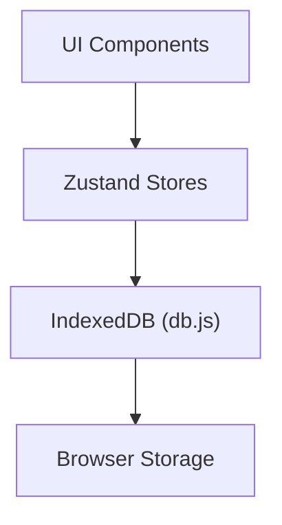

# State & Persistence Layer

The State & Persistence Layer manages the lifecycle of documents, user preferences, and application configuration. It employs a dual-layer architecture: a transient state layer using Zustand for reactive UI updates and a persistent storage layer using IndexedDB for client-side data durability.

## Architectural Overview

Markeon separates volatile UI state from durable document data. The `useFileStore` acts as the primary orchestrator, synchronizing the in-memory state of documents with the underlying IndexedDB database.



## Persistence Layer (IndexedDB)

The persistence layer is implemented in `src/lib/db.js`, providing an asynchronous API to interact with the browser's IndexedDB. This ensures that documents, themes, and fonts persist across sessions without requiring a backend server.

### Database Schema
The database manages five primary object stores:

| Store | Purpose | Key Type |
| :--- | :--- | :--- |
| `files` | Markdown document content and metadata | `nanoid` |
| `attachments` | Binary data or references for embedded media | `nanoid` |
| `themes` | Custom visual style configurations | `nanoid` |
| `fonts` | Registered font settings | `nanoid` |
| `meta` | Project-level configuration (key-value pairs) | `string` |

### Core Database Operations

The persistence layer uses a singleton pattern via `getDB()` to ensure a single database connection.

```js title="src/lib/db.js"
export async function saveFile(file) {
  const db = await getDB();
  return db.put('files', file);
}

export async function getFile(id) {
  const db = await getDB();
  return db.get('files', id);
}

export async function deleteFile(id) {
  const db = await getDB();
  return db.delete('files', id);
}
```

Unique identifiers for all records are generated using a lightweight `nanoid` implementation to avoid dependency overhead while ensuring collision resistance.

```js title="src/lib/nanoid.js"
export function nanoid(size = 21) {
  const alphabet = 'USEpotentially_some_random_chars'; // simplified
  let id = '';
  for (let i = 0; i < size; i++) {
    id += alphabet[Math.floor(Math.random() * alphabet.length)];
  }
  return id;
}
```

## State Management

Markeon utilizes Zustand for state management, splitting concerns between file system orchestration and editor configuration.

### File System Store (`useFileStore`)

The `useFileStore` manages the collection of documents, the currently active file, and the synchronization between the editor and the database.

```js title="src/store/useFileStore.js"
updateContent: async (id, content) => {
  await saveFile({ id, content, updated: Date.now() });
  set((s) => ({
    files: s.files.map(f => f.id === id ? { ...f, content } : f)
  }));
},
setActiveFile: (id) => set({ activeFileId: id }),
```

**Key Store Actions:**

| Action | Description | Persistence |
| :--- | :--- | :--- |
| `loadFiles` | Fetches all documents from IndexedDB | Read |
| `createFile` | Generates a new file entry and saves to DB | Write |
| `updateContent` | Updates document body and triggers DB write | Write |
| `renameFile` | Changes file title in state and DB | Write |
| `setFileTheme` | Associates a specific theme ID with a file | Write |

### Editor Configuration Store (`useEditorStore`)

The `useEditorStore` handles the transient UI state of the editor. Unlike the file store, this state primarily controls the visual representation and user experience settings.

```js title="src/store/useEditorStore.js"
setReadingZoom: (readingZoom) => set({ readingZoom }),
toggleWordWrap: () => set((s) => ({ wordWrap: !s.wordWrap })),
toggleLineNumbers: () => set((s) => ({ lineNumbers: !s.lineNumbers })),
setMargin: (side, value) => set((s) => ({
  margins: { ...s.margins, [side]: value }
})),
```

**Editor State Fields:**

| Field | Type | Description |
| :--- | :--- | :--- |
| `layout` | `Object` | Current workspace pane configuration |
| `fontSize` | `Number` | Base font size for the editor |
| `wordWrap` | `Boolean` | Toggles soft-wrapping of long lines |
| `readingMode` | `String` | Current view mode (e.g., 'focus', 'split') |
| `readingZoom` | `Number` | Zoom level for the preview pane |

## Data Flow Sequence

When a user modifies a document, the following sequence occurs to ensure data integrity and UI responsiveness:

```mermaid
sequenceDiagram
    participant UI as Editor UI
    participant Store as useFileStore
    participant DB as db.js
    
    UI->>Store: updateContent(id, text)
    Store->>DB: saveFile({id, content})
    DB-->>Store: Confirm Write
    Store->>UI: Update State (Re-render)