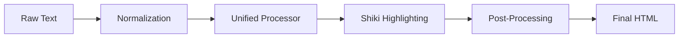

# The Markdown Engine

The Markdown Engine is the core processing unit of Markeon. Its primary responsibility is to maintain a bidirectional relationship between raw Markdown text and a high-fidelity, print-ready HTML preview. 

Unlike simple Markdown renderers, the Markeon engine is designed for a "document-first" experience. This means it doesn't just convert syntax; it handles document-level concerns such as thematic line normalization, syntax highlighting for code blocks via Shiki, and the injection of physical page breaks for PDF output.

### Architectural Role

The engine operates in two distinct modes: **The Rendering Pipeline** (converting text to HTML) and **The Formatting Layer** (converting UI commands into text manipulations).

| Component | Responsibility | Primary Source |
| :--- | :--- | :--- |
| **Render Pipeline** | Transform raw MD $\rightarrow$ HTML with custom plugins | `src/lib/markdown.js` |
| **Syntax Highlighter** | Tokenize and theme code blocks | `src/lib/shiki.js` |
| **Format Commands** | Programmatic manipulation of editor text | `src/lib/formatCommands.js` |
| **Page Manager** | Handle `page-break` logic for print/PDF | `src/lib/markdown.js` |

---

### The Rendering Pipeline

The transformation from raw text to a rendered preview is a multi-stage process. Markeon employs a normalization step before the content ever hits the parser to ensure that "edge case" Markdown (like extremely long thematic breaks) doesn't break the layout.

#### Processing Flow
The data flow follows a linear pipeline:



#### 1. Normalization and Thematic Lines
A common issue in Markdown rendering is when a user creates a thematic break (e.g., `=======`) that is too long, causing the rendered HTML `<p>` tag to overflow the container or be incorrectly parsed as a Setext-style heading.

Markeon solves this via `normalizeThematicLines`, which ensures these lines are isolated and treated as distinct horizontal rules.

```javascript
export function normalizeThematicLines(content) {
  // Isolate divider lines so long ===== rows become <hr>, 
  // not overflow or merged setext.
}
```

#### 2. The Processor and Custom Plugins
The engine uses a processor (initialized via `getProcessor()`) that leverages a plugin-based architecture. Two critical custom transformations are applied during the rehype phase:
- **`rehypeThematicLineParagraphs`**: Converts lines consisting only of symbols (`===`, `---`) into proper `<hr>` elements.
- **`rehypeMarkeonImages`**: Specifically handles image rendering to fit the Markeon layout constraints.

#### 3. Syntax Highlighting with Shiki
To achieve production-grade code blocks, Markeon integrates **Shiki**. Unlike regex-based highlighters, Shiki uses TextMate grammars, ensuring that the code in the preview looks identical to a professional IDE.

```javascript
// src/lib/shiki.js
export function getHighlighter() {
  // Returns the Shiki instance used by the renderer
}
```

#### 4. Pagination and Page Breaks
Since Markeon targets PDF export, the engine must handle physical page boundaries. This is achieved by injecting specific markers into the content and then processing those markers into HTML page-break elements.

```javascript
export async function renderMarkdown(content) {
  const html = await processor.process(content);
  return processPageBreaks(html); 
}
```

---

### The Formatting Layer

While the Render Pipeline handles the *output*, the Formatting Layer handles the *input*. Located in `formatCommands.js`, this module provides a suite of utility functions that interact with the editor's current selection to inject Markdown syntax.

#### Selection Manipulation Logic
The core of the formatting system is the `wrapSelection` utility. This function determines if the user has text selected; if so, it wraps that text; if not, it inserts the markers and places the cursor in the middle.

```javascript
function wrapSelection(before, after = before) {
  // 1. Get current editor view/selection
  // 2. If selection exists: wrap it with 'before' and 'after'
  // 3. If no selection: insert 'before' + 'after' and position cursor
}
```

#### Command Mapping
The engine exposes a set of semantic commands that map UI buttons to specific Markdown patterns:

| Command | Markdown Pattern | Implementation Logic |
| :--- | :--- | :--- |
| `bold` | `**text**` | `wrapSelection('**')` |
| `inlineCode` | `` `text` `` | `wrapSelection('`')` |
| `h1` | `# Text` | `setHeading(1)` (Modifies line start) |
| `bulletList` | `- ` | `toggleLinePrefix('- ')` |
| `blockquote` | `> ` | `toggleLinePrefix('> ')` |

The `setHeading` function is particularly important as it must first strip any existing heading prefixes from the current line before applying the new level (1-3) to prevent nested heading markers (e.g., `## # Heading`).

### Summary of Engine Interaction

When a user clicks the **Bold** button in the toolbar:
1. The UI triggers the `bold()` command from `formatCommands.js`.
2. `wrapSelection('**')` is called, modifying the raw text in the editor state.
3. The editor state updates, triggering `renderMarkdown(content)` in `markdown.js`.
4. The text is normalized $\rightarrow$ processed by the Unified engine $\rightarrow$ highlighted by Shiki $\rightarrow$ post-processed for page breaks.
5. The resulting HTML is injected into the Preview Pane.