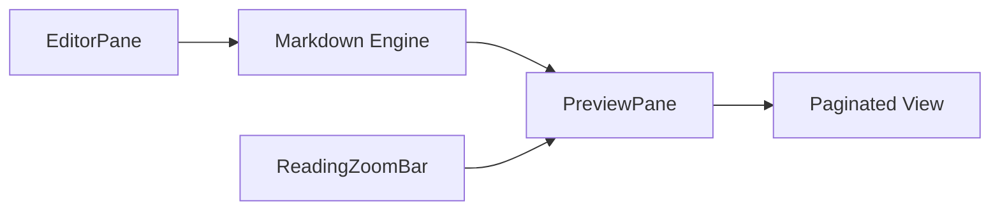

# Editor and Preview Panes

The Editor and Preview Panes constitute the primary workspace of Markeon. This module implements a synchronized, split-screen interface that bridges the gap between raw Markdown authoring and professional document layout. While the `EditorPane` handles the input and manipulation of text, the `PreviewPane` transforms that text into a paginated, paper-simulated visual representation, controlled by the `ReadingZoomBar`.

### Architectural Role

In the Markeon ecosystem, this module acts as the presentation layer for the Markdown engine. It doesn't just render HTML; it simulates a physical print medium (like A4 paper) within a digital viewport. This allows authors to anticipate pagination and layout issues before exporting to PDF.

| Component | Role | Key Responsibility |
| :--- | :--- | :--- |
| `EditorPane` | Input Surface | Handles text entry and Markdown manipulations. |
| `PreviewPane` | Layout Engine | Converts HTML to paginated "paper" sheets with zoom/pan. |
| `ReadingZoomBar` | View Controller | Provides UI controls to scale the preview magnification. |

### Component Interaction and Data Flow

The interaction follows a unidirectional data flow: user input in the `EditorPane` updates the global state, which triggers a re-render in the `PreviewPane`. The `ReadingZoomBar` acts as a modifier, altering the CSS transform scale of the preview without affecting the underlying document content.



### The Preview Engine: Simulating Physical Paper

Unlike standard Markdown previews that render as a continuous web page, the `PreviewPane` implements a coordinate system based on physical dimensions (mm) converted to pixels.

#### Physical Dimension Calculation
Markeon uses a standard 96 DPI (dots per inch) conversion factor to ensure consistency across screens. The logic calculates the exact pixel dimensions of a page based on the selected paper size (e.g., A4) and orientation.

```javascript
// 96dpi: 1 inch = 96px, 1mm = 96/25.4 px
function mmToPx(mmStr) {
  const mm = parseFloat(mmStr);
  return (mm * 96) / 25.4;
}

function getPaperPx(paperSize = 'A4', orientation = 'portrait') {
  // Returns dimensions based on standard paper specifications
  // e.g., A4: 210mm x 297mm
}
```

#### Paginated Rendering
The `splitIntoPages` function is the core of the visual experience. It takes the rendered HTML string and logically divides it into separate "pages." This process ensures that the user sees exactly where page breaks occur, mimicking the final PDF output.

```javascript
function splitIntoPages(html) {
  // Logic to partition the rendered HTML content 
  // into discrete page segments based on height constraints.
}
```

### Interactive Viewport Control

To handle large "paper" sheets on smaller screens, the `PreviewPane` implements a sophisticated zoom and pan system.

1.  **The Zoom Bar**: The `ReadingZoomBar` provides a discrete stepping mechanism via its `step` function, allowing users to increment or decrement the zoom level.
2.  **Direct Manipulation**: The `PreviewPane` captures `onWheel` events for zooming and implements touch gestures for mobile users.
3.  **Pinch-to-Zoom**: Using a `touchDistance` utility, the system calculates the distance between two touch points to determine the zoom delta.

```javascript
function touchDistance(touches) {
  const dx = touches[0].clientX - touches[1].clientX;
  const dy = touches[0].clientY - touches[1].clientY;
  return Math.sqrt(dx * dx + dy * dy);
}
```

### Theme Injection

The visual identity of the document is not handled by global CSS but is injected directly into the preview context. The `injectThemeStyle` function takes the current theme configuration and layout settings to apply specific typography, colors, and margins to the simulated paper.

```javascript
function injectThemeStyle(theme, layoutSettings = {}) {
  // Merges theme definitions with layout settings 
  // to create a scoped CSS block for the PreviewPane.
}
```

This architectural choice ensures that the "paper" remains visually isolated from the application's UI chrome, maintaining a strict separation between the editor's interface and the document's final appearance.