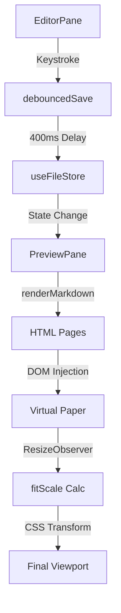

# Editor Workspace Architecture

The Editor Workspace is a dual-pane synchronization engine designed to bridge the gap between raw Markdown source editing and a high-fidelity, paginated print preview. It implements a unidirectional data flow where the source of truth resides in the `useFileStore`, mediated by a debounced update cycle to prevent rendering thrash during high-frequency keystrokes.

## System Role & Architectural Position

The workspace acts as the primary interface layer, orchestrating the interaction between the CodeMirror 6 editor instance and a custom-built CSS-paginated preview engine. It is decoupled from the file system logic but tightly integrated with the theme and editor configuration stores.

### Component Specification Matrix

| Component | Responsibility | Primary Dependencies | Key Invariants |
| :--- | :--- | :--- | :--- |
| `EditorPane` | Source manipulation & syntax highlighting | `@codemirror/view`, `useFileStore` | Must maintain `editorViewRef` for imperative API access. |
| `PreviewPane` | WYSIWYG paginated rendering | `mermaid`, `renderMarkdown` | Must calculate `fitScale` based on `ResizeObserver` entry. |
| `ReadingZoomBar` | Viewport scale orchestration | `useEditorStore` | Zoom values must be clamped between `READING_ZOOM_MIN` and `MAX`. |
| `editorRef` | Global instance pointer | N/A | Singleton reference to the active `EditorView`. |

## Core Execution & Data Flow Mechanics

The workspace operates on a "Write $\rightarrow$ Sync $\rightarrow$ Render" pipeline. Changes in the `EditorPane` are not immediately pushed to the preview to avoid blocking the main thread; instead, they are buffered via a debounce timer.

### Synchronization Workflow



### Execution Sequence

1.  **Input Capture**: `EditorView.updateListener` detects `docChanged` events in the CodeMirror instance.
2.  **State Buffering**: The `debouncedSave` callback clears existing timers and schedules a `useFileStore.updateContent` call after 400ms.
3.  **Markdown Compilation**: `PreviewPane` reacts to `activeFile.content` changes, invoking `renderMarkdown` and passing the result through `processPageBreaks` to split the document into a paginated array.
4.  **Theme Application**: `injectThemeStyle` dynamically generates a CSS rule block in the document head, mapping theme tokens (e.g., `--color-accent`) to the `.markeon-document` scope.
5.  **Scale Computation**: The `useLayoutEffect` hook monitors the container width via `ResizeObserver`, calculating a `fitScale` to ensure the virtual A4/Letter page fits the viewport width.

## Implementation Deep Dive

### CodeMirror 6 Integration
The editor is implemented as a controlled-uncontrolled hybrid. While the initial state is derived from the store, subsequent updates are handled imperatively by CodeMirror and synced back to the store.

```jsx title="src/components/editor/EditorPane.jsx"
const extensions = [
  history(),
  lineNumbers(),
  highlightActiveLine(),
  markdown({ base: markdownLanguage }),
  keymap.of([...defaultKeymap, ...historyKeymap, indentWithTab]),
  EditorView.updateListener.of((update) => {
    if (update.docChanged && activeFileIdRef.current) {
      debouncedSave(activeFileIdRef.current, update.state.doc.toString())
    }
  }),
  mode === 'dark' ? oneDark : lightTheme,
]

const state = EditorState.create({ doc, extensions })
const view = new EditorView({ state, parent: editorRef.current })
```
*   **`updateListener`**: Hooks into the CodeMirror transaction system to detect document mutations.
*   **`editorViewRef`**: The `view` instance is exported to a shared mutable ref, allowing the Ribbon Toolbar to dispatch transactions (e.g., inserting bold text) without triggering a full React re-render.

### Virtual Paper & Zoom Logic
The `PreviewPane` simulates physical paper using a fixed-pixel width derived from millimeter specifications (96 DPI).

```jsx title="src/components/editor/PreviewPane.jsx"
const displayScale = readingMode ? fitScale * readingZoom : fitScale;

// ... in render
<div
  id="markeon-all-pages"
  style={{
    width: `${dims.w}px`,
    transform: `scale(${displayScale})`,
    transformOrigin: 'top center',
    marginBottom: displayScale !== 1 
      ? `${(pages.length * (dims.h + 24)) * (displayScale - 1)}px` 
      : 0,
  }}
>
```
*   **DPI Calculation**: Uses `96 / 25.4` to convert mm to pixels, ensuring cross-browser consistency for A4/Letter sizes.
*   **Scale Compensation**: Since `transform: scale()` does not alter the element's layout footprint in the DOM, a calculated `marginBottom` is applied to prevent the container from collapsing and creating excessive whitespace.
*   **Pinch-to-Zoom**: Implements a `touchDistance` hypotenuse calculation to map multi-touch gestures to the `readingZoom` state.

### Dynamic Theme Injection
To avoid the overhead of inline styles on thousands of DOM elements, Markeon uses a singleton style tag to inject CSS variables.

```jsx title="src/components/editor/PreviewPane.jsx"
function injectThemeStyle(theme, layoutSettings = {}, styleOverrides = {}) {
  let styleEl = document.getElementById('markeon-doc-theme')
  if (!styleEl) {
    styleEl = document.createElement('style')
    styleEl.id = 'markeon-doc-theme'
    document.head.appendChild(styleEl)
  }
  // ... variable mapping
  styleEl.textContent = `:root { --page-bg: ${pageBg}; }\n.markeon-document {\n${docVars}\n${overrides.join('\n')}\n}`
}
```
*   **Complexity**: $O(1)$ DOM mutation regardless of document length.
*   **Scope**: Targets the `.markeon-document` class to prevent theme leakage into the application UI.

## Method & State Reference

### Zoom State Configuration

| Key | Type | Default | Range | Description |
| :--- | :--- | :--- | :--- | :--- |
| `readingMode` | `boolean` | `false` | N/A | Toggles between "Fit-to-Width" and "Custom Zoom". |
| `readingZoom` | `number` | `1.0` | `0.35 - 2.0` | Multiplier applied to the `fitScale`. |
| `fitScale` | `number` | `1.0` | `0.35 - 1.0` | Calculated ratio: `ViewportWidth / PaperWidth`. |

### Error Recovery & Edge Cases

*   **Mermaid Rendering Failures**: The Mermaid integration is wrapped in a `.finally()` block. If a diagram fails to render due to syntax errors, the `onHeadingsChange` callback is still executed to ensure the document outline remains synchronized.
*   **Large Document Latency**: To mitigate "jank" during rendering of 50+ page documents, the `PreviewPane` utilizes `useLayoutEffect` for scale calculations to prevent visual flashing (Layout Shift).
*   **Clipboard Bloat**: Image pasting is intercepted via `EditorView.domEventHandlers`. Images are processed asynchronously via `handleImagePaste` before the document state is updated, preventing the editor from freezing during large binary transfers.