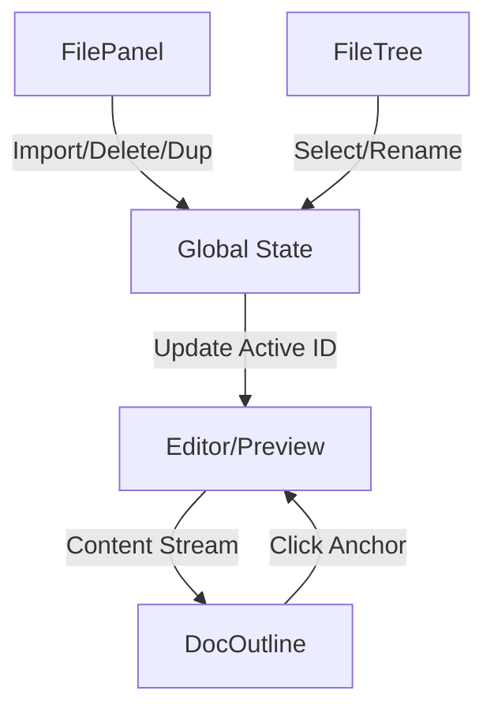

# Navigation and Document Organization

The Navigation and Document Organization module provides the structural framework for managing multiple markdown documents and navigating within a single document. It is composed of three primary interfaces: the `FileTree` (for global document switching), the `DocOutline` (for intra-document navigation), and the `FilePanel` (for file-system level operations). 

Architecturally, this module acts as the primary controller for the application's "Active Document" state. It mediates between the persistence layer (the data store where documents are saved) and the Editor/Preview engine by triggering state mutations that update the current file ID. The implementation emphasizes a decoupled approach where the navigation components trigger actions that the global state manager processes, ensuring that the UI remains synchronized regardless of whether a file was deleted, renamed, or imported.

### Core Component Summary

| Component/Module | Primary Responsibility | Key Dependencies | Primary State Interactions |
| :--- | :--- | :--- | :--- |
| `FileTree` | Renders the list of available files and manages renaming. | Global Store, File ID State | `setCurrentFile`, `updateFileName` |
| `DocOutline` | Generates a hierarchical table of contents from active MD content. | Active Document Content | Read-only access to current MD text |
| `FilePanel` | Executes file-level mutations (Import, Export, Duplicate, Delete). | FileSystem API, Blob API | `addFile`, `removeFile`, `duplicateFile` |

---

## Architecture, State & Data Flow

The navigation system operates on a unidirectional data flow pattern. The `FileTree` and `FilePanel` modify the global application state, which in turn triggers a re-render of the editor content and the `DocOutline`.

### File Operation Workflow
When a user performs a file operation (e.g., importing a `.md` file), the flow follows this sequence:
1. **Trigger**: `FilePanel` invokes `handleImportMd`.
2. **Ingestion**: The browser's `FileReader` API reads the local disk file as a UTF-8 string.
3. **State Mutation**: The application state is updated with a new file object containing a unique ID, the filename, and the extracted content.
4. **Synchronization**: The `FileTree` detects the change in the file list and renders the new entry; the `FilePanel` may automatically set this new file as the active document.

### Document Navigation Workflow
Intra-document navigation is a derived state process:
1. **Content Update**: As the user types in the editor, the active document's content state changes.
2. **Outline Parsing**: `DocOutline` consumes the current content string.
3. **Transformation**: The component scans for markdown header syntax (`#`, `##`, etc.).
4. **Rendering**: A clickable list of anchors is generated, allowing the user to jump to specific sections of the document.

### Interaction Diagram



---

## In-Depth Code Walkthrough & Implementation Details

### 1. The File Tree and Rename Logic
The `FileTree` is responsible for the vertical navigation bar. It implements a two-stage renaming process: `startRename` to enter edit mode and `commitRename` to persist the change.

```jsx title="src/components/sidebar/FileTree.jsx"
function startRename(file, e) {
  e.stopPropagation();
  // Set the active renaming target to the specific file ID
  setRenamingId(file.id);
  setRenameValue(file.name);
}

function commitRename(id) {
  const newValue = renameValue.trim();
  if (newValue && newValue !== currentFileName) {
    // Dispatch update to the global state/persistence layer
    updateFileMetadata(id, { name: newValue });
  }
  setRenamingId(null);
}
```

In this implementation, `startRename` prevents event bubbling to ensure that clicking the rename trigger does not simultaneously select the file. The state is managed locally via `renamingId` to track which file is currently being edited. `commitRename` includes a validation check to ensure filenames are not empty and have actually changed before triggering a potentially expensive state update or database write via `updateFileMetadata`.

### 2. File Import and Reader Integration
The `FilePanel` handles the ingestion of external markdown files. It utilizes the HTML5 `FileReader` API to bridge the gap between the local file system and the application state.

```jsx title="src/components/toolbar/FilePanel.jsx"
async function handleImportMd(e) {
  const file = e.target.files[0];
  if (!file) return;

  const reader = new FileReader();
  reader.onload = async (ev) => {
    const content = ev.target.result;
    const fileName = file.name.replace(/\.md$/, '');
    
    // Create a new document object and inject into state
    await createFile({
      name: fileName,
      content: content,
      createdAt: Date.now()
    });
  };
  reader.readAsText(file);
}
```

The `handleImportMd` function creates an asynchronous pipeline. The `FileReader` is instantiated and a callback is assigned to `onload`. Once the file is read as a UTF-8 string, the `.md` extension is stripped from the filename using a regular expression to maintain a clean UI in the `FileTree`. Finally, `createFile` is called, which generates a unique identifier for the document and adds it to the global document collection.

### 3. File Management Operations
The `FilePanel` also manages destructive and duplicative actions. These functions interact directly with the application's data layer to modify the document array.

```jsx title="src/components/toolbar/FilePanel.jsx"
async function handleDuplicate() {
  const current = activeFile;
  if (!current) return;

  const duplicatedFile = {
    ...current,
    id: generateUniqueId(),
    name: `${current.name} (Copy)`,
  };
  
  await addFile(duplicatedFile);
}

async function handleDelete() {
  if (confirm("Are you sure you want to delete this document?")) {
    await deleteFile(activeFile.id);
    // Redirect to first available file or empty state
    handleSelectFirstAvailable();
  }
}
```

`handleDuplicate` performs a shallow copy of the `activeFile` object but overrides the `id` to prevent primary key collisions in the state. It appends "(Copy)" to the name to provide immediate visual distinction. `handleDelete` implements a safety confirmation dialog before invoking `deleteFile`. Crucially, it must call a redirection handler (like `handleSelectFirstAvailable`) because deleting the currently active file would otherwise leave the editor in a "null" or "undefined" state, potentially crashing the preview renderer.

### 4. Automatic Outline Generation
The `DocOutline` component transforms the raw markdown string into a navigational hierarchy.

```jsx title="src/components/sidebar/DocOutline.jsx"
export default function DocOutline({ content }) {
  const headers = useMemo(() => {
    const lines = content.split('\n');
    const outline = [];
    
    lines.forEach((line, index) => {
      const match = line.match(/^(#{1,6})\s+(.*)$/);
      if (match) {
        outline.push({
          level: match[1].length,
          text: match[2],
          line: index
        });
      }
    });
    return outline;
  }, [content]);

  return (
    <div className="doc-outline">
      {headers.map(h => (
        <div 
          key={h.line} 
          style={{ paddingLeft: `${(h.level - 1) * 12}px` }}
          onClick={() => scrollToLine(h.line)}
        >
          {h.text}
        </div>
      ))}
    </div>
  );
}
```

The `DocOutline` uses a `useMemo` hook to prevent expensive regex parsing on every single render unless the `content` string actually changes. It utilizes a regular expression `^(#{1,6})\s+(.*)$` to identify markdown headers. The `level` (1-6) is determined by the number of `#` characters, which is then used to calculate a dynamic `paddingLeft` value, visually representing the document's nesting structure. The `scrollToLine` function (implemented in the editor core) uses the stored line index to move the viewport to the corresponding header.

---

## API / Method Reference

### `FileTree` Internal Methods
- **`startRename(file, e)`**
  - **Parameters**: `file` (Object), `e` (Event).
  - **Action**: Sets the UI to "edit mode" for the specified file.
- **`commitRename(id)`**
  - **Parameters**: `id` (String/UUID).
  - **Action**: Persists the updated filename to the data store.

### `FilePanel` Operation Handlers
- **`handleDuplicate()`**
  - **Return**: `Promise<void>`.
  - **Invariant**: Requires an `activeFile` to be present in state.
  - **Effect**: Adds a new document with a unique ID and duplicated content.
- **`handleExportMd()`**
  - **Return**: `Promise<void>`.
  - **Effect**: Creates a `Blob` from the active document content and triggers a browser download.
- **`handleImportMd(e)`**
  - **Parameters**: `e` (ChangeEvent from file input).
  - **Effect**: Reads local file via `FileReader` and injects content into the application state.
- **`handleDelete()`**
  - **Return**: `Promise<void>`.
  - **Effect**: Removes the active document from the state; requires user confirmation.

---

## Error Handling, Edge Cases & Performance

### Error Recovery
- **Import Failures**: The `FileReader` API is wrapped in a way that if the file is not a valid text file or is corrupted, the `onload` event may fail or return garbage. The application handles this by treating the result as a raw string, ensuring the app doesn't crash, though the content may be unreadable.
- **Empty State**: When the last file is deleted via `handleDelete`, the system invokes a fallback mechanism to prevent the editor from attempting to render `undefined` content. This is handled by a null-check in the `Editor` component and a redirection in `FilePanel`.

### Edge Cases
- **Duplicate Filenames**: The system allows duplicate filenames because it relies on a unique identifier (`id`) for document management. The `handleDuplicate` function explicitly appends "(Copy)" to minimize user confusion.
- **Deep Header Nesting**: The `DocOutline` handles up to 6 levels of markdown headers. If a user uses more than 6 `#` symbols, the regex `#{1,6}` ignores them, treating them as standard text.

### Performance Optimizations
- **Memoized Outline Parsing**: Because the `DocOutline` must update as the user types, parsing the entire document on every keystroke would be $O(n)$ where $n$ is the number of lines. The use of `useMemo` ensures that the parsing logic only runs when the content string changes.
- **Event Propagation**: In the `FileTree`, `e.stopPropagation()` is critical. Without it, clicking the "Rename" icon would trigger the "Select File" event on the parent container, causing the editor to reload the file while the user is trying to rename it.
- **Virtualization Potential**: While the current implementation maps through the file list, for documents containing thousands of files, this would become a bottleneck. The current architecture allows for the transition to a virtualized list without changing the `FilePanel` or `DocOutline` logic.