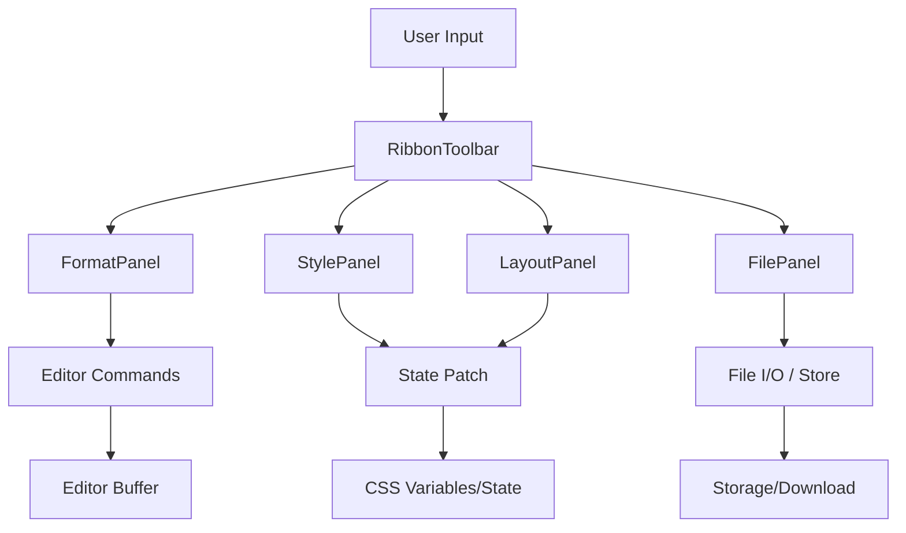

# Toolbar & Control Systems

The Toolbar system in Markeon implements a Ribbon-style interface that serves as the primary control layer for document manipulation. It decouples user interactions from the underlying Markdown engine by dispatching commands to the editor or patching the document's metadata state.

## Architectural Role

The toolbar is structured as a composite component. The `RibbonToolbar` acts as the shell and coordinator, while specialized panels handle distinct domains of document configuration:

| Panel | Responsibility | Primary State Impact |
| :--- | :--- | :--- |
| `FormatPanel` | Text styling and Markdown syntax injection | Editor Content (Buffer) |
| `StylePanel` | Visual aesthetics (fonts, colors) | Document Theme State |
| `LayoutPanel` | Page geometry (margins, orientation) | Layout Configuration State |
| `FilePanel` | Persistence and lifecycle (import/export) | Document Store / File System |

## Component Interaction Flow

The following diagram illustrates how user interactions in the Ribbon panels propagate through the system to affect either the document content or the global layout state.



## Detailed Panel Analysis

### 1. RibbonToolbar (The Shell)
The `RibbonToolbar` manages the top-level layout and the identity of the active document. Its primary unique logic resides in the filename editing state, allowing users to rename documents in-place.

```jsx title="src/components/toolbar/RibbonToolbar.jsx"
function startEditing() {
  setEditing(true);
  setFilename(currentFilename);
}

function commitRename() {
  saveDocument({ name: filename });
  setEditing(false);
}
```
The toolbar coordinates the visibility and placement of the specialized panels, ensuring that global actions (like exporting) are accessible regardless of which panel is active.

### 2. FormatPanel
The `FormatPanel` is a collection of trigger buttons that execute the Command pattern defined in the Editor Manipulation layer. It groups related formatting tools (e.g., Bold, Italic, Lists) using `GroupLabel` and `Sep` (Separator) components.

```jsx title="src/components/toolbar/FormatPanel.jsx"
function FmtButton({ label, cmd, icon }) {
  return (
    <button onClick={() => executeCommand(cmd)}>
      {icon}
      <span>{label}</span>
    </button>
  );
}
```
Each button maps a UI label to a specific command string which the editor engine interprets to wrap selected text in Markdown syntax.

### 3. StylePanel
The `StylePanel` modifies the visual appearance of the document. It utilizes a `patch` mechanism to update specific keys in the theme state without overwriting the entire configuration object.

```jsx title="src/components/toolbar/StylePanel.jsx"
function patch(updates) {
  setDocumentStyle(prev => ({
    ...prev,
    ...updates
  }));
}

// Usage in ColorField
<input 
  type="color" 
  onChange={(e) => patch({ accentColor: e.target.value })} 
/>
```
Key controls include `FontDropdown` for typeface selection and `ColorField` for hexadecimal color updates.

### 4. LayoutPanel
The `LayoutPanel` manages the physical dimensions and spacing of the document. It includes logic for "Linked Margins," where changing one margin can optionally update all others to maintain symmetry.

```jsx title="src/components/toolbar/LayoutPanel.jsx"
function setLinkedMargin(mm) {
  patch({
    marginTop: mm,
    marginBottom: mm,
    marginLeft: mm,
    marginRight: mm,
  });
}

function setSideMargin(side, mm) {
  patch({ [side]: mm });
}
```
The panel provides inputs for:
- **Paper Size**: Presets for A4, Letter, etc.
- **Orientation**: Toggle between Portrait and Landscape.
- **Line Spacing**: Numeric input for leading.

### 5. FilePanel
The `FilePanel` handles the document lifecycle. Unlike the other panels, it primarily executes asynchronous side effects involving the `FileReader` API and document storage.

```jsx title="src/components/toolbar/FilePanel.jsx"
async function handleImportMd(e) {
  const file = e.target.files[0];
  const reader = new FileReader();
  reader.onload = async (ev) => {
    const content = ev.target.result;
    await createNewDocument(content);
  };
  reader.readAsText(file);
}
```

#### File Operations Summary
| Function | Action | Mechanism |
| :--- | :--- | :--- |
| `handleDuplicate` | Clones active document | Deep copy of state $\rightarrow$ Store |
| `handleExportMd` | Downloads current buffer | Blob creation $\rightarrow$ Anchor download |
| `handleImportMd` | Loads external `.md` file | `FileReader` $\rightarrow$ State update |
| `handleDelete` | Removes document | Store deletion $\rightarrow$ Redirect |