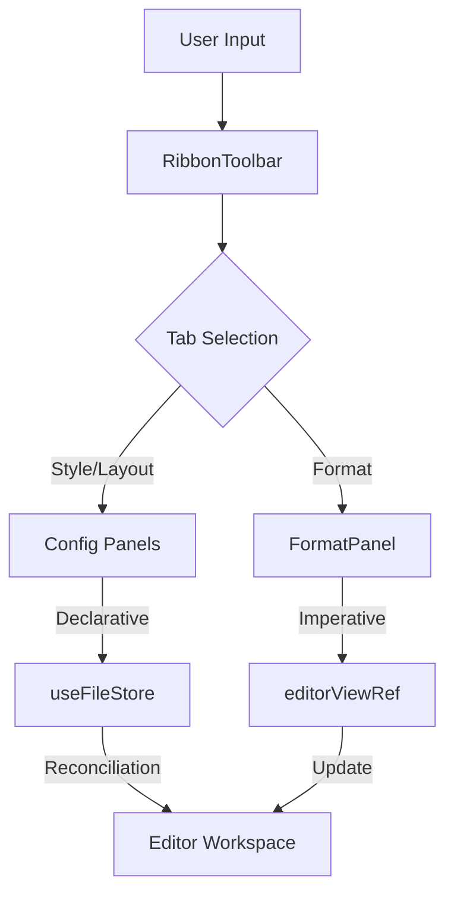

# Command & Control Interface

The Command & Control Interface (CCI) serves as the primary orchestration layer for user intent within the Markeon environment. It is implemented as a hierarchical ribbon system that decouples high-level UI navigation from low-level document mutation and global state synchronization. The system manages three distinct domains of application state: editor viewport/content (imperative), document metadata and layout (declarative via Zustand), and global visual themes (contextual).

## Section A: System Role & Architectural Position

The CCI acts as the bridge between the React reconciliation cycle and the imperative CodeMirror editor instance. While the toolbar components are reactive, many actions—specifically those within the `Format` tab—bypass the standard state-to-props flow to perform direct mutations on the `EditorView` via a singleton reference.

### Component Dependency Matrix

| Component | Responsibility | Primary State Dependency | Mutation Target |
| :--- | :--- | :--- | :--- |
| `RibbonToolbar` | Tab orchestration & File lifecycle | `useFileStore`, `useThemeStore` | `router`, `activeFileId` |
| `FormatPanel` | Markdown syntax injection | `editorViewRef` | `CodeMirror EditorView` |
| `StylePanel` | Visual typography/color overrides | `useFileStore` | `CSS Custom Properties` |
| `LayoutPanel` | Physical document geometry | `useFileStore` | `PDF/Print Engine` |
| `ThemePicker` | Global visual mode | `useThemeStore` | `Document Root` |

## Section B: Core Execution & Data Flow Mechanics

The system employs a hybrid data flow model. Configuration changes (Layout/Style) follow a **unidirectional data flow** through Zustand stores, while text formatting follows a **direct-mutation command pattern**.

### Command Execution Workflow



### Key Execution Patterns

1.  **Declarative Layout Patching**: When a user adjusts a margin or font size in the `LayoutPanel`, the component invokes a `patch` function. This function performs a shallow merge of the existing `layoutSettings` with the new delta, ensuring that existing properties (like `paperSize`) are preserved while specific dimensions (like `margins.top`) are updated.
2.  **Imperative Text Mutation**: The `FormatPanel` utilizes a collection of pure functions defined in `formatCommands.js`. These functions retrieve the current `EditorView` from a ref, calculate the precise `from` and `to` offsets of the selection, and dispatch a `Transaction` to the editor. This avoids the overhead of syncing the entire document string through the React state tree on every keystroke.
3.  **Portal-Based UI Projection**: To prevent clipping issues within the `overflow-x-auto` containers of the toolbar, the `StylePanel` uses `createPortal`. This projects dropdown menus to the `document.body`, allowing them to bypass the toolbar's local stacking context while still receiving positional updates via `getBoundingClientRect`.

## Section C: Implementation Deep Dive

### 1. Imperative Selection Wrapping
The following algorithm demonstrates the precision required for Markdown injection. It handles both the "active selection" case (wrapping text) and the "cursor-only" case (inserting empty markers).

```javascript title="src/lib/formatCommands.js"
function wrapSelection(before, after = before) {
  const view = getView()
  if (!view) return
  const { state } = view
  const { from, to } = state.selection.main
  const selected = state.doc.sliceString(from, to)

  if (selected) {
    // Case: Text is highlighted. Wrap the selection.
    view.dispatch({
      changes: [
        { from, to, insert: `${before}${selected}${after}` },
      ],
      selection: { anchor: from, head: from + before.length + selected.length + after.length },
    })
  } else {
    // Case: No selection. Insert markers at cursor and advance head.
    view.dispatch({
      changes: { from, insert: `${before}${after}` },
      selection: { anchor: from + before.length },
    })
  }
  view.focus()
}
```
*Mechanics*: The `view.dispatch` method is the atomic unit of change in CodeMirror. By calculating the new `anchor` and `head` indices, the function ensures the cursor is placed correctly after the injected syntax, maintaining a seamless typing experience.

### 2. Partial State Updates (Patching)
The `LayoutPanel` uses a functional update pattern to manage complex nested objects within the `useFileStore`.

```javascript title="src/components/toolbar/LayoutPanel.jsx"
const { files, activeFileId, setFileLayout } = useFileStore()
const activeFile = files.find((f) => f.id === activeFileId)

// Default merge strategy: ensures nested objects like margins are not wiped
const layout = {
  ...DEFAULT_LAYOUT,
  ...activeFile?.layoutSettings,
  margins: { ...DEFAULT_LAYOUT.margins, ...activeFile?.layoutSettings?.margins },
}

function patch(updates) {
  // Triggers a Zustand state update for the specific file ID
  setFileLayout(activeFile.id, updates)
}
```
*Mechanics*: The `layout` constant performs a tiered merge. This prevents the "partial object loss" bug where updating `layout.fontSize` would inadvertently delete `layout.margins`.

### 3. Portal-Driven Dropdown Positioning
The `FontDropdown` calculates its viewport position dynamically to ensure the menu appears directly below the trigger button.

```javascript title="src/components/toolbar/StylePanel.jsx"
function openDropdown() {
  if (!btnRef.current) return
  const rect = btnRef.current.getBoundingClientRect()
  setDropPos({ 
    top: rect.bottom + 4, 
    left: rect.left, 
    width: Math.max(rect.width, 160) 
  })
  setOpen(true)
}
```
*Mechanics*: Using `getBoundingClientRect()` allows the component to acquire absolute viewport coordinates, which are then passed to a `fixed` positioned element via `createPortal`.

## Section D: Method / State Reference

### Document Style Schema (`styleOverrides`)

The following table defines the structure of the `styleOverrides` object stored in `useFileStore`, which is applied to the document via CSS Custom Properties.

| Key | Type | Default (Theme) | Description |
| :--- | :--- | :--- | :--- |
| `bodyFont` | `string \| null` | `null` | CSS font-family for standard text. |
| `headingFont`| `string \| null` | `null` | CSS font-family for `h1`-`h6`. |
| `monoFont` | `string \| null` | `null` | CSS font-family for `<code>` and `<pre>`. |
| `headingColor`| `string` | `--color-heading`| Hex color for all headings. |
| `accentColor` | `string` | `--color-accent` | Hex color for links and highlights. |
| `bodyColor` | `string` | `--color-text` | Hex color for primary text content. |
| `pageBg` | `string` | `--page-bg` | Background color of the document container. |

### Formatting Command Map

| Command | Logic Type | Markdown Output |
| :--- | :--- | :--- |
| `bold` | Wrap | `**text**` |
| `italic` | Wrap | `*text*` |
| `h1` | Replace | `# text` (replaces existing heading) |
| `blockquote`| Prefix | `> text` (toggles on current line) |
| `bulletList`| Prefix | `- text` (toggles on current line) |
| `table` | Insert | Standard GFM table template |

### Error Recovery & Invariants

*   **Editor Disconnection**: If `editorViewRef.current` is null (e.g., during a route transition), all `formatCommands` perform a silent early return to prevent runtime exceptions.
*   **Font Loading Latency**: The `FontDropdown` utilizes an `ensureFont` utility. If a user selects a font not currently in the DOM, the system triggers an asynchronous font-face loading sequence before committing the state change.
*   **Constraint Enforcement**: `NumInput` components in the `LayoutPanel` implement hard clamps (`Math.min(max, Math.max(min, v))`) to prevent invalid CSS values (e.g., negative margins or 0pt font sizes) from being committed to the store.