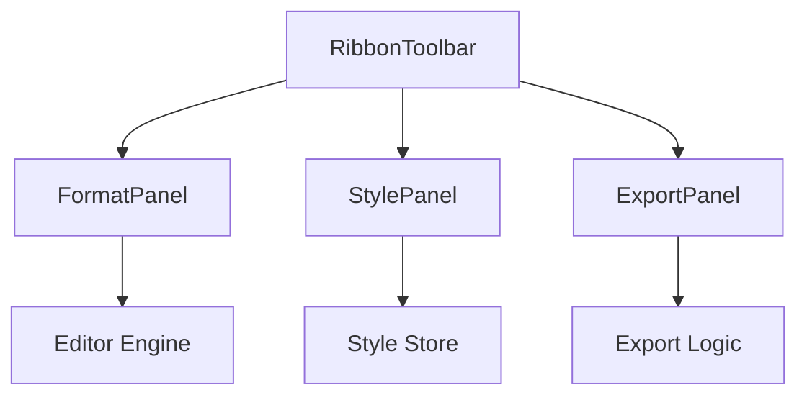

# Toolbar and Control Panels

The Toolbar and Control Panels module serves as the primary command center for Markeon. Rather than relying solely on Markdown syntax, this module provides a "Ribbon-style" interface that allows users to manipulate document structure, apply visual styles, and manage file metadata through intuitive GUI elements.

Architecturally, this module acts as the translation layer between user intent (clicks and selections) and the underlying editor state or document settings. It is decomposed into a primary orchestrator (`RibbonToolbar`) and several specialized panels that encapsulate specific domains of functionality.

### Component Hierarchy

| Component | Role | Primary Responsibility |
| :--- | :--- | :--- |
| `RibbonToolbar` | Orchestrator | Manages the top-level layout and filename editing state. |
| `FormatPanel` | Editor Controller | Provides shortcuts for text formatting and structural Markdown elements. |
| `StylePanel` | Aesthetic Controller | Manages typography, color schemes, and visual overrides. |
| `ExportPanel` | Output Controller | Triggers the document conversion and export pipeline. |

### Component Interaction & Data Flow

The toolbar operates on a delegated command pattern. While the `RibbonToolbar` handles the global layout and file identification, the sub-panels are responsible for invoking specific logic—either by modifying the editor's content (FormatPanel) or patching the application's style state (StylePanel).



### The Ribbon Toolbar: Orchestration and Metadata

The `RibbonToolbar` is the top-level container. Beyond housing the panels, it manages a critical piece of UX: the inline editing of the document filename. This is handled through a local state transition that toggles between a display label and an input field.

```javascript
function startEditing() {
  // Switches view to input mode for filename modification
}

function commitRename() {
  // Validates and persists the new filename to the state
}

function cancelRename() {
  // Reverts to the original filename without saving
}
```

This design ensures that file management is integrated directly into the workspace, reducing the need for separate "Save As" modals for simple name changes.

### Formatting and Style Control

#### FormatPanel
The `FormatPanel` is designed for speed. It utilizes a grouped layout consisting of `GroupLabel` and `Sep` (separator) components to categorize formatting tools (e.g., text styles vs. structural elements). The `FmtButton` serves as the atomic unit of interaction, triggering specific Markdown insertions or wraps.

#### StylePanel
Unlike the `FormatPanel`, which modifies the document *content*, the `StylePanel` modifies the document *appearance*. It leverages a `patch` mechanism to update the theme state dynamically.

Key components within the `StylePanel` include:
- **FontDropdown**: A custom selection menu for switching typefaces.
- **ColorField**: A dedicated input for hex/RGB color values.
- **ResetBtn**: A utility to clear custom overrides and return to the theme default.

The styling logic is implemented as a partial update to the configuration object:

```javascript
function patch(updates) {
  // Merges new style overrides into the current active theme
  // updates = { font: 'Inter', color: '#333' }
}
```

### Export Pipeline

The `ExportPanel` provides the gateway to the document's final output. It encapsulates the `handleExport` logic, which interfaces with the application's export engine to convert the current Markdown state into a portable format (such as PDF).

By decoupling the `ExportPanel` from the main toolbar logic, Markeon can easily extend export options (e.g., adding HTML or DOCX support) without modifying the rest of the UI layout.