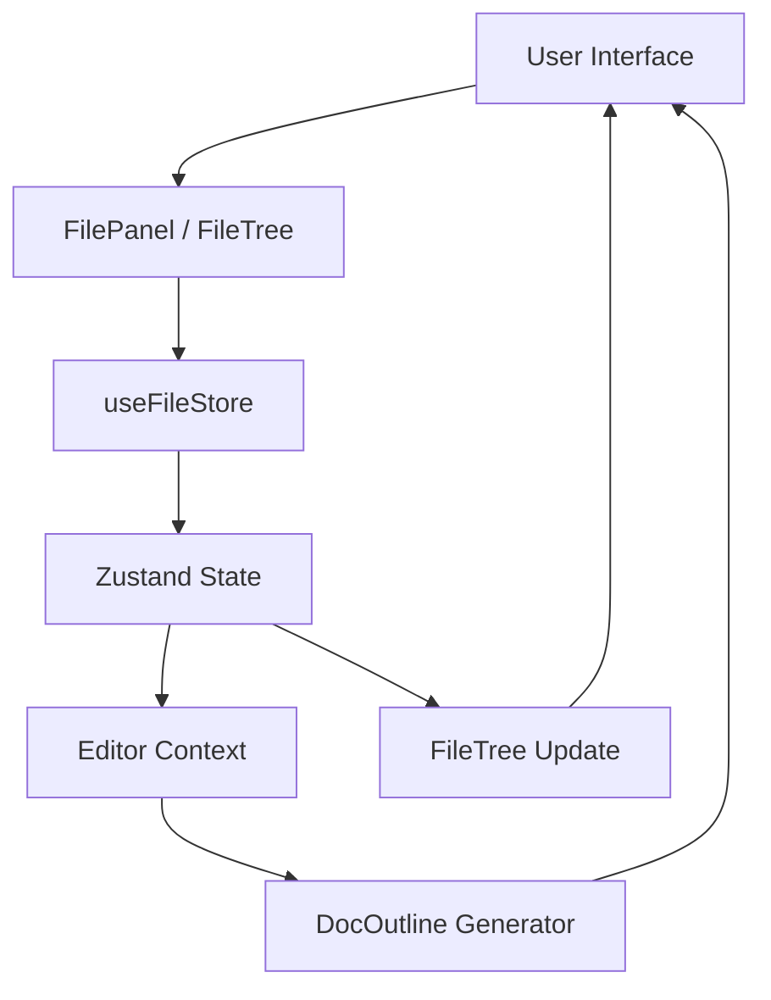

# Document Navigation System

The Document Navigation System provides the structural interface for managing a multi-document environment within Markeon. It acts as the primary orchestration layer between the `useFileStore` state management and the visual workspace, enabling file lifecycle operations (CRUD), document context switching, and hierarchical navigation of markdown content.

### System Role & Architectural Position

This system is positioned within the Interface Orchestration layer, serving as the navigational bridge to the Editor Workspace. It consumes the centralized file state and exposes mutation methods to modify the project structure.

| Component | Responsibility | Primary Dependency | State Interaction |
| :--- | :--- | :--- | :--- |
| `FileTree` | Visual file listing & active file selection | `useFileStore` | Read `files`, Call `setActiveFile`, `renameFile` |
| `DocOutline` | Structural mapping of H-tags within active doc | `headings` (Prop) | Read-only; triggers `onSelect` scroll events |
| `FilePanel` | High-level file I/O and duplication logic | `useFileStore` | Call `createFile`, `updateContent`, `deleteFile` |
| `useFileStore` | Persistence and state synchronization | Zustand | Source of truth for `files[]` and `activeFileId` |

### Core Execution & Data Flow Mechanics

The navigation system operates on a unidirectional data flow: User Interactions $\rightarrow$ Store Mutations $\rightarrow$ State Broadcast $\rightarrow$ UI Re-render.



#### Key Operational Workflows:

1.  **File Context Switching**: When a node in `FileTree` is clicked, `setActiveFile(id)` updates the global `activeFileId`. This triggers a reactive update across the workspace, loading the corresponding content into the editor.
2.  **Document Outlining**: The `DocOutline` component receives a processed array of heading objects. It calculates indentation based on the `level` property (H1-H6), creating a virtual hierarchy without requiring a nested data structure.
3.  **Import/Export Pipeline**:
    *   **Export**: The system leverages the `Blob` API to serialize the active file's string content into a `text/markdown` MIME type, creating a temporary object URL for browser-initiated download.
    *   **Import**: Utilizes the `FileReader` API to asynchronously read local `.md` files, subsequently invoking `createFile` and `updateContent` to integrate the external data into the store.

### Implementation Deep Dive

#### File Lifecycle Management
The `FilePanel` handles complex file operations that require multiple store mutations, such as duplication.

```javascript title="src/components/toolbar/FilePanel.jsx"
async function handleDuplicate() {
  if (!activeFile) return
  // Generate unique name to prevent collision
  const copy = await createFile(activeFile.name.replace('.md', '') + ' copy.md')
  // Atomic update of the newly created file's content
  await updateContent(copy.id, activeFile.content)
}
```
*   **Line 3**: Guard clause prevents execution if the `activeFileId` does not resolve to a valid file object.
*   **Line 4**: `createFile` is awaited to ensure the file ID is generated and registered in the store before content is applied.
*   **Line 6**: `updateContent` synchronizes the buffer of the original file to the duplicate.

#### Dynamic Structural Outlining
`DocOutline` implements a linear-to-hierarchical visual mapping using calculated padding.

```javascript title="src/components/sidebar/DocOutline.jsx"
{headings.map((h) => (
  <li key={h.id}>
    <button
      onClick={() => onSelect(h.id)}
      style={{
        fontFamily: 'var(--font-ui)',
        color: 'var(--text-secondary)',
        paddingLeft: `${8 + (h.level - 1) * 12}px`,
      }}
    >
      {h.text}
    </button>
  </li>
))}
```
*   **`h.level`**: An integer (1-6) extracted during the markdown parsing phase.
*   **Padding Calculation**: The formula `8 + (h.level - 1) * 12` ensures a consistent 12px indent per heading level, providing immediate visual cues for document depth.
*   **`onSelect(h.id)`**: A callback that typically triggers a `scrollTo` or `setCursorPosition` event in the editor pane.

#### Inline Renaming State Machine
The `FileTree` manages a hybrid state: global store state for the file list and local component state for the renaming input buffer.

```javascript title="src/components/sidebar/FileTree.jsx"
const [renamingId, setRenamingId] = useState(null)
const [renameValue, setRenameValue] = useState('')

function commitRename(id) {
  if (renameValue.trim()) renameFile(id, renameValue.trim())
  setRenamingId(null)
}
```
*   **`renamingId`**: Acts as a pointer to the file currently in "edit mode." If `null`, the tree renders labels.
*   **`renameValue`**: A temporary buffer to prevent frequent store updates on every keystroke (debouncing via local state).
*   **`commitRename`**: Validates the input (trimming whitespace) before invoking the store's `renameFile` mutation.

### Method & State Reference

#### Store Action Contract (`useFileStore`)

| Method | Parameters | Return Type | Effect |
| :--- | :--- | :--- | :--- |
| `createFile` | `name: string` | `Promise<string>` | Appends new file object; returns generated `id`. |
| `deleteFile` | `id: string` | `Promise<void>` | Removes file from `files[]`; clears `activeFileId` if matched. |
| `renameFile` | `id: string, name: string` | `Promise<void>` | Updates `name` property of target file object. |
| `updateContent` | `id: string, content: string` | `Promise<void>` | Synchronizes editor buffer to store persistence. |
| `setActiveFile` | `id: string` | `void` | Updates `activeFileId` to switch editor context. |

#### Failure Modes & Recovery

| Scenario | System Response | Recovery Mechanism |
| :--- | :--- | :--- |
| **Empty File Name** | `commitRename` ignores empty strings via `.trim()` | Input remains in edit mode until valid text is entered. |
| **Import I/O Error** | `FileReader` failure | Standard browser error handling; store remains unchanged. |
| **Deletion of Active File** | `deleteFile` executes | Store triggers update; UI reverts to "No files" state or selects first available file. |
| **Malformed Markdown** | `DocOutline` receives empty `headings` array | Renders "Headings appear here as you write" fallback UI. |