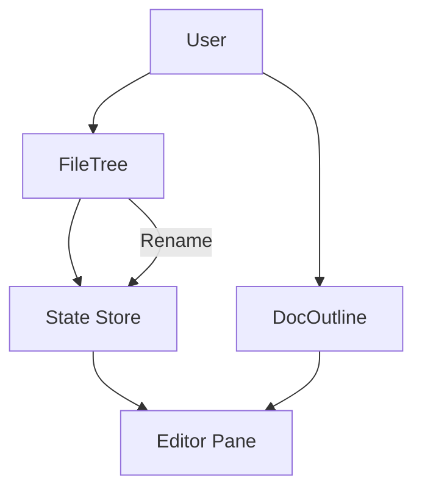

# Navigation and Sidebars

The Navigation and Sidebars module serves as the primary spatial interface for Markeon, providing users with both global and local context. While the editor focuses on content creation, the sidebars manage the organizational hierarchy of the workspace and the structural anatomy of the active document.

This module is divided into two primary functional components: the **File Tree**, which manages the project-level file system, and the **Document Outline**, which provides an interactive table of contents for the current file.

### Architectural Role

In the broader Markeon architecture, these components act as "controllers" for the Editor pane. They do not hold the primary document state but instead trigger state transitions that dictate which file is loaded or where the editor's viewport should be positioned.

| Component | Scope | Primary Responsibility | Triggered Action |
| :--- | :--- | :--- | :--- |
| `FileTree` | Global | File system browsing & management | Switches active document in store |
| `DocOutline` | Local | Document structure visualization | Scrolls editor to specific heading |

### Component Interaction & Data Flow

The navigation system operates on a unidirectional flow: user interactions in the sidebar dispatch actions to the application state, which then propagates changes down to the Editor and Preview components.

The renaming workflow in the `FileTree` is a critical state transition, moving from a "read-only" display mode to an "editing" mode before persisting the change back to the underlying data store.



### File Tree Implementation

The `FileTree` component is responsible for rendering the list of available documents and providing management utilities. It implements a dynamic renaming mechanism that allows users to modify filenames inline without leaving the navigation context.

#### Renaming Workflow
The renaming logic is split into two phases: initialization and commitment. This prevents unnecessary store updates on every keystroke and ensures that filename changes are intentional.

```javascript
function startRename(file, e) {
  // Transitions the specific file into an editable state
  // e.preventDefault() prevents the file from being selected/opened
}

function commitRename(id) {
  // Persists the new filename to the global store
  // Validates the name and closes the inline editor
}
```

The `FileTree` utilizes a conditional rendering pattern in its list to switch between a standard file link and an input field when `startRename` is triggered. This ensures the UI remains responsive and avoids the overhead of complex modal dialogs for simple metadata changes.

### Document Outline Implementation

The `DocOutline` component provides a structural map of the active Markdown document. By parsing the headers within the current file, it generates a clickable hierarchy that enables rapid navigation through long-form content.

Unlike the `FileTree`, which interacts with the file system state, the `DocOutline` is tightly coupled with the current document's content. It acts as a bridge between the rendered Markdown AST (Abstract Syntax Tree) and the editor's scroll position.

**Key Functional Characteristics:**
- **Dynamic Updates:** The outline refreshes as the user adds or modifies headers in the editor.
- **Jump-to-Section:** Clicking an item in the outline triggers a scroll event to the corresponding line in the editor.
- **Visual Hierarchy:** Indentation is used to represent the nesting level of headings (H1 $\rightarrow$ H2 $\rightarrow$ H3).