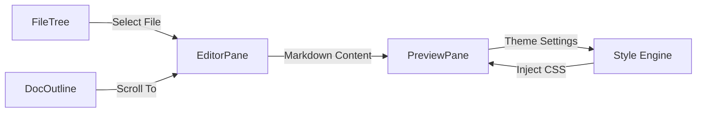

# Editor Interface Architecture

The Editor Interface in Markeon implements a classic three-column IDE layout optimized for document authoring. It separates file navigation and structural outlining from the content creation and real-time visual rendering process.

## Architectural Overview

The interface is divided into two primary zones: the **Navigation Sidebar** and the **Workspace**. The Workspace utilizes a dual-pane synchronization model where the `EditorPane` acts as the source of truth and the `PreviewPane` acts as a paginated, themed projection of that state.

### Component Map

| Component | Responsibility | Key Logic/State |
| :--- | :--- | :--- |
| `FileTree` | Workspace file system management | Rename operations, file switching |
| `DocOutline` | Document header hierarchy | Jump-to-section navigation |
| `EditorPane` | Raw Markdown input handling | Text manipulation, paste handling |
| `PreviewPane` | Virtual paper rendering | DPI conversion, pagination, zooming |

## Workspace Layout Flow

The following diagram illustrates the data flow from file selection through to the final paginated preview.



## Dual-Pane System

### Editor Pane
The `EditorPane` handles the input layer. It is designed to interface with the Markdown processing engine to provide a seamless editing experience.

```jsx title="src/components/editor/EditorPane.jsx"
// Example of event handling within the editor
paste: (event, view) => {
  // Custom paste logic to sanitize or transform 
  // incoming content before it hits the state
}
```

### Preview Pane (Virtual Paper)
The `PreviewPane` does not simply render HTML; it simulates physical paper (e.g., A4) using a coordinate system based on DPI (Dots Per Inch).

#### Dimensional Calculations
Markeon uses a standard 96 DPI scale to convert millimeters to pixels to ensure print consistency.

```jsx title="src/components/editor/PreviewPane.jsx"
function mmToPx(mmStr) {
  // 96dpi: 1 inch = 96px, 1mm = 96/25.4 px
  return (parseFloat(mmStr) * 96) / 25.4;
}

function getPaperPx(paperSize = 'A4', orientation = 'portrait') {
  // Returns calculated dimensions based on standard paper specs
}
```

#### Pagination & Rendering
To simulate a document, the `PreviewPane` employs a pagination strategy that splits the rendered HTML into discrete page containers.

```jsx title="src/components/editor/PreviewPane.jsx"
function splitIntoPages(html) {
  // Logic to calculate content height and 
  // break HTML into page-sized chunks
}

function injectThemeStyle(theme, layoutSettings) {
  // Dynamically injects CSS variables based on 
  // the selected document theme
}
```

#### Interaction Model
The preview pane implements a custom zoom and pan system via touch and wheel events to handle high-resolution document views.

| Event | Action | Implementation |
| :--- | :--- | :--- |
| `onWheel` | Zoom/Scroll | Adjusts transform scale or scroll offset |
| `onTouchMove` | Pan | Calculates delta between `touchStart` and current pos |
| `onTouchStart` | Anchor | Records initial coordinates for pan/zoom |

## Sidebar Navigation

The sidebar provides the structural context for the project and the active document.

### File Tree
The `FileTree` manages the project's file hierarchy. It includes an inline renaming mechanism to avoid modal-heavy workflows.

```jsx title="src/components/sidebar/FileTree.jsx"
function startRename(file, e) {
  // Switches file node to edit mode
}

function commitRename(id) {
  // Persists the new filename to the state layer
}
```

### Document Outline
The `DocOutline` parses the active document's headers to create a clickable map. This component interacts with the `EditorPane` to trigger scrolls to specific line numbers or anchors, facilitating rapid navigation in long-form documents.