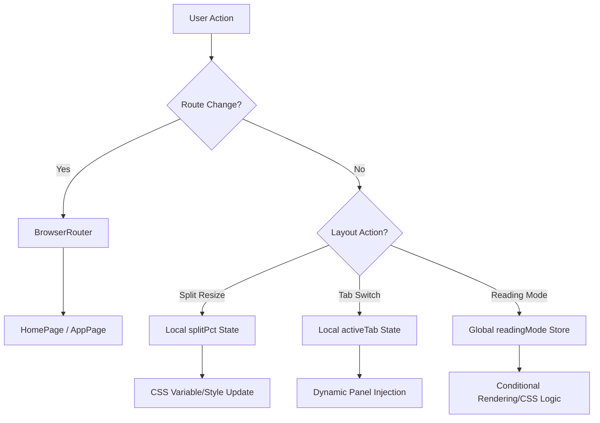

# Interface Orchestration

Interface Orchestration serves as the high-level structural shell of the Markeon application. It manages the transition between the marketing landing surface and the core editor environment, handles page-level layout composition, and synchronizes the visual state between disparate functional panes (Editor, Preview, Sidebar, and Toolbar).

### System Role & Architectural Position

The Interface Orchestration layer sits above the Core Processing Engine and Client State Orchestration layers. It translates global state transitions (e.g., `readingMode` toggle) into layout mutations and manages the routing lifecycle via `react-router-dom`.

| Component | Responsibility | Primary State Dependency | Critical Invariant |
| :--- | :--- | :--- | :--- |
| `App` | Root Route Dispatcher | N/A | All undefined paths must redirect to `/` |
| `HomePage` | Entry Point & Brand Surface | `useThemeStore.mode` | Aurora background colors must match theme mode |
| `AppPage` | Workspace Layout Orchestrator | `useEditorStore.readingMode` | Splitter must be disabled/hidden when `readingMode` is true |
| `RibbonToolbar` | Contextual Command Dispatch | `activeTab` (local state) | Active panel must match `TAB_PANELS` mapping |

### Core Execution & Data Flow Mechanics

The orchestration layer utilizes a hybrid state model: global persistent state via Zustand for application-wide settings and local React state for transient UI layout (e.g., splitter percentages, active tabs).



#### Layout Synchronization Logic
1.  **Splitter Mechanics**: The application implements a manual mouse-tracking algorithm for the editor/preview split. It captures `mousedown` on the splitter handle, attaches global `mousemove` and `mouseup` listeners to the `window` object to prevent cursor drift, and calculates the percentage offset relative to the `workAreaRef` bounding rectangle.
2.  **Reading Mode Transition**: When `readingMode` is activated, the orchestration layer triggers a cascade of UI mutations:
    *   `EditorPane` width is forced to `0`.
    *   `editor-splitter` is hidden.
    *   `RibbonToolbar` child panels (Format, Style, etc.) are unmounted.
    *   `DocOutline` switches from `stacked` to `panel` variant.
3.  **Cross-Pane Coordination**: The `scrollToHeading` mechanism coordinates the `DocOutline` (sidebar) and the `PreviewPane` (main view). It calculates the relative offset of the target element within the preview scroller to ensure precise alignment, bypassing standard `scrollIntoView` to account for fixed header offsets.

### Implementation Deep Dive

#### Application Routing
The root orchestrator defines the entry points and enforces a strict redirect policy for unmatched routes.

```jsx title="src/App.jsx"
export default function App() {
  return (
    <BrowserRouter>
      <Routes>
        <Route path="/" element={<HomePage />} />
        <Route path="/app" element={<AppPage />} />
        <Route path="*" element={<Navigate to="/" replace />} />
      </Routes>
    </BrowserRouter>
  )
}
```
*   **`BrowserRouter`**: Provides the history API context.
*   **`Navigate replace`**: Ensures that invalid URLs do not pollute the browser history stack during redirection.

#### Dynamic Panel Orchestration
`AppPage` utilizes a mapping object to decouple the ribbon toolbar's tab selection from the actual panel implementation.

```jsx title="src/pages/AppPage.jsx"
const TAB_PANELS = {
    File: FilePanel,
    Format: FormatPanel,
    Style: StylePanel,
    Layout: LayoutPanel,
    Export: ExportPanel,
}

// Inside AppPage component:
const ActivePanel = TAB_PANELS[activeTab] || null;
// ...
{ActivePanel && !readingMode && (
    <div className="border-t overflow-x-auto" style={{ ... }}>
        <ActivePanel />
    </div>
)}
```
*   **`TAB_PANELS`**: A lookup table allowing $O(1)$ access to panel components based on the `activeTab` string key.
*   **Conditional Rendering**: The `!readingMode` guard ensures that configuration panels are purged from the DOM when the user enters the read-only preview state.

#### Split-Pane Resize Algorithm
The resizing logic uses a `useRef` for dragging state to avoid unnecessary re-renders during high-frequency mouse move events.

```jsx title="src/pages/AppPage.jsx"
const onMouseDown = useCallback((e) => {
    if (readingMode) return
    e.preventDefault()
    dragging.current = true
    document.body.style.cursor = 'col-resize'
    document.body.style.userSelect = 'none'
}, [readingMode])

useEffect(() => {
    function onMouseMove(e) {
        if (!dragging.current || !workAreaRef.current || readingMode) return
        const rect = workAreaRef.current.getBoundingClientRect()
        const pct = ((e.clientX - rect.left) / rect.width) * 100
        setSplitPct(Math.min(SPLIT_MAX, Math.max(SPLIT_MIN, pct)))
    }
    // ... listeners attachment
}, [readingMode])
```
*   **`SPLIT_MIN` / `SPLIT_MAX`**: Constants (20% and 80%) that enforce layout boundaries, preventing the editor or preview from disappearing entirely.
*   **`getBoundingClientRect()`**: Used to normalize the mouse X-coordinate relative to the workspace container.
*   **`userSelect = 'none'`**: Prevents accidental text selection during the drag operation.

### Method & State Reference

#### Local State Schema (`AppPage`)

| State Key | Type | Default | Description |
| :--- | :--- | :--- | :--- |
| `splitPct` | `number` | `50` | Percentage width of the `EditorPane` relative to work area. |
| `sidebarOpen` | `boolean` | `true` | Toggle state for the left-hand navigation/outline sidebar. |
| `activeTab` | `string` | `'Layout'` | Key for the current active configuration panel in the ribbon. |
| `headings` | `Array<Object>` | `[]` | List of document headings parsed from the preview for the outline. |

#### Error Recovery & Boundary Handling

| Failure Scenario | Recovery Mechanism | Technical Detail |
| :--- | :--- | :--- |
| **Invalid Tab Key** | Null Coalescing | `TAB_PANELS[activeTab] \|\| null` prevents application crash on undefined tab state. |
| **Missing Heading ID** | Guard Clause | `if (!el) return` in `scrollToHeading` prevents null reference errors when clicking outdated outline links. |
| **Overflowing Content** | CSS `overflow-hidden` | `h-dvh` (dynamic viewport height) combined with `flex-1 overflow-hidden` ensures the layout does not scroll globally, only within designated panes. |
| **Reading Mode Conflict** | Effect Synchronization | `useEffect` forces `setSidebarOpen(true)` when `readingMode` is active to ensure the outline is visible. |