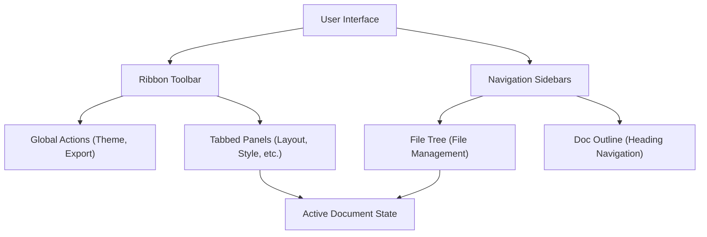

# Interface & Layout

Markeon provides a professional, document-centric workspace designed to bridge the gap between a Markdown editor and a word processor. The interface is divided into a global control ribbon and context-aware navigation sidebars.

## Workspace Architecture

The interface follows a hierarchical structure where the Ribbon Toolbar manages the global application state and specific feature panels, while the sidebars handle content navigation and file organization.

## Ribbon Toolbar

The Ribbon Toolbar serves as the primary command center. It is divided into three functional zones:

### 1. Navigation & Tabs
On the left, the toolbar provides a "Home" shortcut and a tabbed navigation system to switch between different configuration contexts:
- **File**: Document-level management.
- **Format**: Text and element formatting.
- **Style**: Visual themes and typography.
- **Layout**: Page-specific settings for PDF output.
- **Export**: Final document delivery options.

### 2. Document Identifier
The center of the ribbon displays the current active file name. Clicking the filename enters an **inline editing mode**, allowing users to rename the file without leaving the editor.

### 3. Global Actions
The right side contains utility controls:
- **Theme Picker**: Switch between predefined color schemes.
- **Reading Mode**: Toggles a distraction-free view of the document.
- **Export PDF**: Triggers the PDF generation engine using the current layout settings.
- **Dark/Light Mode**: Quick toggle for the system appearance.

## Navigation Sidebars

Markeon utilizes two specialized sidebars to help users manage complex documents.

### File Tree
The File Tree manages the application's virtual file system.
- **File Operations**: Create new files via the `+` button, rename via double-click, and delete via the trash icon.
- **Active State**: The currently open file is highlighted with the accent color for immediate orientation.

### Document Outline
The Document Outline provides a dynamic table of contents generated from the Markdown headings in the active editor.
- **Auto-generation**: Headings are updated in real-time as the user writes.
- **Hierarchical Indentation**: Support for multiple heading levels (H1-H6) is visualized through progressive indentation.
- **Quick Navigation**: Clicking any heading in the outline instantly scrolls the editor to that section.

## Layout Configuration

When the **Layout** tab is active in the Ribbon Toolbar, the `LayoutPanel` provides granular control over the document's physical dimensions and typography for print.

| Control | Description | Range/Options |
| :--- | :--- | :--- |
| **Font Size** | Base typography size for the document. | `8pt` to `20pt` |
| **Line Spacing** | Vertical distance between lines of text. | `1.0` to `2.5` |
| **Margins** | Page boundaries. Can be "Linked" (all sides equal) or "Free" (independent control). | `5mm` to `40mm` |
| **Paper Size** | The physical dimensions of the PDF page. | Standard Paper Presets |
| **Orientation** | Page direction. | Portrait or Landscape |

**Pro Tip:** Use the **Reset** button (circular arrow) next to Font Size and Line Spacing to revert to the default theme values.