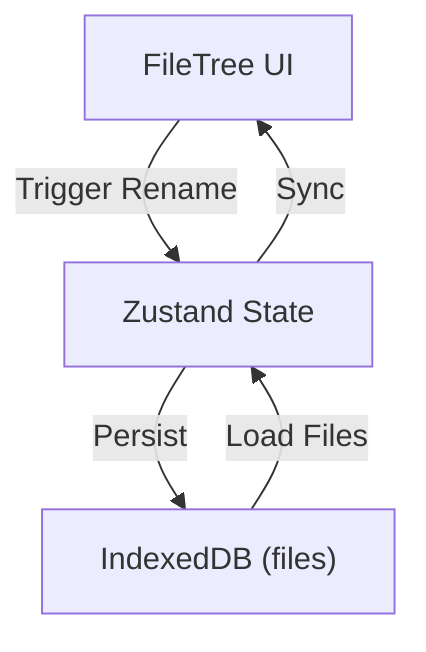
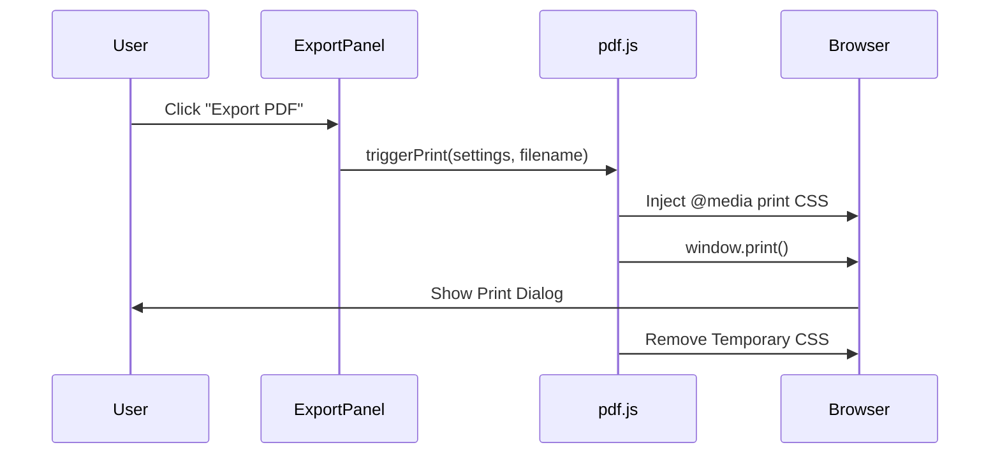

# Persistence & Document Export

The Persistence & Document Export module manages the application's long-term data storage and the transformation of rendered Markdown into portable documents. It utilizes a client-side IndexedDB instance for low-latency data persistence and a CSS-driven print pipeline for PDF generation.

## Data Persistence Layer

Markeon uses IndexedDB via a wrapper in `src/lib/db.js` to ensure that documents, themes, and configuration persist across browser sessions without requiring a backend server.

### Database Schema

The database is partitioned into five primary object stores to isolate different data types and optimize retrieval.

| Store | Purpose | Key Type |
| :--- | :--- | :--- |
| `files` | Markdown document content and metadata | `id` (nanoid) |
| `attachments` | Binary data or links to linked assets | `id` (nanoid) |
| `themes` | Custom CSS theme definitions | `id` (nanoid) |
| `fonts` | Font configuration and preferences | `id` (nanoid) |
| `meta` | Project-level settings and app state | `key` (string) |

### Database Implementation

The `getDB` function handles the initialization and versioning of the IndexedDB instance.

```js title="src/lib/db.js"
async function getDB() {
  return new Promise((resolve, reject) => {
    const request = indexedDB.open("markeon-db", 1);
    request.onupgradeneeded = (e) => {
      const db = e.target.result;
      if (!db.objectStoreNames.contains("files")) db.createObjectStore("files", { keyPath: "id" });
      if (!db.objectStoreNames.contains("attachments")) db.createObjectStore("attachments", { keyPath: "id" });
      if (!db.objectStoreNames.contains("themes")) db.createObjectStore("themes", { keyPath: "id" });
      if (!db.objectStoreNames.contains("fonts")) db.createObjectStore("fonts", { keyPath: "id" });
      if (!db.objectStoreNames.contains("meta")) db.createObjectStore("meta", { keyPath: "key" });
    };
    request.onsuccess = () => resolve(request.result);
    request.onerror = () => reject(request.error);
  });
}
```

Data mutations are performed through specialized helper functions. All IDs are generated using a lightweight `nanoid` implementation to ensure uniqueness without external dependencies.

```js title="src/lib/db.js"
export async function saveFile(file) {
  const db = await getDB();
  return new Promise((resolve, reject) => {
    const transaction = db.transaction("files", "readwrite");
    const store = transaction.objectStore("files");
    const request = store.put(file);
    request.onsuccess = () => resolve();
    request.onerror = () => reject(request.error);
  });
}
```

## File Tree Management

The `FileTree` component provides the UI layer for interacting with the `files` object store. It manages the visibility, selection, and renaming of documents.

### File Interaction Workflow

The file tree implements a "start-commit" pattern for renaming to minimize database writes during typing.

```tsx title="src/components/sidebar/FileTree.jsx"
function startRename(file, e) {
  e.stopPropagation();
  setRenamingId(file.id);
  setRenameValue(file.name);
}

function commitRename(id) {
  const newName = renameValue;
  // Update logic triggers a Zustand state update which then calls saveFile()
  updateFileName(id, newName);
  setRenamingId(null);
}
```

### Data Flow Diagram



## Document Export Pipeline

Markeon avoids heavy PDF libraries in favor of a "Print-to-PDF" strategy. This leverages the browser's native print engine, ensuring that the high-fidelity CSS used in the editor is preserved in the final output.

### The Print Pipeline

The export process consists of three stages:
1. **Style Construction**: `buildPrintStyle` generates a CSS string that strips UI elements (toolbars, sidebars) and optimizes typography for A4/Letter paper.
2. **Injection**: The generated styles are injected into the document head.
3. **Trigger**: `window.print()` is invoked to open the system print dialog.

```js title="src/lib/pdf.js"
export function buildPrintStyle(layoutSettings = {}) {
  return `
    @media print {
      .no-print { display: none !important; }
      body { background: white !important; color: black !important; }
      .markdown-body { width: 100%; margin: 0; padding: 0; }
      @page { margin: 2cm; }
    }
  `;
}

export function triggerPrint(styleOverrides, filename) {
  const styleTag = document.createElement("style");
  styleTag.innerHTML = buildPrintStyle(styleOverrides);
  document.head.appendChild(styleTag);
  
  document.title = filename; // Sets the default PDF filename
  window.print();
  
  document.head.removeChild(styleTag);
}
```

### Export Execution Sequence

The `ExportPanel` serves as the entry point, collecting user preferences before initiating the pipeline.



### Export Panel Integration

The `ExportPanel` component maps UI toggles (e.g., margin size, font choice) to the `styleOverrides` object passed to the PDF utility.

```tsx title="src/components/toolbar/ExportPanel.jsx"
function handleExport() {
  const filename = currentFile?.name || "untitled";
  const overrides = {
    margins: marginSetting,
    fontSize: fontSetting,
  };
  triggerPrint(overrides, filename);
}