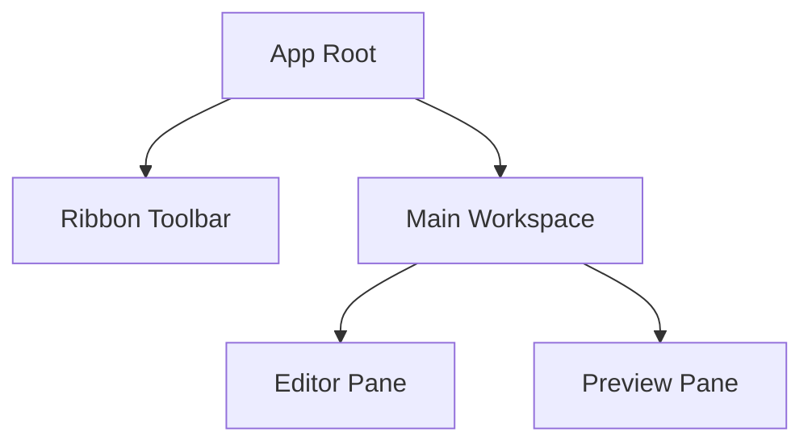
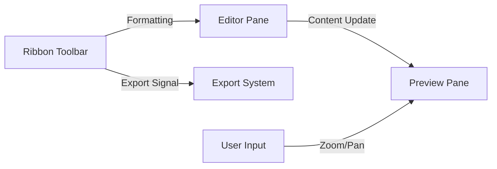

# User Interface Components

The User Interface of Markeon is engineered as a modular, three-pillar system designed to bridge the gap between a raw text editor and a professional typesetting tool. The UI architecture prioritizes a non-distracting workspace where the input (Markdown) and the output (Rendered Paper) coexist in a synchronized, side-by-side layout.

This module acts as the presentation layer, translating the internal state of the document and the user's configuration into a tactile, "paper-like" experience.

### Architectural Structure

The UI is divided into three primary functional areas: the **Control Plane** (RibbonToolbar), the **Input Plane** (EditorPane), and the **Visualization Plane** (PreviewPane).

| Component | Role | Primary Responsibility |
| :--- | :--- | :--- |
| `RibbonToolbar` | Control Plane | Global actions, filename management, and export triggers. |
| `EditorPane` | Input Plane | Raw Markdown entry and text manipulation. |
| `PreviewPane` | Visualization Plane | Real-time rendering, pagination, and theme application. |

#### Component Tree
The following diagram illustrates the hierarchical relationship between the main UI components.



### Component Interaction & Data Flow

The data flow within the UI is primarily unidirectional from the editor to the preview, while the toolbar acts as a command dispatcher that can influence both.

1.  **The Edit-Preview Loop**: As the user types in the `EditorPane`, the content is processed by the Markdown engine and streamed into the `PreviewPane`.
2.  **Command Dispatch**: The `RibbonToolbar` triggers specific actions—such as `handleExport` or renaming the current file—which interact with the application state and the underlying file system.
3.  **Visual Scaling**: The `PreviewPane` maintains its own internal state for zoom levels and paper dimensions, utilizing wheel and touch events to scale the document view without affecting the editor.



### Focused Technical Walkthrough

#### 1. The "Paper" Rendering Logic
Unlike standard web previews, the `PreviewPane` implements a precise coordinate system to mimic physical A4 or Letter paper. It converts millimeters (mm) to pixels (px) based on a 96 DPI standard to ensure that the PDF export matches the on-screen visualization.

```javascript
// 96dpi: 1 inch = 96px, 1mm = 96/25.4 px
function mmToPx(mmStr) {
    const mm = parseFloat(mmStr);
    return (mm * 96) / 25.4;
}

function getPaperPx(paperSize = 'A4', orientation = 'portrait') {
    // Returns dimensions calculated via mmToPx based on standard paper sizes
    // ... implementation details
}
```
This logic allows the `PreviewPane` to maintain a strict "paper" boundary, ensuring that the `splitIntoPages` function can accurately determine where content overflows to the next physical page.

#### 2. Dynamic Theme Injection
To maintain a consistent visual identity between the editor and the exported document, the `PreviewPane` uses a dynamic style injection mechanism. This allows the application to apply CSS variables and theme-specific styles directly to the rendered HTML.

```javascript
function injectThemeStyle(theme, layoutSettings = {}) {
    // Logic to generate a <style> block based on the selected theme
    // and apply it to the preview container.
}
```

#### 3. Toolbar State Management
The `RibbonToolbar` manages the transition between "viewing" and "editing" the document filename. This is handled through a set of local state transitions (`startEditing`, `commitRename`, `cancelRename`) that prevent accidental filename changes.

```javascript
function startEditing() {
    // Switches filename display to an input field
}

function commitRename() {
    // Validates and persists the new filename to the state
}
```

### Input Handling & UX
The UI implements advanced event listeners to ensure a fluid experience:
*   **EditorPane**: Implements custom `paste` handlers to manage how external content is integrated into the Markdown flow.
*   **PreviewPane**: Utilizes a sophisticated touch-and-wheel system (`onWheel`, `onTouchMove`) to allow users to zoom into their documents, mimicking the behavior of a PDF viewer.