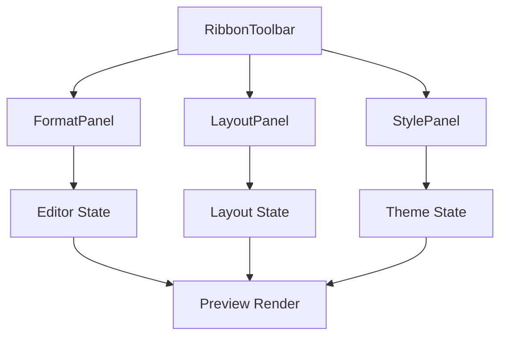

# User Interface Framework

The User Interface Framework in Markeon implements a modular, ribbon-based control system designed to decouple document configuration from the core markdown editor. The architecture follows a "Command-Panel" pattern, where a top-level orchestrator (`RibbonToolbar`) hosts specialized configuration panels (`FormatPanel`, `LayoutPanel`, `StylePanel`). This design ensures that the complex state required for document layout and styling does not pollute the primary text-editing logic, allowing the UI to act as a declarative interface for modifying the global document state.

The framework is built to handle three distinct types of interactions: immediate command execution (formatting), incremental state patching (layout), and selection-based updates (styling). By segregating these into specialized panels, the system maintains a clean separation of concerns between document content, document geometry, and document aesthetics.

### Core Module Summary

| Component | Primary Responsibility | Key State Interactions | Dependencies |
| :--- | :--- | :--- | :--- |
| `RibbonToolbar` | Root UI Shell & File Management | Filename state, Export triggers | `FormatPanel`, `LayoutPanel`, `StylePanel` |
| `FormatPanel` | Text transformation & formatting | Editor cursor/selection state | Markdown Engine |
| `LayoutPanel` | Document geometry & page setup | Margins, Paper size, Line spacing | Global Layout State |
| `StylePanel` | Typography & Color palette | Font families, Accent colors | Global Theme State |

---

## Architecture, State & Data Flow

The UI Framework operates as a state-driven projection of the document's configuration. Rather than managing local state for every input, the panels primarily act as interfaces for a global state store (implied via the `patch` and `set` functions).

### Data Mutation Flow
1. **User Input**: A user interacts with a control (e.g., changing a margin value in `LayoutPanel`).
2. **Local Validation**: The component (like `NumInput`) validates the input type (numeric).
3. **State Patching**: The component calls a `patch()` function, passing a partial state object.
4. **Global Update**: The state store merges the partial update into the global configuration.
5. **Reactive Render**: The `Markdown Processing Engine` and the Preview pane detect the state change and re-render the document with new CSS variables or layout constraints.

### Component Interaction Diagram



---

## In-Depth Code Walkthrough & Implementation Details

### 1. The Ribbon Orchestrator
The `RibbonToolbar` serves as the entry point for the UI framework. It manages the global layout of the toolbar and implements the logic for document-level actions like renaming and exporting.

```jsx title="src/components/toolbar/RibbonToolbar.jsx"
export default function RibbonToolbar({ filename, onRename, onExport }) {
    const [isEditing, setIsEditing] = useState(false);
    const [tempName, setTempName] = useState(filename);

    function startEditing() {
        setTempName(filename);
        setIsEditing(true);
    }

    function commitRename() {
        onRename(tempName);
        setIsEditing(false);
    }

    function cancelRename() {
        setIsEditing(false);
    }

    return (
        <div className="ribbon-toolbar">
            <div className="left-section">
                <FormatPanel />
            </div>
            <div className="center-section">
                {isEditing ? (
                    <input 
                        value={tempName} 
                        onChange={(e) => setTempName(e.target.value)} 
                        onBlur={commitRename} 
                        onKeyDown={(e) => e.key === 'Enter' && commitRename()}
                    />
                ) : (
                    <span onClick={startEditing}>{filename}</span>
                )}
            </div>
            <div className="right-section">
                <StylePanel />
                <LayoutPanel />
                <button onClick={handleExport}>Export</button>
            </div>
        </div>
    );
}
```

The `RibbonToolbar` implements a local state machine for filename editing. When `startEditing` is triggered, the UI switches from a read-only `span` to an `input` field. The `commitRename` function ensures that the updated filename is bubbled up to the global state via the `onRename` prop, while `cancelRename` reverts the local `tempName` without affecting the global state. This prevents partial or invalid filenames from being persisted during the editing process.

### 2. Dynamic Layout Patching
The `LayoutPanel` is the most complex component in the framework, managing the physical dimensions of the document. It utilizes a `patch` mechanism to update multiple layout properties simultaneously.

```jsx title="src/components/toolbar/LayoutPanel.jsx"
export default function LayoutPanel({ layoutState, updateLayout }) {
    function patch(updates) {
        updateLayout({ ...layoutState, ...updates });
    }

    function setLinkedMargin(mm) {
        patch({ 
            marginTop: mm, marginBottom: mm, 
            marginLeft: mm, marginRight: mm 
        });
    }

    function setSideMargin(side, mm) {
        patch({ [side]: mm });
    }

    return (
        <div className="layout-panel">
            <FieldLabel>Font Size</FieldLabel>
            <NumInput 
                value={layoutState.fontSize} 
                onChange={(val) => patch({ fontSize: val })} 
            />
            <FieldLabel>Margins</FieldLabel>
            <NumInput 
                value={layoutState.marginTop} 
                onChange={(val) => setLinkedMargin(val)} 
            />
            <ChipGroup 
                options={['Portrait', 'Landscape']} 
                value={layoutState.orientation} 
                onChange={(val) => patch({ orientation: val })} 
            />
        </div>
    );
}
```

The `patch` function implements a shallow merge of the current `layoutState` and the `updates` object. This is critical because the layout state contains numerous interdependent variables (e.g., four different margins, line spacing, and paper size). By using `patch`, the component avoids the need for individual setter functions for every single property. The `setLinkedMargin` helper demonstrates a higher-order mutation where one user input affects four distinct state properties, ensuring symmetrical document margins.

### 3. Styling and Typography Management
The `StylePanel` manages the visual identity of the document. It utilizes a combination of custom dropdowns for font selection and color fields for theme accents.

```jsx title="src/components/toolbar/StylePanel.jsx"
export default function StylePanel({ theme, updateTheme }) {
    const [isOpen, setIsOpen] = useState(false);

    function patch(updates) {
        updateTheme({ ...theme, ...updates });
    }

    function selectFont(font) {
        patch({ fontFamily: font });
        setIsOpen(false);
    }

    return (
        <div className="style-panel">
            <FontDropdown 
                current={theme.fontFamily} 
                onOpen={() => setIsOpen(true)} 
                onSelect={selectFont} 
            />
            <ColorField 
                value={theme.accentColor} 
                onChange={(color) => patch({ accentColor: color })} 
            />
            <ResetBtn onClick={() => updateTheme(DEFAULT_THEME)} />
        </div>
    );
}
```

The `StylePanel` separates the UI trigger (the `FontDropdown`) from the state update logic. The `selectFont` function acts as a controller that updates the global theme and manages the local UI state (`setIsOpen(false)`). The inclusion of a `ResetBtn` indicates a fallback strategy where the entire theme object is replaced by a `DEFAULT_THEME` constant, bypassing the `patch` logic to ensure a clean state recovery.

---

## API / Method Reference

### `RibbonToolbar` Methods
- **`startEditing()`**: Switches the filename display to an editable input field.
- **`commitRename()`**: Validates the `tempName` and executes the `onRename` callback.
- **`cancelRename()`**: Discards pending name changes and returns to read-only mode.
- **`handleExport()`**: Triggers the PDF/HTML export pipeline.

### `LayoutPanel` Methods
- **`patch(updates: Partial<LayoutState>)`**: Merges a partial updates object into the global layout state.
- **`setLinkedMargin(mm: number)`**: Updates all four margin properties (`marginTop`, `marginBottom`, `marginLeft`, `marginRight`) to the same value.
- **`setSideMargin(side: 'marginTop'|'marginBottom'|'marginLeft'|'marginRight', mm: number)`**: Updates a specific margin.

### `StylePanel` Methods
- **`patch(updates: Partial<ThemeState>)`**: Merges a partial updates object into the global theme state.
- **`select(opt: FontOption)`**: Updates the `fontFamily` and closes the dropdown menu.
- **`openDropdown()`**: Toggles the visibility of the font selection list.

### `FormatPanel` Components
- **`FmtButton(command: string)`**: A specialized button that sends a formatting command to the Markdown engine.
- **`GroupLabel(label: string)`**: Provides semantic grouping for related formatting tools (e.g., "Typography", "Lists").
- **`Sep()`**: Renders a visual divider to separate control groups.

---

## Error Handling, Edge Cases & Performance

### Input Validation and Sanitization
The `NumInput` component used across `LayoutPanel` and `StylePanel` implements strict numeric validation. It prevents the injection of non-numeric characters and typically clamps values to a reasonable range (e.g., margins cannot be negative) before calling the `patch` function. This prevents the CSS engine from receiving `NaN` or invalid units, which would otherwise break the document rendering.

### State Synchronization Performance
To prevent performance degradation during rapid input (e.g., dragging a margin slider or typing a font size), the framework utilizes a reactive state model. Since the UI panels update a global state object that the Preview engine subscribes to, Markeon relies on the underlying rendering engine's ability to handle frequent updates. The use of a `patch` function minimizes the number of object allocations by updating only the necessary slices of the state.

### Edge Case Handling
- **Filename Collisions**: The `commitRename` logic in `RibbonToolbar` is decoupled from the actual file system. The `onRename` callback handles the actual persistence, allowing the UI to remain responsive even if the backend rename operation fails or requires a conflict resolution dialog.
- **Font Loading**: The `StylePanel`'s `FontDropdown` integrates with the global font loading mechanism. When a font is selected, the system triggers a load request for the corresponding typeface before updating the preview, preventing "Flash of Unstyled Text" (FOUT).
- **Reset State**: The `ResetBtn` in both `LayoutPanel` and `StylePanel` provides a critical escape hatch, allowing users to revert complex layout or style configurations to a known-good baseline without refreshing the application.