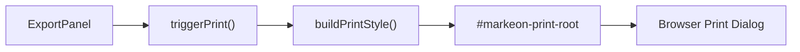

# Document Export & Printing

The Document Export & Printing module handles the conversion of rendered Markdown content into a paginated PDF format. Rather than using a server-side rendering engine or a heavy PDF library (like jsPDF), Markeon leverages the browser's native print engine combined with a specialized "nuclear" CSS strategy to isolate the document from the application UI.

## Export Workflow

The export process is triggered via the `ExportPanel` and managed by a utility library that dynamically modifies the DOM to prepare a print-ready view.



### 1. Triggering the Export
The `ExportPanel` provides the user interface for initiating the export process. The `handleExport` function orchestrates the call to the PDF library.

```jsx title="src/components/toolbar/ExportPanel.jsx"
function handleExport() {
  // Trigger the print sequence with current layout settings and filename
  triggerPrint(currentLayoutSettings, documentTitle);
}
```

### 2. Print Orchestration
The `src/lib/pdf.js` utility manages the transition from the application view to the print view. It uses a dedicated print root to ensure that only the document content, and not the editor chrome, is sent to the printer.

```javascript title="src/lib/pdf.js"
export function buildPrintStyle(layoutSettings = {}) {
  // Generates CSS overrides based on user-selected layout settings
  // (e.g., margins, font scaling)
}

export function triggerPrint(styleOverrides, filename) {
  // 1. Injects styles from buildPrintStyle
  // 2. Isolates content into #markeon-print-root
  // 3. Executes window.print()
}
```

## Styling Architecture

Markeon uses a dual-layer CSS strategy to ensure consistency between the on-screen preview and the final PDF output.

### Document Typography (`document.css`)
The `.markeon-document` class provides the base typographic system. It uses CSS variables injected by the active theme to handle fonts and colors.

| Element | Styling Approach | Note |
| :--- | :--- | :--- |
| `h1`-`h4` | Relative `em` sizing | Maintains hierarchy across themes |
| `.shiki` | Block-level highlighting | Integrated with Shiki for code blocks |
| `.page-break` | Visual divider | Rendered as a line in preview |
| `img` | Fluid width | Constrained to document container |

```css title="src/styles/document.css"
.markeon-document h1 { font-size: 2.2em; margin-top: 0; }
.markeon-document p { margin-bottom: 1em; }
.markeon-document .shiki code { 
  /* Shiki specific styling for syntax highlighting */ 
}
.markeon-document .page-break::after {
  content: "";
  border-bottom: 1px dashed #ccc;
}
```

### Print-Specific Overrides (`print.css`)
The `print.css` file implements a "nuclear" hide strategy. It suppresses all application elements and forces the browser to treat the `#markeon-print-root` as the sole content source.

```css title="src/styles/print.css"
@page {
  size: A4;
  margin: 20mm;
}

/* Hide all application chrome */
body > * {
  display: none !important;
}

/* Reveal only the print root */
#markeon-print-root {
  display: block !important;
}

/* Transform visual page breaks into actual PDF page breaks */
#markeon-print-root .markeon-document .page-break {
  page-break-after: always;
}
#markeon-print-root .markeon-document .page-break::after {
  display: none;
}
```

## Key Technical Constraints

1. **Pagination**: The system avoids fixed or absolute positioning within the document content. This allows the browser's layout engine to paginate content naturally across A4 pages.
2. **Content Isolation**: By moving the document into `#markeon-print-root` during the print sequence, Markeon avoids the complexity of trying to hide hundreds of individual UI components (sidebars, toolbars, etc.) via media queries.
3. **Asset Rendering**:
    * **KaTeX**: Rendered as standard HTML/CSS, which is natively supported by browser print engines.
    * **Mermaid**: Rendered as SVGs, which maintain vector quality in PDF exports.
    * **Shiki**: Code blocks are pre-rendered with inline styles, ensuring syntax highlighting is preserved in the export.