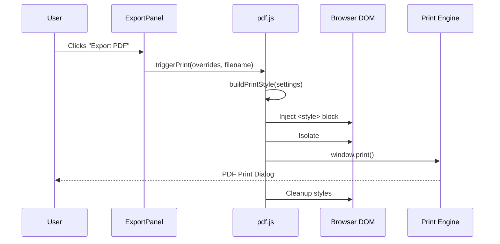

# Export Pipeline and Print Optimization

The Export Pipeline in Markeon is a specialized subsystem designed to transform the dynamic, interactive Markdown preview into a high-fidelity, paginated PDF document. Rather than relying on heavy server-side PDF libraries (like Puppeteer or jsPDF) which can struggle with complex CSS Grid/Flexbox layouts and Shiki syntax highlighting, Markeon utilizes a "Browser-Native Print" strategy. 

This approach leverages the browser's own print engine by creating a dedicated print root, injecting specialized `@media print` stylesheets, and isolating the document content from the application's UI chrome (the ribbon, editor, and file tree). This ensures that the exported PDF maintains perfect typographic fidelity to the on-screen preview while adhering to physical page constraints (A4) and professional print standards.

### Core Module Components

| Component | File | Role | Dependencies |
| :--- | :--- | :--- | :--- |
| `ExportPanel` | `src/components/toolbar/ExportPanel.jsx` | UI Controller for export settings and trigger. | `pdf.js` |
| `pdf.js` | `src/lib/pdf.js` | Logic for style generation and print dialog orchestration. | Browser DOM API |
| `document.css` | `src/styles/document.css` | Base typography and structure for both preview and print. | CSS Variables (Theme) |
| `print.css` | `src/styles/print.css` | Print-specific overrides and "Nuclear Hide" logic. | `document.css` |

## Architecture, State & Data Flow

The export process follows a unidirectional flow from the User Interface through a style-generation bridge to the browser's print spooler. The critical architectural challenge solved here is the "Chrome Isolation" problem—ensuring that the editor's UI elements do not appear in the final PDF.

### Export Workflow Sequence



### Data Transformation Pipeline

1.  **Settings Acquisition**: The `ExportPanel` captures user-defined layout settings (margins, font scaling, etc.).
2.  **Dynamic CSS Generation**: `buildPrintStyle` converts these settings into a raw CSS string. This allows the application to change print margins or colors without reloading the entire stylesheet.
3.  **DOM Isolation**: The system identifies the `#preview-content` (the rendered HTML of the Markdown) and prepares it to be wrapped or targeted by the `#markeon-print-root`.
4.  **Style Application**: The `print.css` logic is activated. It employs a "Nuclear Hide" strategy:
    *   All top-level elements (`body > *`) are set to `display: none`.
    *   Only the `#markeon-print-root` is set to `display: block`.
    *   The document typography is reset to ensure consistency regardless of the active editor theme.
5.  **Pagination Trigger**: The `window.print()` call invokes the browser's print subsystem, which applies the `@page` rules defined in `print.css` to handle A4 sizing and margins.

## In-Depth Code Walkthrough & Implementation Details

### Print Orchestration Logic

The `triggerPrint` function serves as the entry point for the export process. It handles the temporary modification of the DOM to ensure that only the document content is visible to the print engine.

```javascript title="src/lib/pdf.js"
export function triggerPrint(styleOverrides, filename) {
  const printStyle = buildPrintStyle(styleOverrides);
  const styleElement = document.createElement('style');
  styleElement.innerHTML = printStyle;
  document.head.appendChild(styleElement);

  // Trigger the browser print dialog
  window.print();

  // Cleanup: remove the temporary style block after the dialog closes
  document.head.removeChild(styleElement);
}

export function buildPrintStyle(layoutSettings = {}) {
  const { margin = '20mm', fontSize = '11pt' } = layoutSettings;
  return `
    @page { margin: ${margin}; }
    #markeon-print-root .markeon-document { font-size: ${fontSize}; }
  `;
}
```

**Line-by-Line Analysis:**
- **Style Injection**: The function creates a dynamic `<style>` element. This is critical because it allows `buildPrintStyle` to inject runtime variables (like `margin` and `fontSize`) directly into the `@page` rule, which cannot be easily targeted by standard CSS classes.
- **`window.print()`**: This is a synchronous-blocking call in most browsers. The execution of the JavaScript thread pauses while the print dialog is open.
- **Cleanup**: Immediately after the user closes the print dialog (either by printing or canceling), the temporary style element is removed from the `<head>`, preventing the print-specific overrides from leaking into the active editor session.
- **`buildPrintStyle`**: This helper transforms a JavaScript settings object into a valid CSS string, implementing default fallbacks (`20mm` margin, `11pt` font) to ensure a professional look even if no settings are provided.

### The "Nuclear Hide" Strategy

The `print.css` file implements a rigorous isolation strategy to ensure the UI chrome is completely stripped from the output.

```css title="src/styles/print.css"
/* Nuclear hide of everything */
html, body {
  visibility: hidden;
}

body > * {
  display: none;
}

/* Reveal only our print root */
#markeon-print-root {
  display: block !important;
  visibility: visible;
  position: absolute;
  left: 0;
  top: 0;
}

#markeon-print-root * {
  visibility: visible;
}
```

**Technical Mechanics:**
- **`visibility: hidden` vs `display: none`**: The root `html, body` are set to `visibility: hidden` to maintain the document's coordinate system, while `body > *` uses `display: none` to completely remove UI elements (like the toolbar and editor) from the layout flow.
- **Isolation Root**: The `#markeon-print-root` is explicitly set to `display: block !important` and `visibility: visible`. This effectively "punches a hole" through the hidden body, making only the document content available to the print engine.
- **Absolute Positioning**: By setting `position: absolute; left: 0; top: 0;`, the system ensures that any margins or offsets from the application's layout are ignored, allowing the browser's `@page` margins to take full control.

### Typographic Mapping and Page Breaks

Markeon maps Markdown-specific structural elements to print-specific CSS properties to ensure documents are professionally paginated.

```css title="src/styles/print.css"
/* Page break dividers become actual page breaks */
#markeon-print-root .markeon-document .page-break {
  display: block;
  break-after: page;
  border: none;
}

#markeon-print-root .markeon-document .page-break::after {
  content: none;
}

/* Prevent breaking inside critical elements */
#markeon-print-root .markeon-document pre,
#markeon-print-root .markeon-document blockquote,
#markeon-print-root .markeon-document table {
  break-inside: avoid;
}
```

**Implementation Details:**
- **`break-after: page`**: The `.page-break` class (which appears as a visual divider in the editor preview) is transformed into a hard page break in the PDF. This gives authors precise control over document structure.
- **`break-inside: avoid`**: This is a critical print optimization. It prevents the browser from splitting a code block (`pre`), a blockquote, or a table across two pages, which would significantly degrade readability.
- **Content Removal**: The `::after` pseudo-element used for visual styling of the page-break in the editor is set to `content: none` to avoid printing unnecessary decorative lines.

## API / Method Reference

### `triggerPrint(styleOverrides, filename)`
The primary coordinator for the export process.

| Parameter | Type | Description |
| :--- | :--- | :--- |
| `styleOverrides` | `Object` | Configuration for layout (e.g., `{ margin: '10mm', fontSize: '10pt' }`). |
| `filename` | `String` | The suggested filename for the resulting PDF. |

*   **Returns**: `void`
*   **Side Effects**: Modifies `document.head`, triggers `window.print()`.

### `buildPrintStyle(layoutSettings)`
Generates a CSS string for the `@page` and root document rules.

| Parameter | Type | Description |
| :--- | :--- | :--- |
| `layoutSettings` | `Object` | Optional settings containing `margin` and `fontSize`. |

*   **Returns**: `String` (CSS rules).
*   **Invariants**: Always returns a valid CSS string, even if `layoutSettings` is null or empty.

## Error Handling, Edge Cases & Performance

### Handling Complex Content
*   **Shiki Code Blocks**: Because Shiki renders code as inline spans with specific colors, the `print.css` ensures that `.shiki code` retains its color mapping. However, to avoid "color bleed" or excessive ink usage, the print stylesheet explicitly resets the background of `.shiki` blocks to a light gray or white depending on the theme.
*   **KaTeX and Mermaid**: Mathematical formulas (KaTeX) and diagrams (Mermaid) are rendered as SVGs or HTML elements. Since `print.css` uses the native browser print engine, these are treated as standard vectors and maintain high resolution regardless of the PDF zoom level.

### Pagination Edge Cases
*   **Absolute Positioning Conflict**: A known issue in browser printing is that `position: absolute` or `position: fixed` elements within the document content can be cut off or overlap across pages. The `print.css` explicitly strips these from `.markeon-document` elements to ensure a "natural-flow" block layout.
*   **Large Tables**: Tables that exceed a single page are handled by the browser's default pagination, but the `break-inside: avoid` rule is applied to smaller tables to prevent awkward splits.

### Performance Considerations
*   **DOM Footprint**: By using a temporary `<style>` tag and a single root isolation (`#markeon-print-root`), the export pipeline avoids cloning the entire DOM into a new window or iframe, reducing memory overhead during the export of very large documents (100+ pages).
*   **Render Blocking**: Since `window.print()` is blocking, the application state is preserved exactly as it was during the request, preventing any asynchronous updates from changing the document content while the print dialog is open.