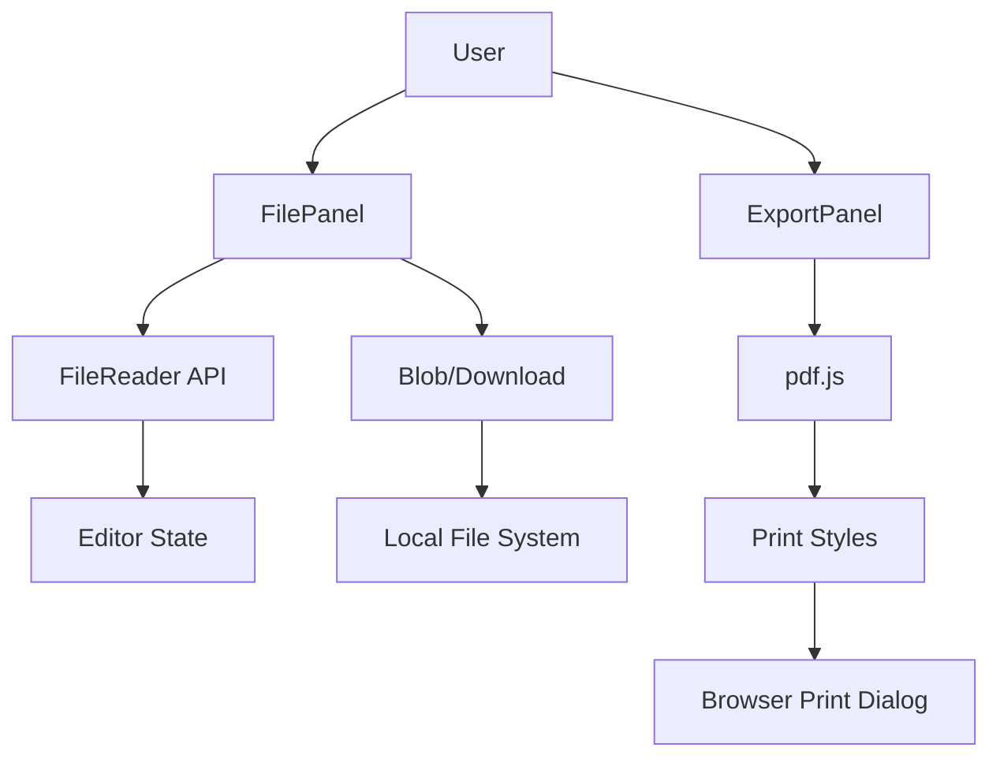

# Export and File I/O

The **Export and File I/O** module serves as the bridge between Markeon's internal application state and the user's local file system. While the core editor manages content in memory and a local database, this module provides the necessary mechanisms for portability—allowing users to import existing Markdown files, export their work for distribution, and generate high-fidelity PDF documents.

Architecturally, this module operates as a set of utility services and UI controllers that interface directly with Browser APIs (such as the `FileReader` API and the `window.print()` method) to bypass the need for a backend server for file processing.

### Core Responsibilities

| Feature | Implementation Logic | Primary Component/Utility |
| :--- | :--- | :--- |
| **Markdown Import** | Asynchronous file reading via `FileReader` | `FilePanel.jsx` |
| **Markdown Export** | Blob generation and programmatic download | `FilePanel.jsx` |
| **PDF Generation** | CSS-based print layout and browser print trigger | `pdf.js` $\rightarrow$ `ExportPanel.jsx` |
| **File Lifecycle** | Document duplication and deletion | `FilePanel.jsx` |

---

### Component Interaction & Data Flow

The File I/O system is split between the `FilePanel` (handling raw Markdown files) and the `ExportPanel` (handling formatted output). The flow of data depends on whether the user is bringing content *into* the system or extracting it *out*.

#### Workflow: Markdown Import vs. PDF Export



#### Data Flow Analysis
1.  **Import Flow**: When a user selects a file via `handleImportMd`, the `FileReader` reads the local disk content. Once the `onload` event fires, the text content is injected back into the editor's state, allowing for an immediate transition from a local file to an editable document.
2.  **PDF Flow**: Unlike Markdown export, which saves raw text, PDF export is a visual process. The `ExportPanel` invokes `pdf.js` to generate a specific set of print styles (`buildPrintStyle`). These styles ensure that the "paper-like" feel of the editor is preserved during the transition to a physical or digital page.

---

### Technical Implementation

#### 1. Markdown File Handling
The `FilePanel` implements basic CRUD operations for files. The import mechanism is particularly critical as it handles the asynchronous nature of file system access.

```jsx
// Simplified logic from FilePanel.jsx
async function handleImportMd(e) {
  const file = e.target.files[0];
  if (!file) return;

  const reader = new FileReader();
  reader.onload = async (ev) => {
    const content = ev.target.result;
    // Process the loaded content and update the application state
    // (Integration with store/database happens here)
  };
  reader.readAsText(file);
}
```
The use of `readAsText` ensures that the Markdown content is treated as a UTF-8 string, which is then passed to the Markdown engine for rendering.

#### 2. PDF Generation Strategy
Markeon utilizes a "Print-to-PDF" strategy rather than using a heavy JS library like jsPDF. This ensures that the high-quality CSS styles used in the preview pane are accurately reflected in the final document.

The process is split into two phases in `src/lib/pdf.js`:
1.  **Styling**: `buildPrintStyle` generates a CSS string based on layout settings.
2.  **Execution**: `triggerPrint` applies these styles and calls the system print dialog.

```javascript
// Core logic from src/lib/pdf.js
export function triggerPrint(styleOverrides, filename) {
  // 1. Create a style element for print-specific CSS
  const style = document.createElement('style');
  style.innerHTML = buildPrintStyle(styleOverrides);
  document.head.appendChild(style);

  // 2. Trigger the browser's native print functionality
  window.print();

  // 3. Cleanup to avoid polluting the UI styles
  document.head.removeChild(style);
}
```
By injecting and then removing the style block, the application can modify the document's appearance specifically for the print spooler without affecting the user's active editing session.

#### 3. Document Management
Beyond I/O, the `FilePanel` handles internal document organization.
- **Duplication**: `handleDuplicate` creates a clone of the current document state, allowing users to version their work manually.
- **Deletion**: `handleDelete` removes the document from the local persistence layer, effectively cleaning up the workspace.

These actions are wrapped in `ActionButton` components to maintain a consistent UI language across the toolbar.