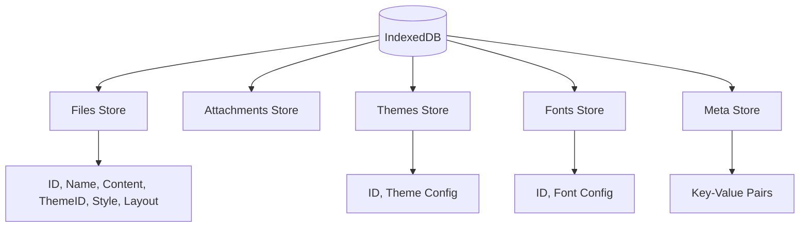
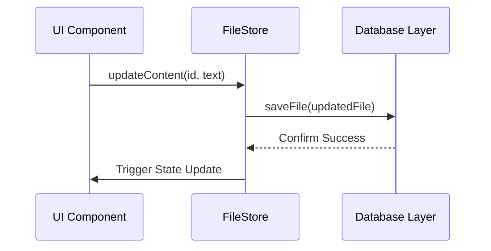

# Data Management and Persistence

The Data Management and Persistence module serves as the backbone of Markeon, transforming it from a transient browser-based editor into a reliable document workstation. Instead of relying on a remote backend, Markeon employs a **client-side-first persistence strategy**, leveraging IndexedDB to ensure that user documents, stylistic configurations, and application metadata are stored locally and available offline.

This architecture minimizes latency and maximizes privacy, as the user's data never leaves their machine unless explicitly exported.

## Architectural Role

The persistence layer is split into two distinct responsibilities: the **Database Layer** (`db.js`), which handles raw I/O and schema management, and the **State Orchestration Layer** (`useFileStore.js`), which manages the in-memory representation of the data for the UI.

| Component | Responsibility | Technology |
| :--- | :--- | :--- |
| **Database Layer** | Low-level CRUD operations and IndexedDB connection | IndexedDB / Browser API |
| **State Store** | Reactive state management and DB synchronization | Zustand |
| **ID Generation** | Creation of collision-resistant unique identifiers | Custom `nanoid` implementation |

## Data Storage Schema

Markeon organizes its local storage into several specialized object stores. This separation allows for efficient querying and prevents the main document store from becoming bloated with configuration data.



## The Database Layer (`db.js`)

The persistence logic is encapsulated in `src/lib/db.js`, which provides a promise-based wrapper around the asynchronous IndexedDB API. The `getDB()` function ensures a singleton connection to the database and handles versioning via an `upgrade` callback.

### Core Persistence Logic
The database implements standard CRUD operations across its stores. A critical pattern used here is the "upsert" (update or insert) approach, where `saveFile` is used regardless of whether the document is new or existing.

```javascript
// Example: File persistence implementation
export async function saveFile(file) {
  const db = await getDB();
  return db.put('files', file);
}

export async function getFile(id) {
  const db = await getDB();
  return db.get('files', id);
}
```

This abstraction allows the rest of the application to interact with the database without managing transaction lifecycles or connection states manually.

## State Orchestration (`useFileStore.js`)

While `db.js` handles the disk, `useFileStore.js` handles the "live" experience. It acts as a middleware that ensures the UI remains reactive while the database operates asynchronously.

### Data Flow: Modification to Persistence
When a user modifies a document, the application follows a specific synchronization flow to ensure data integrity:



### Implementation Detail: File Lifecycle
The store manages the creation and modification of files by combining ID generation with database calls.

```javascript
createFile: async (name = 'untitled.md') => {
  const id = nanoid();
  const file = makeFile(name);
  file.id = id;
  await saveFile(file);
  // Update local state to reflect the new file
  set((state) => ({ files: [...state.files, file] }));
},
```

The use of a custom `nanoid` implementation ensures that every file, attachment, and theme has a unique identifier without introducing heavy external dependencies, maintaining a lightweight bundle size.

## Configuration and Metadata

Beyond document storage, Markeon persists application-level settings using a dedicated `meta` store. This allows the application to remember user preferences (such as the last opened file or window dimensions) across sessions.

The meta system operates as a simple key-value store:

*   **`getMeta(key)`**: Retrieves a specific configuration value.
*   **`setMeta(key, value)`**: Persists a configuration change.

This design allows the software architect to add new global settings without needing to perform a database schema migration, providing high flexibility for future feature additions.