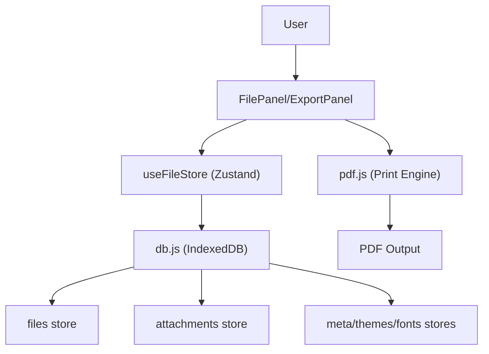

# Data & File Management

Markeon utilizes a local-first storage architecture to ensure data privacy and offline availability. All documents, configuration settings, and assets are persisted in the browser's IndexedDB.

## Storage Architecture

The application uses the `idb` library to manage a client-side database named `markeon`. This allows for complex queries and larger storage limits compared to `localStorage`.

### Database Schema

The database is divided into several object stores to separate content from configuration:

| Store | Key | Description |
| :--- | :--- | :--- |
| `files` | `id` | Stores Markdown content, filenames, and layout settings. |
| `attachments` | `id` | Stores binary data linked to files via `fileId`. |
| `themes` | `id` | Custom CSS themes for document rendering. |
| `fonts` | `id` | Custom font configurations. |
| `meta` | `key` | Project-level global configurations. |




## File Operations

Files are managed through the `FilePanel` component, providing standard CRUD operations and interoperability with the local filesystem.

### Import and Export (.md)

Markeon supports standard Markdown files for portability:

- **Import**: The application reads a `.md` file using the `FileReader` API, creates a new entry in the `files` object store, and populates it with the file's text content.
- **Export**: Content is retrieved from the database and converted into a `Blob` with the `text/markdown` MIME type, which is then triggered as a browser download.

### File Lifecycle

- **Creation**: New files are initialized with unique IDs and default layout settings.
- **Duplication**: Creates a new database record by copying the content and name of an existing file.
- **Deletion**: Removes the file record from the `files` store. (Note: Users are prompted with a confirmation dialog before deletion).

## PDF Export & Printing

Rather than using a server-side PDF generator, Markeon leverages the browser's native print engine with dynamic CSS injection to ensure high-fidelity output.

### The Print Pipeline

When a user triggers a PDF export, the following sequence occurs:

1. **Style Generation**: The `buildPrintStyle` function generates a `@media print` CSS block based on the active file's `layoutSettings`.
2. **Configuration**: 
   - **Paper Size**: Supports `A4`, `Letter`, and `Legal`.
   - **Orientation**: Supports `portrait` and `landscape`.
   - **Margins**: Customizable top, right, bottom, and left margins.
3. **Watermarking**: If a watermark is defined, a CSS `::after` pseudo-element is injected into the print root, centering the text with a rotation and low opacity.
4. **DOM Isolation**: The content of `#markeon-all-pages` is cloned into a temporary `#markeon-print-root` element to ensure only the document content (and not the UI) is printed.
5. **Execution**: The browser's `window.print()` dialog is triggered.

### PDF Layout Settings

Layout settings are stored per-file within the `files` object store, allowing different documents to have different print configurations.

```javascript
// Example layout object stored in DB
{
  paperSize: 'A4',
  orientation: 'portrait',
  margins: { top: '20mm', right: '20mm', bottom: '20mm', left: '20mm' },
  watermark: 'CONFIDENTIAL'
}
```