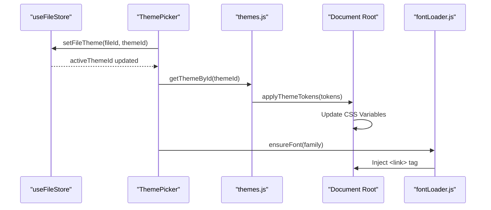

# Visual Design System

The Visual Design System in Markeon implements a tri-layered styling architecture that decouples application chrome (UI), document content (Typography), and physical output (Print). The system utilizes CSS Custom Properties (CSS variables) as the primary injection mechanism to achieve real-time theme switching without necessitating component re-renders for style updates.

### System Role & Architectural Position

The design system operates as a downstream consumer of the `useFileStore` state. While the application UI follows a global light/dark mode toggle, the document content is governed by a per-file `themeId`. This allows a single session to maintain multiple documents with diverging typographic identities (e.g., an "Academic Serif" thesis and a "Dark Tech" developer guide).

#### Styling Layer Specifications

| Layer | Scope | Control Mechanism | Primary Objective |
| :--- | :--- | :--- | :--- |
| **UI Chrome** | App Shell, Toolbar, Sidebar | `[data-theme='light|dark']` | Interface ergonomics and brand consistency. |
| **Document** | `.markeon-document` | `--font-body`, `--color-accent` | Readability, typographic hierarchy, and document intent. |
| **Print** | `#markeon-print-root` | `@media print` + A4 constraints | High-fidelity PDF/Paper output with pagination control. |

---

### Core Execution & Data Flow Mechanics

Theme application follows a unidirectional flow from the centralized state store to the DOM root. When a user selects a theme via the `ThemePicker`, the system synchronizes the file-specific metadata and triggers a side-effect to update the CSS variable map.

#### Theme Injection Sequence



**Key Execution Points:**
*   **Token Injection:** `applyThemeTokens` iterates over the theme's token object and calls `document.documentElement.style.setProperty()`. This ensures that any CSS rule referencing `var(--font-body)` updates instantly across the entire DOM tree.
*   **Typography Lazy-Loading:** To prevent render-blocking and unnecessary bandwidth consumption, Google Fonts are injected dynamically. The `fontLoader` maintains a `Set` of loaded families to prevent duplicate `<link>` injections.
*   **CSS Cascade Strategy:** Global styles are defined in `global.css`, while document-specific overrides are encapsulated in `.markeon-document`. This prevent "leaking" document styles (like serif fonts) into the UI chrome.

---

### Implementation Deep Dive

#### Dynamic Typography Loading
The `fontLoader` acts as a singleton manager for external stylesheets. It maps human-readable family names to specific Google Fonts API endpoints.

```js title="src/lib/fontLoader.js"
const loaded = new Set()

const GOOGLE_FONT_URLS = {
  'Crimson Text': 'https://fonts.googleapis.com/css2?family=Crimson+Text:ital,wght@0,400;0,600;1,400&display=swap',
  'Nunito': 'https://fonts.googleapis.com/css2?family=Nunito:wght@300..700&display=swap',
  // ... other mappings
}

export function ensureFont(family) {
  if (loaded.has(family)) return
  const url = GOOGLE_FONT_URLS[family]
  if (!url) return
  const link = document.createElement('link')
  link.rel = 'stylesheet'
  link.href = url
  document.head.appendChild(link)
  loaded.add(family)
}
```
*   **`loaded` Set:** Ensures $O(1)$ lookup for already injected fonts.
*   **DOM Injection:** Appends a `<link>` element to `document.head`, triggering the browser's asynchronous font download.

#### Theme Token Mapping
Themes are defined as data objects containing metadata (name, tags) and a `tokens` map.

```js title="src/lib/themes.js"
export function applyThemeTokens(tokens) {
  const root = document.documentElement
  for (const [key, value] of Object.entries(tokens)) {
    root.style.setProperty(key, value)
  }
}

export function clearThemeTokens(tokens) {
  const root = document.documentElement
  for (const key of Object.keys(tokens)) {
    root.style.removeProperty(key)
  }
}
```
*   **`applyThemeTokens`**: Maps the `tokens` object keys directly to CSS variables.
*   **Complexity**: Time complexity is $O(N)$ where $N$ is the number of tokens per theme.

#### Print Orchestration
The print system employs a "Nuclear Hide" strategy. Instead of attempting to hide individual elements, it suppresses the entire application body and promotes a specific print root.

```css title="src/styles/print.css"
@media print {
  @page {
    size: A4 portrait;
    margin: 0;
  }

  body > * {
    display: none !important;
  }

  #markeon-print-root {
    display: block !important;
    position: static !important;
    width: 100% !important;
    print-color-adjust: exact !important;
    -webkit-print-color-adjust: exact !important;
  }
}
```
*   **`position: static`**: Crucial for multi-page flow; `absolute` or `fixed` positioning breaks the browser's native pagination.
*   **`print-color-adjust`**: Forces the browser to render background colors (e.g., code block backgrounds) which are typically stripped by print drivers.
*   **Page Break Logic**: `.page-break` elements are converted from visual dividers in the UI to `break-before: page` directives in print.

---

### Method & State Reference

#### Document Token Schema

| Token | Type | Default (Academic) | Description |
| :--- | :--- | :--- | :--- |
| `--font-heading` | `string` | `'Playfair Display', serif` | Heading font family. |
| `--font-body` | `string` | `'Source Serif 4', serif` | Paragraph font family. |
| `--font-mono` | `string` | `'JetBrains Mono', monospace` | Inline/Block code font family. |
| `--color-accent` | `hex/rgb` | `#8b3a3a` | Primary accent for links and blockquote borders. |
| `--base-size` | `string` | `12pt` | Root font size for the document. |
| `--line-height` | `number` | `1.8` | Leading for body text. |
| `--page-bg` | `hex/rgb` | `#ffffff` | Background color of the document page. |

#### Failure Modes & Recovery

| Failure Scenario | Impact | Recovery Mechanism |
| :--- | :--- | :--- |
| **Font API Timeout** | Text falls back to generic `serif`/`sans-serif`. | CSS stack provides system-ui fallbacks in `global.css`. |
| **Invalid Theme ID** | UI may display incorrect theme name. | `getThemeById` falls back to `BUILT_IN_THEMES[0]`. |
| **Print Overflow** | Content clipped at page edges. | `white-space: pre-wrap` and `word-break: break-word` enforced in `print.css`. |
| **CSS Variable Conflict** | Unexpected colors in UI chrome. | Strict naming convention (e.g., `--color-text` for doc vs `--text-primary` for UI). |