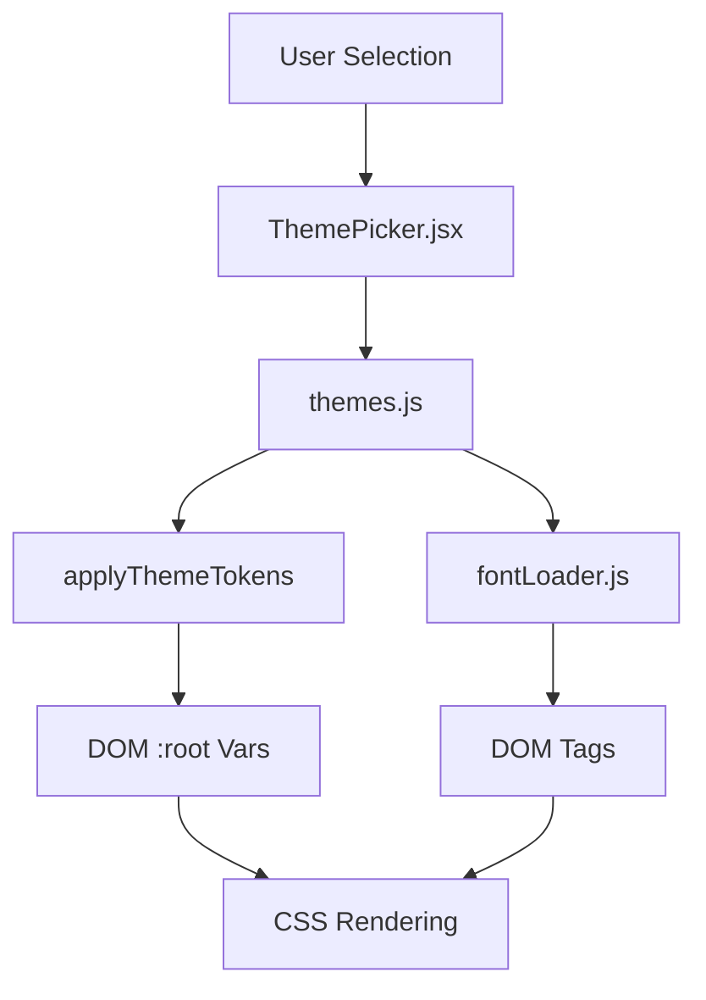

# Visual Identity and Theming

The Visual Identity and Theming module in Markeon implements a decoupled styling architecture that separates structural layout from aesthetic presentation. It utilizes a hybrid approach combining Tailwind CSS for utility-first layout and a dynamic CSS Variable (Custom Properties) system for real-time theme switching and document-specific branding. This architecture allows the application to modify the visual identity of the editor and the rendered document without requiring a full page reload or complex CSS-in-JS runtime overhead.

The system is centered around "Design Tokens"—a set of standardized CSS variables that act as the single source of truth for colors, spacing, and typography across the entire application.

### Core Module Components

| Export/Module | Responsibility | Primary Dependencies |
| :--- | :--- | :--- |
| `ThemePicker` (Component) | UI interface for selecting and applying theme presets. | `themes.js`, React |
| `fontLoader.js` (Lib) | Dynamic injection of external web fonts into the DOM. | Browser DOM API |
| `themes.js` (Lib) | Theme registry and logic for manipulating CSS root variables. | Browser DOM API |
| `global.css` (Styles) | Base design tokens, Umbreon palette, and global resets. | Tailwind CSS |

---

## Architecture, State & Data Flow

The theming system operates as a unidirectional flow: from user selection to DOM mutation. Unlike state-driven styles (where React state might dictate a class name), Markeon utilizes a "Token Injection" pattern. When a theme is selected, the system calculates the required CSS variables and injects them directly into the `:root` element of the document.

### Theme Application Workflow

The process of changing a theme follows this sequence:
1. The user interacts with the `ThemePicker` component.
2. `ThemePicker` invokes `getThemeById()` to retrieve the specific token set from the theme registry.
3. The `applyThemeTokens()` function iterates through the token key-value pairs and updates the CSS variables on the document root.
4. If the theme specifies a custom font, `ensureFont()` is called to check if the font is already present in the DOM; if not, it injects a Google Fonts `<link>` tag.
5. The browser re-renders the UI based on the updated CSS variable values.

### Data Flow Diagram



---

## In-Depth Code Walkthrough & Implementation Details

### Dynamic Token Manipulation

The core of the theming engine resides in `src/lib/themes.js`. Rather than toggling classes, the system manipulates the style object of the root element.

```javascript title="src/lib/themes.js"
export function applyThemeTokens(tokens) {
  const root = document.documentElement;
  Object.entries(tokens).forEach(([key, value]) => {
    root.style.setProperty(`--${key}`, value);
  });
}

export function clearThemeTokens(tokens) {
  const root = document.documentElement;
  Object.entries(tokens).forEach(([key]) => {
    root.style.removeProperty(`--${key}`);
  });
}
```

The `applyThemeTokens` function takes a `tokens` object where keys correspond to the CSS variable name (excluding the `--` prefix) and values are the CSS values (e.g., hex codes). By using `document.documentElement.style.setProperty`, the system overrides any defaults defined in `global.css`. The `clearThemeTokens` function is critical for reverting the document to the base "Umbreon" palette by removing the inline styles from the root element, allowing the CSS cascade to fall back to the stylesheet defaults.

### On-Demand Font Loading

To optimize the initial bundle size and prevent the browser from downloading dozens of unused fonts, `src/lib/fontLoader.js` implements a lazy-loading mechanism.

```javascript title="src/lib/fontLoader.js"
export function ensureFont(family) {
  if (!family) return;
  const fontId = `font-${family.replace(/\s+/g, '-').toLowerCase()}`;
  if (document.getElementById(fontId)) return;

  const link = document.createElement('link');
  link.id = fontId;
  link.rel = 'stylesheet';
  link.href = `https://fonts.googleapis.com/css2?family=${family.replace(/\s+/g, '+')}:wght@400;700&display=swap`;
  document.head.appendChild(link);
}
```

The `ensureFont` function uses a unique `fontId` to prevent duplicate `<link>` tags from being injected into the `<head>`. It transforms the font family name into a URL-safe format (replacing spaces with `+` for the API request and `-` for the DOM ID). The `display=swap` parameter is utilized to ensure that text remains visible during font load, preventing the "Flash of Invisible Text" (FOIT).

### Global Styling and Variable Architecture

The `global.css` file defines the foundational design system using the `@theme` directive (Tailwind v4+) and standard CSS variables.

```css title="src/styles/global.css"
@theme inline {
  --color-bg: var(--bg);
  --color-text: var(--text);
  --color-border: var(--border);
  --color-primary: var(--primary);
}

[data-theme='dark'] {
  --bg: #1a1a1a;
  --text: #e5e5e5;
  --border: #333;
  --text-muted: #a0a0a0;
}

[data-theme='light'] {
  --bg: #ffffff;
  --text: #1a1a1a;
  --border: #ddd;
  --text-muted: #666;
}
```

The styling architecture is layered:
1. **Base Layer**: `global.css` defines default variables for the "Umbreon" palette.
2. **Mode Layer**: `[data-theme='dark']` and `[data-theme='light']` selectors override base variables to handle system-wide dark/light modes.
3. **Dynamic Layer**: The `applyThemeTokens` function injects inline styles on `:root`, which take the highest specificity, overriding both the Base and Mode layers.
4. **Utility Layer**: Tailwind classes reference these variables (e.g., `bg-[var(--bg)]`), ensuring that a single variable change propagates through the entire UI.

### Theme Selection Component

The `ThemePicker.jsx` component acts as the bridge between the UI and the `themes.js` logic.

```jsx title="src/components/toolbar/ThemePicker.jsx"
export default function ThemePicker() {
  const handleThemeChange = (themeId) => {
    const theme = getThemeById(themeId);
    if (theme) {
      applyThemeTokens(theme.tokens);
      ensureFont(theme.fontFamily);
    }
  };

  return (
    <div className="theme-picker-container">
      {/* Map through themes and render buttons calling handleThemeChange */}
    </div>
  );
}
```

The `handleThemeChange` function encapsulates the entire theme transition logic. It first resolves the theme configuration object via `getThemeById`, then sequentially updates the CSS tokens and ensures the required typography is loaded. This ensures that the visual change and the font change occur synchronously from the user's perspective.

---

## API / Method Reference

### `themes.js`

#### `getThemeById(id: string): ThemeObject | undefined`
Retrieves a theme configuration object from the internal registry.
- **Parameters**: `id` - The unique identifier for the theme preset.
- **Returns**: An object containing `tokens` (key-value pairs of CSS variables) and `fontFamily` (string). Returns `undefined` if the ID is not found.

#### `applyThemeTokens(tokens: Record<string, string>): void`
Iterates through the provided tokens and applies them to the document root.
- **Parameters**: `tokens` - A map of variable names to values.
- **Invariants**: Assumes the `document` object is available (Browser environment).

#### `clearThemeTokens(tokens: Record<string, string>): void`
Removes specific inline styles from the document root to revert to stylesheet defaults.
- **Parameters**: `tokens` - The set of tokens to be removed.

### `fontLoader.js`

#### `ensureFont(family: string): void`
Checks for the existence of a font link and injects one if missing.
- **Parameters**: `family` - The exact name of the Google Font family.
- **Side Effects**: Appends a `<link>` element to `document.head`.

---

## Error Handling, Edge Cases & Performance

### Performance Optimizations
- **DOM Minimization**: The system avoids React state updates for every color change. By modifying CSS variables on `:root`, the browser handles the style recalculation natively, which is significantly more performant than re-rendering a large React component tree with new style props.
- **Font Deduplication**: The `fontId` check in `ensureFont` prevents the browser from making redundant network requests for fonts already loaded in the current session.

### Edge Cases & Fallbacks
- **Invalid Theme IDs**: `getThemeById` returns `undefined` for unknown IDs, and `ThemePicker` performs a null check before calling `applyThemeTokens`, preventing runtime crashes during theme switching.
- **Font Loading Failure**: Since Google Fonts are loaded via `<link>` tags with `display=swap`, the browser falls back to system sans-serif fonts immediately if the network request fails or times out, ensuring the document remains readable.
- **Specificity Conflicts**: By applying tokens to `document.documentElement.style`, the system ensures that dynamic themes always override the defaults in `global.css`, regardless of the selector complexity in the stylesheet.

### Concurrency & State
Because the theming system modifies the global DOM state, it is inherently synchronous. There are no race conditions between token application and font loading because the browser's rendering engine handles the style update as a single reflow/repaint cycle once the DOM is mutated.