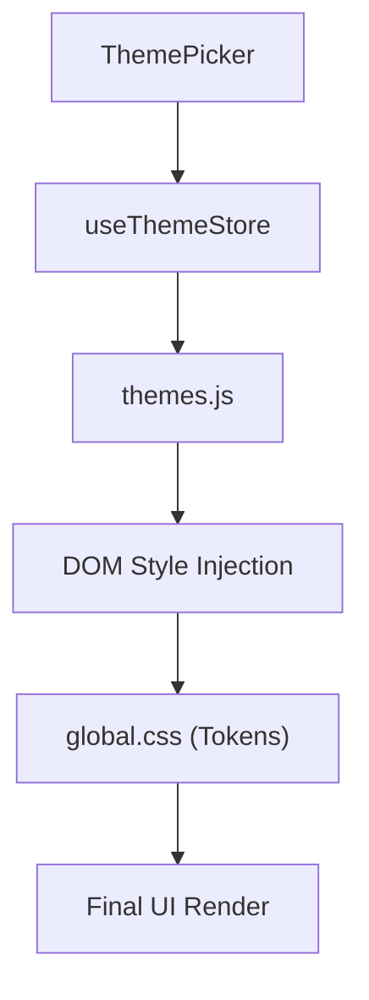

# Visual Identity & Theming

The Visual Identity system in Markeon is a dual-layer engine that separates **Color Mode** (Light/Dark) from **Document Themes** (Custom Token Sets). It utilizes a CSS-variable-first approach, where JavaScript manages the state and application of tokens, while Tailwind CSS references these variables for layout and component styling.

## Architectural Overview

The theming engine operates by mutating CSS custom properties on the root element or specific data-attribute selectors. This ensures that theme changes are reflected globally without requiring a full application re-render.



## State Management

The `useThemeStore` handles the persistence and current state of the visual identity. It manages the toggle between light/dark modes and the selection of specific theme presets.

```javascript title="src/store/useThemeStore.js"
export const useThemeStore = create((set) => ({
  mode: 'dark',
  activeTheme: 'default',
  themeOverrides: {},
  setMode: (mode) => set({ mode }),
  toggleMode: () => set((state) => ({ mode: state.mode === 'dark' ? 'light' : 'dark' })),
  setActiveTheme: (id) => set({ activeTheme: id }),
  setThemeOverride: (key, value) => set((state) => ({ 
    themeOverrides: { ...state.themeOverrides, [key]: value } 
  })),
  clearThemeOverrides: () => set({ themeOverrides: {} }),
}));
```

### Store State Reference

| Property | Type | Description | Persistence |
| :--- | :--- | :--- | :--- |
| `mode` | `string` | Either `'light'` or `'dark'`. | Yes |
| `activeTheme` | `string` | The ID of the active theme preset (e.g., 'umbreon'). | Yes |
| `themeOverrides` | `object` | Key-value pairs for custom CSS variable overrides. | Yes |

## Theme Application Logic

The `themes.js` library acts as the bridge between the store's state and the browser's DOM. It transforms theme configuration objects into active CSS variables.

```javascript title="src/lib/themes.js"
export function applyThemeTokens(tokens) {
  const root = document.documentElement;
  Object.entries(tokens).forEach(([key, value]) => {
    root.style.setProperty(`--${key}`, value);
  });
}

export function clearThemeTokens() {
  const root = document.documentElement;
  // Removes inline styles to revert to CSS stylesheet defaults
  root.setAttribute('style', '');
}
```

When `setActiveTheme` is called, the system retrieves the token map via `getThemeById(id)` and passes it to `applyThemeTokens`. This allows for dynamic theme switching without reloading the page.

## Design Token System

The visual identity is defined in `global.css` using a tokenized approach. The "Umbreon" palette serves as the base, providing a set of semantic variables that Tailwind classes reference.

### CSS Variable Structure

```css title="src/styles/global.css"
/* Light mode overrides */
[data-theme='light'] {
  --bg: #ffffff;
  --text: #1a1a1a;
  --border: #e5e7eb;
  --accent: #3b82f6;
}

/* Dark mode (default) */
[data-theme='dark'] {
  --bg: #0f172a;
  --text: #f8fafc;
  --border: #1e293b;
  --accent: #60a5fa;
}
```

### Implementation Details
1. **Data Attributes**: The application applies `data-theme="light|dark"` to the `<html>` element.
2. **Tailwind Integration**: Tailwind is configured to use these variables (e.g., `bg-[var(--bg)]`), ensuring that utility classes respond immediately to theme changes.
3. **Reading Mode**: A specialized state `[data-reading-mode='true']` is used to hide editor chrome (sidebar, file tree) via CSS, optimizing the view for document consumption.

## Theme Picker Component

The `ThemePicker` provides the user interface for interacting with the `useThemeStore`. It triggers the state changes that eventually lead to the injection of CSS tokens.

```jsx title="src/components/toolbar/ThemePicker.jsx"
export default function ThemePicker() {
  const { activeTheme, setActiveTheme } = useThemeStore();
  
  return (
    <div className="theme-picker-container">
      {themes.map(theme => (
        <button 
          key={theme.id}
          className={activeTheme === theme.id ? 'active' : ''}
          onClick={() => setActiveTheme(theme.id)}
        >
          {theme.name}
        </button>
      ))}
    </div>
  );
}
```

The component utilizes the `setActiveTheme` action, which updates the Zustand store, triggering the `applyThemeTokens` side effect to update the document root's style properties.