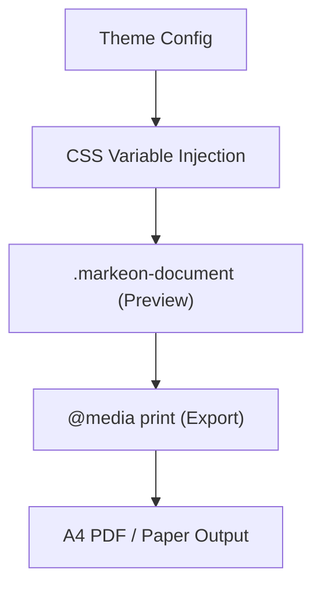

# Print & Document Styling

Markeon employs a dual-layer CSS strategy to ensure a seamless transition between the interactive editor preview and high-fidelity, print-ready document output. The system relies on dynamic CSS variables injected via the `PreviewPane` to support real-time theming.

## Document Architecture

The rendering engine uses two primary stylesheets to handle the document lifecycle:
1. `document.css`: Controls the visual representation within the application UI.
2. `print.css`: A specialized media query layer that optimizes the document for A4 PDF export and physical printing.




## Theming & Typography

The `.markeon-document` class serves as the root for all rendered content. It utilizes a flexible variable system that allows users to switch themes without reloading the DOM.

### CSS Variable Specifications

The following variables are injected by the active theme. If no theme is provided, the system falls back to the **Academic Serif** defaults.

| Variable | Fallback Value | Description |
| :--- | :--- | :--- |
| `--font-body` | `'Source Serif 4', serif` | Primary body text typeface |
| `--font-heading` | `'Playfair Display', serif` | Typeface for $\text{h1}$ through $\text{h6}$ |
| `--font-mono` | `'JetBrains Mono', monospace` | Typeface for code and technical blocks |
| `--base-size` | `12pt` | Root font size for the document |
| `--line-height` | `1.8` | Vertical spacing for readability |
| `--color-text` | `#1a1a1a` | Primary text color |
| `--color-accent` | `#8b3a3a` | Color for links and blockquote borders |
| `--color-code-bg` | `#f5f5f0` | Background for inline code and table headers |

## Code & Technical Rendering

Markeon distinguishes between inline code and full blocks to optimize readability and syntax highlighting.

### Inline Code
Inline code is styled for subtle contrast, using a smaller font size (`0.86em`) and a light background to separate technical terms from prose.

### Shiki Code Blocks
For multi-line blocks, Markeon utilizes Shiki. The `.shiki` class overrides standard `pre` styling to ensure:
- **Bordering**: A subtle border defined by `--color-border`.
- **Overflow**: Horizontal scrolling (`overflow-x: auto`) to prevent document layout breakage.
- **Padding**: Consistent inner spacing (`1em 1.2em`).

## Print Optimization Strategy

The print engine implements a "Nuclear Hide" strategy. When the print trigger is activated, the browser ignores all application chrome (toolbars, sidebars, and navigation) and renders only the `#markeon-print-root`.

### Pagination Control

To prevent awkward content splitting (e.g., a heading appearing at the bottom of a page without its following paragraph), Markeon applies specific fragmentation rules:

- **Avoid Breaks**: Headings ($\text{h1}$–$\text{h6}$), code blocks, blockquotes, and tables are marked with `break-inside: avoid`.
- **Typography Reset**: Line height is tightened to `1.7` and code font size is locked to `9pt` for professional density.
- **Color Fidelity**: `print-color-adjust: exact` is applied to ensure background colors (like code blocks) are preserved in PDF exports.

### Manual Page Breaks

The `.page-break` class serves two different purposes depending on the context:

1. **Preview Mode**: Displays as a dashed horizontal line with a "PAGE BREAK" label to notify the author of the split.
2. **Print Mode**: Becomes invisible and triggers a hard page break using `break-before: page`.

```css
/* Preview Appearance */
.markeon-document .page-break {
  border-top: 2px dashed var(--accent);
  opacity: 0.4;
}

/* Print Behavior */
@media print {
  #markeon-print-root .markeon-document .page-break {
    page-break-before: always;
    visibility: hidden;
  }
}
```