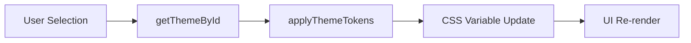

# Theme Configuration

Theme Configuration in Markeon is a dynamic styling system designed to decouple the visual presentation of the editor and the rendered document from the core application logic. Instead of using static CSS classes for every possible state, Markeon employs a **Design Token** architecture.

By utilizing CSS Custom Properties (variables), the system allows for real-time switching between light and dark modes, as well as the application of specific theme presets that alter the "feel" of the document without requiring a page reload or a complete CSS rebuild.

### Architectural Role

The theme system sits between the application state (the selected theme ID) and the browser's rendering engine. It acts as a translation layer that converts a theme definition (a set of tokens) into active CSS variables applied to the DOM.

| Component | Responsibility | Implementation |
| :--- | :--- | :--- |
| **Theme Tokens** | Define the raw colors, spacing, and borders. | CSS Variables (`--bg`, `--border`) |
| **Theme Registry** | Store and retrieve theme definitions by ID. | `getThemeById()` in `themes.js` |
| **Token Applier** | Inject/Remove tokens from the document root. | `applyThemeTokens()` / `clearThemeTokens()` |
| **Global Styles** | Define how tokens are used across the UI. | `global.css` |

### Data Flow and Application

The transition from a user selecting a theme to the UI updating follows a linear pipeline. The system distinguishes between the **App Theme** (the global UI shell, like Dark/Light mode) and **Document Tokens** (specific colors applied to the editor surface).



1.  **Selection**: The user chooses a theme from the settings.
2.  **Retrieval**: `getThemeById(id)` fetches the corresponding token set.
3.  **Injection**: `applyThemeTokens(tokens)` iterates through the token set and applies them to the document's root or a specific container.
4.  **Reaction**: Since the `global.css` references these variables (e.g., `var(--bg)`), the browser automatically updates all elements using those tokens.

### Technical Implementation

#### Dynamic Token Management
The logic for manipulating themes is encapsulated in `src/lib/themes.js`. Rather than swapping entire stylesheets, Markeon modifies specific CSS variables. This ensures that transitions are smooth and that the application doesn't lose state during a theme change.

```javascript
// Example of the token application logic
export function applyThemeTokens(tokens) {
  // Iterates through the token object and sets CSS properties on the root
  Object.entries(tokens).forEach(([key, value]) => {
    document.documentElement.style.setProperty(key, value);
  });
}

export function clearThemeTokens() {
  // Removes inline styles to revert to global.css defaults
  document.documentElement.removeAttribute('style');
}
```

This approach allows Markeon to maintain a base set of styles in `global.css` while overlaying specific theme presets dynamically.

#### The CSS Token Bridge
In `src/styles/global.css`, the application defines a fallback palette (the "Umbreon" palette) and maps these to Tailwind-compatible variables. This allows the developer to use Tailwind classes like `bg-[var(--bg)]` while the actual value of `--bg` changes based on the active theme.

```css
/* Global Theme Definitions */
[data-theme='dark'] {
  --bg: #1a1a1a;
  --text: #eeeeee;
  --border: #333333;
}

[data-theme='light'] {
  --bg: #ffffff;
  --text: #1a1a1a;
  --border: #dddddd;
}
```

### Visual State Logic

The theme system also handles specialized UI states through data attributes. For instance, when the application enters **Reading Mode**, the theme configuration uses CSS selectors to hide the editor chrome (like the file tree and preview pane) without unmounting the components from the React tree.

```css
/* Reading mode — hide editor chrome via CSS */
[data-reading-mode='true'] #file-tree,
[data-reading-mode='true'] #preview-pane {
  display: none;
}
```

This ensures that the transition between "Editing" and "Reading" is instantaneous and handled entirely by the CSS engine, while the theme tokens ensure the document remains visually consistent across both modes.