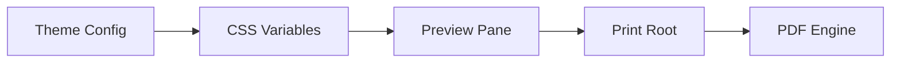

# Document Styling and Print Layout

The Document Styling and Print Layout module is responsible for the visual translation of Markdown content into a professional, "paper-like" document. Its primary goal is to ensure a seamless transition between the interactive editor preview and the final PDF export, maintaining typographic consistency while handling the technical constraints of browser-based pagination.

This module is split into two distinct CSS strategies: one for the live **Preview Pane** (dynamic and themeable) and one for the **Print Engine** (isolated and optimized for A4 output).

### Architectural Role

Styling in Markeon is not merely cosmetic; it is a critical part of the document pipeline. By separating screen styles from print styles, the system avoids "UI leakage" (where editor buttons or sidebars appear in the PDF) and overcomes common CSS pitfalls related to multi-page browser rendering.

| Component | Responsibility | Key File | Strategy |
| :--- | :--- | :--- | :--- |
| **Document Base** | Typography, spacing, and theme application. | `document.css` | CSS Variables $\rightarrow$ `.markeon-document` |
| **Print Root** | Page isolation and A4 pagination. | `print.css` | Nuclear hide $\rightarrow$ `#markeon-print-root` |

### Styling Data Flow

The visual identity of a document is determined by the active theme, which injects CSS variables into the preview environment. When the user triggers a print or export action, the system shifts from a fluid web layout to a rigid page-based layout.



### The Preview Strategy: `.markeon-document`

The `.markeon-document` class serves as the stylistic anchor for all rendered Markdown. Instead of hard-coding colors and fonts, it relies on CSS variables injected by the `PreviewPane`. This allows the application to switch between themes (e.g., "Academic Serif") without reloading the CSS.

#### Typography and Theming
The document uses a hierarchical scale for headings and consistent spacing for paragraphs to mimic a printed manuscript.

```css
/* Example of theme-driven accent colors and typography */
.markeon-document {
    /* Variables injected by PreviewPane */
    color: var(--color-text, #333);
}

.markeon-document a { 
    color: var(--color-accent, #8b3a3a); 
}

.markeon-document h1 { 
    font-size: 2.2em; 
    margin-top: 0; 
}
```

#### Code Block Handling
Markeon distinguishes between inline code and formatted blocks. High-performance syntax highlighting is handled via Shiki, with a fallback system for standard `<pre>` tags.

```css
/* Shiki code blocks for high-fidelity highlighting */
.markeon-document .shiki {
    padding: 1em;
    border-radius: 4px;
}

/* Inline code styling to differentiate from blocks */
.markeon-document :not(pre) > code {
    background-color: rgba(0,0,0,0.05);
    padding: 0.2em 0.4em;
}
```

### The Print Strategy: PDF Optimization

Printing from a web browser is notoriously difficult due to how elements are positioned. Markeon employs a "Nuclear Hide" strategy in `print.css` to ensure that only the document content is sent to the printer.

#### The "Nuclear Hide" and Isolation
To prevent the editor's UI (ribbons, sidebars, toolbars) from appearing in the PDF, the print stylesheet explicitly hides all top-level elements and reveals only the `#markeon-print-root`.

```css
/* Hide all application chrome */
body > * {
    display: none !important;
}

/* Reveal only the print container */
#markeon-print-root {
    display: block !important;
    position: static !important;
}
```

#### Solving the Pagination Problem
A common failure in PDF exports is the use of `fixed` or `absolute` positioning, which often causes the browser to truncate content after the first page. Markeon solves this by enforcing a natural-flow block strategy.

1. **Natural Flow**: No fixed positioning is used within the print root.
2. **A4 Constraints**: The `@page` directive ensures the browser targets standard A4 dimensions.
3. **Explicit Page Breaks**: The `.page-break` class, which appears as a visual marker in the editor, is converted into a hard CSS page break during printing.

```css
/* Convert preview markers into actual PDF page breaks */
#markeon-print-root .markeon-document .page-break {
    page-break-after: always;
    break-after: page;
}

/* Remove visual markers from the final printed output */
#markeon-print-root .markeon-document .page-break::after {
    display: none;
}
```

### Technical Considerations for Complex Content

*   **KaTeX**: Math blocks are targeted specifically within the print root to ensure formulas do not wrap awkwardly across page boundaries.
*   **Mermaid Diagrams**: The system hides fallback labels and ensures SVGs are rendered cleanly without browser-inserted borders or margins.
*   **Images**: Images are constrained to the document width within the print root to prevent "overflow" which could trigger horizontal scrolling or clipping in the resulting PDF.