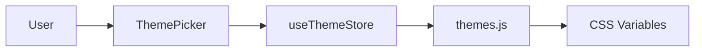

# Theming and Visual Identity

The Theming and Visual Identity module is the orchestration layer responsible for the aesthetic presentation of the Markeon editor and its generated documents. Rather than relying on static CSS, Markeon employs a dynamic token-based system that allows users to switch between predefined themes and override specific visual properties in real-time.

This system ensures a consistent "paper-like" experience while providing the flexibility to shift between light and dark modes or brand-specific color palettes without reloading the application.

## Architectural Role

The theming system operates as a unidirectional pipeline: User Input $\rightarrow$ State Store $\rightarrow$ DOM Manipulation. It decouples the visual definition (the "Theme") from the UI components, allowing components to reference abstract CSS variables (tokens) rather than hardcoded values.

### Core Components

| Component | Responsibility | Source |
| :--- | :--- | :--- |
| `useThemeStore` | Manages active theme ID, color mode, and custom overrides. | `src/store/useThemeStore.js` |
| `themes.js` | Library of theme definitions and logic to inject tokens into the DOM. | `src/lib/themes.js` |
| `ThemePicker` | UI interface for users to select and switch themes. | `src/components/toolbar/ThemePicker.jsx` |

## Component Interaction & Data Flow

The theming process is triggered by user interaction in the `ThemePicker`. When a user selects a new theme, the state is updated in the `useThemeStore`, which then triggers the application of new CSS tokens via the `themes.js` utility functions.



1. **Selection**: The user interacts with the `ThemePicker` to change the theme or toggle the color mode.
2. **State Update**: `useThemeStore` updates the `activeTheme` or `mode` state.
3. **Token Application**: The system calls `applyThemeTokens()`, which translates the theme's JavaScript definition into CSS custom properties (e.g., `--primary-color`) attached to the document root.
4. **Visual Update**: The browser re-renders components using the updated CSS variable values.

## Theme State Management

State is managed via a specialized store that tracks not only the active theme but also granular overrides. This allows users to customize specific aspects of a theme without creating an entirely new theme definition.

```javascript
// src/store/useThemeStore.js
setMode: (mode) => set({ mode }),
toggleMode: () => set((state) => ({ mode: state.mode === 'light' ? 'dark' : 'light' })),
setActiveTheme: (id) => set({ activeTheme: id }),
setThemeOverride: (key, value) => set((state) => ({
  themeOverrides: { ...state.themeOverrides, [key]: value }
})),
clearThemeOverrides: () => set({ themeOverrides: {} }),
```

The store utilizes a `partialize` function, indicating that only a subset of the theme state is persisted to local storage, ensuring that temporary session overrides do not necessarily persist unless intended.

## Token Application Logic

The bridge between the JavaScript state and the visual CSS is handled by `src/lib/themes.js`. This utility abstracts the complexity of manipulating the DOM's style properties.

```javascript
// src/lib/themes.js
export function getThemeById(id) {
  // Retrieves the specific theme configuration based on the provided ID
}

export function applyThemeTokens(tokens) {
  // Iterates through token definitions and applies them as 
  // CSS variables to the root element
}

export function clearThemeTokens(tokens) {
  // Removes specific CSS variables to revert to default styles
}
```

By using `applyThemeTokens`, Markeon can dynamically change the visual identity of the editor. This is critical for the "Document Styling" aspect of the project, as the same tokens are used to define the layout for both the screen preview and the final PDF print output, ensuring visual parity.

## UI Integration: The ThemePicker

The `ThemePicker` component provides the user interface for these operations. It acts as a consumer of the `useThemeStore`, dispatching actions based on user selection. It handles the interaction logic (such as dropdown navigation) and communicates the intent to change the visual identity back to the global state.