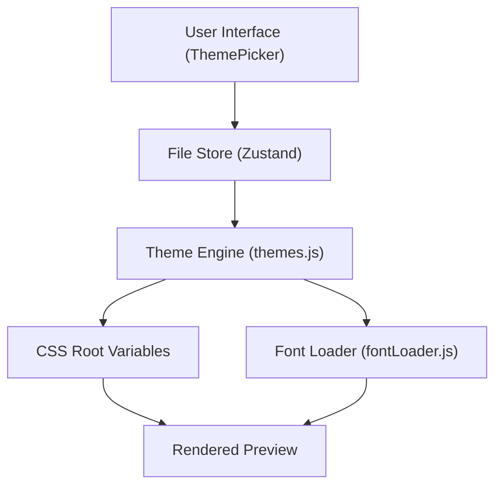

# Theming & Visuals

Markeon employs a dual-layer theming architecture. It distinguishes between the **UI Theme**, which controls the application's interface (chrome, toolbars, and sidebars), and the **Document Theme**, which dictates the visual identity of the rendered content.

## Architecture Overview

The system separates aesthetic concerns into global CSS variables and dynamic JS-driven tokens. While the UI theme is a global toggle, document themes are persisted per-file in the application store.




## UI Design System

The application interface uses the "Umbreon" palette, a high-contrast system designed for focus and reduced eye strain. It is implemented via Tailwind CSS and global CSS variables.

### Light & Dark Modes
UI themes are applied via a `data-theme` attribute on the HTML root.

- **Dark Mode (`[data-theme='dark']`)**: The default experience. Uses a deep charcoal background (`#0c0c0c`) with gold accents (`#e8b84b`) to provide a professional, "IDE-like" feel.
- **Light Mode (`[data-theme='light']`)**: A soft, paper-inspired aesthetic using off-whites (`#f9f7f4`) and deep gold accents.

### UI Token Mapping
Key interface variables include:
- `--bg`: Main application background.
- `--surface`: Primary container background.
- `--accent`: Primary brand color for active states and highlights.
- `--glass-bg`: Semi-transparent backgrounds for overlays with `backdrop-filter: blur`.

## Document Themes

Document themes allow users to change the typography and color scheme of their documents independently of the UI theme. This is critical for preparing documents for different outputs (e.g., academic papers vs. technical documentation).

### The Token System
Each theme is defined as a set of CSS tokens. When a theme is selected, these tokens are injected into the `:root` element via `applyThemeTokens()`.

| Token | Description | Example Value |
| :--- | :--- | :--- |
| `--font-heading` | Font family for H1-H6 | `'Playfair Display', serif` |
| `--font-body` | Main paragraph typography | `'Source Serif 4', serif` |
| `--color-accent` | Accent color for links/highlights | `#8b3a3a` |
| `--base-size` | Root font size for the document | `12pt` |
| `--page-bg` | Background color of the preview page | `#ffffff` |

### Built-in Presets
Markeon ships with several curated presets:
- **Academic Serif**: Formal, high-readability serif fonts for print-style documents.
- **GitHub Docs**: A clean, sans-serif minimal look mirroring modern documentation.
- **Dark Tech**: A high-contrast dark mode specifically for the document content.
- **Warm Journal**: A cream-colored background with serif fonts for a personal feel.

## Dynamic Font Loading

To prevent performance degradation and "Flash of Unstyled Text" (FOUT) across all documents, Markeon uses a lazy-loading strategy for Google Fonts.

The `ensureFont(family)` utility manages this process:
1. Checks if the font family is already present in a session-wide `Set`.
2. If not loaded, it dynamically creates a `<link>` tag.
3. Appends the link to the document `<head>`, ensuring each font is requested only once per session.

## Reading Mode

Reading mode is a CSS-driven state that maximizes the preview area by hiding the editor chrome. Instead of unmounting components (which would destroy the CodeMirror state), Markeon uses the `[data-reading-mode='true']` selector to collapse the editor panes to zero width and opacity.

```css
[data-reading-mode='true'] #editor-pane {
  width: 0 !important;
  opacity: 0;
  pointer-events: none;
}
```