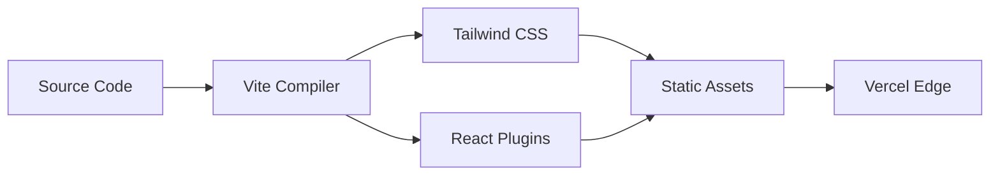

# Deployment and Configuration

The Deployment and Configuration module defines the lifecycle of Markeon from source code to a production-ready Progressive Web Application (PWA). Its primary role is to orchestrate the build process, manage asset optimization, and ensure that the application remains functional and performant in an offline-first environment.

At its core, Markeon leverages a modern Vite-based pipeline that integrates Tailwind CSS for styling and a robust service worker strategy via `vite-plugin-pwa` to provide a "desktop-app" experience within the browser.

## Build Pipeline and Tooling

Markeon utilizes **Vite** as its build tool, chosen for its extremely fast Hot Module Replacement (HMR) during development and its highly optimized Rollup-based production builds.

### Core Build Scripts
The build lifecycle is managed through three primary scripts defined in the project configuration:

| Script | Command | Purpose |
| :--- | :--- | :--- |
| `dev` | `vite` | Launches the development server with HMR. |
| `build` | `vite build` | Compiles assets, minifies code, and generates the PWA bundle. |
| `preview` | `vite preview` | Locally boots the production build for final verification. |

### Architectural Build Flow
The transformation from source to deployment follows a linear pipeline:



## PWA and Offline Strategy

To fulfill the goal of being a professional-grade editor, Markeon is configured as a Progressive Web Application. This allows the app to be installed on the user's OS and provides critical caching for assets that would otherwise slow down the "designer" experience.

### Service Worker Configuration
The application uses `vite-plugin-pwa` with an `autoUpdate` registration type. The Workbox configuration is specifically tuned to cache external dependencies that are critical for visual fidelity:

```javascript
workbox: {
  globPatterns: ['**/*.{js,css,html,svg,woff2}'],
  runtimeCaching: [
    {
      urlPattern: /^https:\/\/fonts\.googleapis\.com\/.*/i,
      handler: 'StaleWhileRevalidate',
      options: { cacheName: 'google-fonts-stylesheets' },
    },
    {
      urlPattern: /^https:\/\/fonts\.gstatic\.com\/.*/i,
      handler: 'CacheFirst',
      options: {
        cacheName: 'google-fonts-webfonts',
        expiration: { maxEntries: 30, maxAgeSeconds: 31536000 },
      },
    },
  ],
}
```

The strategy employs `StaleWhileRevalidate` for stylesheets and `CacheFirst` for actual font files, ensuring that the typography—central to Markeon's identity—loads instantaneously on repeat visits.

## Deployment and Routing

Markeon is architected as a Single Page Application (SPA) using `react-router-dom`. To prevent 404 errors when users refresh the page on a deep link (e.g., `/editor/document-1`), a rewrite rule is implemented at the infrastructure level.

### Vercel Configuration
The `vercel.json` file ensures that all incoming requests are routed back to the entry point, allowing the client-side router to handle the resolution:

```json
{
  "rewrites": [
    { "source": "/(.*)", "destination": "/index.html" }
  ]
}
```

This configuration is critical for maintaining the application's internal state and routing consistency across different deployment environments.

## Performance Optimizations

### Dependency Optimization
A specific architectural constraint in Markeon is the use of **Shiki** for high-fidelity syntax highlighting. Because Shiki involves complex loading mechanisms for language grammars and themes, it is explicitly excluded from Vite's pre-bundling process to avoid resolution errors during the build:

```javascript
optimizeDeps: {
  exclude: ['shiki', '@shikijs/rehype'],
}
```

### PWA Manifest
The application is configured for a `standalone` display mode, removing the browser chrome to simulate a native desktop environment. The theme and background colors are set to `#0C0C0C` to provide a seamless transition from the OS splash screen to the dark-themed editor UI.