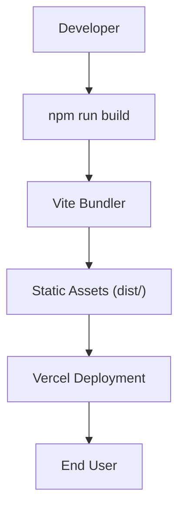

# Deployment & Configuration

Markeon is built as a modern Single Page Application (SPA) using Vite and React. This section covers the build process, environment settings, and deployment configurations required to get the application running in production.

## Build Pipeline

The application utilizes Vite for bundling and optimization. The build process transforms the source code into highly optimized static assets.

### Available Scripts

| Command | Description | Execution |
| :--- | :--- | :--- |
| `dev` | Starts the development server with Hot Module Replacement (HMR) | `npm run dev` |
| `build` | Bundles the application for production | `npm run build` |
| `preview` | Locally previews the production build | `npm run preview` |

### Deployment Flow




## Vercel Configuration

To ensure that client-side routing works correctly (preventing 404 errors on page refresh), Markeon includes a `vercel.json` configuration.

The configuration uses a rewrite rule to redirect all incoming requests to the root `index.html` file, allowing `react-router-dom` to handle the routing internally:

```json
{
  "rewrites": [
    { "source": "/(.*)", "destination": "/index.html" }
  ]
}
```

## Vite Configuration

The `vite.config.js` file manages the build-time transformations and PWA capabilities.

### Progressive Web App (PWA)
Markeon is configured as a PWA to allow offline access and "Install to Desktop" functionality. Key settings include:

- **Update Strategy**: `autoUpdate` ensures users always have the latest version without manual refreshes.
- **Theme**: Set to `#0C0C0C` for a seamless dark-mode integration.
- **Caching Strategy**: Workbox is configured with specific handlers:
    - `StaleWhileRevalidate`: Used for Google Fonts stylesheets and CDN assets to ensure fast loads with background updates.
    - `CacheFirst`: Used for font files to minimize network requests.

### Dependency Optimization
Because `shiki` and `@shikijs/rehype` are heavy libraries used for syntax highlighting, they are excluded from Vite's dependency pre-bundling to avoid build-time conflicts and optimize runtime loading:

```javascript
optimizeDeps: {
  exclude: ['shiki', '@shikijs/rehype'],
}
```

## Environment Requirements

To deploy Markeon, ensure your environment meets the following criteria:

- **Node.js**: Latest LTS version recommended.
- **Build Command**: `npm run build` or `vite build`.
- **Output Directory**: `dist`.
- **Framework Preset**: Vite / React.