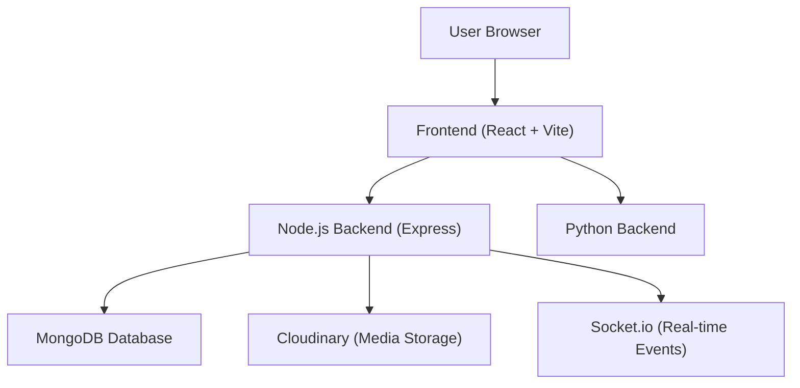

# Project Overview

ShinyChat is a full-stack, real-time communication platform designed for seamless instant messaging. The application leverages a modern distributed architecture to handle real-time data synchronization, user authentication, and media management.

The core objective of ShinyChat is to provide a responsive, low-latency chat experience while maintaining a scalable infrastructure through a dual-backend approach.

## Architecture

ShinyChat employs a hybrid backend strategy. While the primary application logic and real-time orchestration are handled by a Node.js environment, the system is designed to integrate with a Python-based backend to handle specialized computational tasks or data processing.

## Key Capabilities

- **Real-time Messaging**: Powered by `socket.io` for bi-directional, event-driven communication between clients and the server.
- **Hybrid Authentication**: Secure access control implementing both traditional JWT-based sessions and Google OAuth 2.0 via `passport`.
- **State Management**: Efficient client-side state orchestration using `zustand` for a fluid user experience.
- **Media Integration**: Integrated image and file handling via `cloudinary` to ensure optimized asset delivery.
- **Responsive UI**: A modern interface built with `React`, `Tailwind CSS`, and `DaisyUI`, ensuring compatibility across mobile and desktop devices.

## Technical Stack

### Frontend
- **Framework**: React 18 (Vite)
- **Styling**: Tailwind CSS & DaisyUI
- **State Management**: Zustand
- **Communication**: Axios & Socket.io-client

### Primary Backend (Node.js)
- **Runtime**: Node.js (ES Modules)
- **Framework**: Express
- **Database**: MongoDB (Mongoose ODM)
- **Security**: bcryptjs & JSON Web Tokens (JWT)
- **Real-time**: Socket.io

### Secondary Backend (Python)
- **Purpose**: Specialized service processing and extended API functionality.