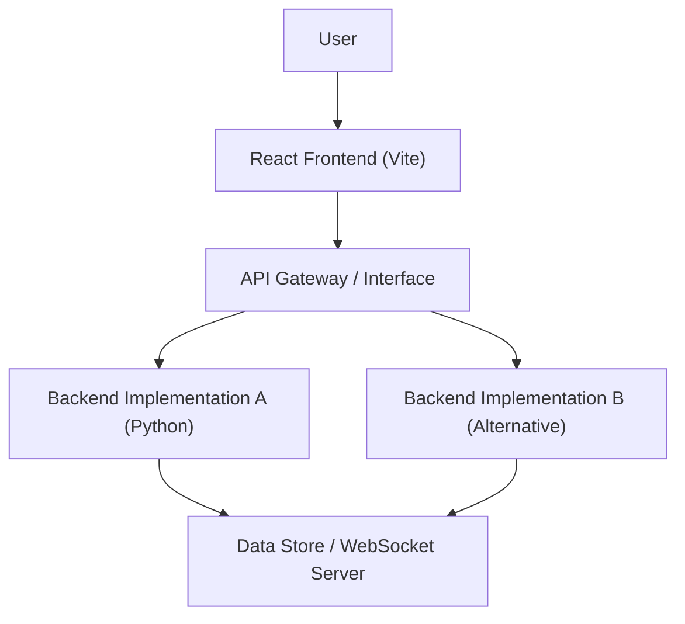

# Project Overview

ShinyChat is a modern, full-stack real-time communication application designed to provide a seamless messaging experience. The project emphasizes a decoupled architecture, separating the user interface from the business logic to allow for high scalability and flexibility in backend implementation.

## Purpose

The primary goal of ShinyChat is to demonstrate a production-ready chat interface that leverages high-performance tooling for both the client and server sides. By utilizing a modular approach, the application allows developers to experiment with different backend environments without requiring modifications to the frontend presentation layer.

## High-Level Architecture

ShinyChat employs a client-server architecture where the frontend is built using **React** and **Vite** for optimal developer experience (HMR) and fast build times. 

A distinguishing feature of the project is its **dual backend implementation strategy**. The architecture is designed to be backend-agnostic, currently supporting multiple implementations—including a Python-based backend (`backend_py`)—to accommodate different performance requirements or ecosystem preferences.

## Core Technology Stack

| Component | Technology | Role |
| :--- | :--- | :--- |
| **Frontend** | React + Vite | UI rendering and state management |
| **Build Tooling** | SWC/Babel | Fast refresh and compilation |
| **Backend (Primary)** | Python | Business logic and message routing |
| **Communication** | WebSockets/REST | Real-time bidirectional data flow |