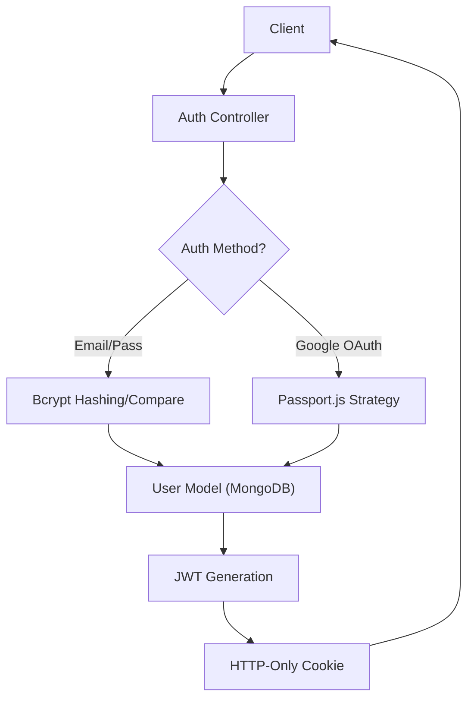

# Node.js Auth & User Management

The authentication system in `shinychat` implements a hybrid approach combining traditional email/password credentials with OAuth 2.0 via Google, secured by JSON Web Tokens (JWT) stored in HTTP-only cookies.

## Authentication Architecture

The following diagram illustrates the authentication lifecycle for both local and third-party providers.




## User Data Model

The `User` model is defined using Mongoose and handles multi-provider identity management.

### Schema Definition
Located in `backend/src/models/user.model.js`, the schema includes:

| Field | Type | Constraints | Description |
| :--- | :--- | :--- | :--- |
| `email` | String | Required, Unique | Primary identifier for the account. |
| `username` | String | Required, Unique (3-20 chars) | Public display name. |
| `password` | String | Min length 6 | Hashed password (omitted for Google users). |
| `authProvider`| String | Enum: `['email', 'google']` | Tracks the registration method. |
| `googleId` | String | Unique, Sparse | Google-specific unique identifier. |
| `profilePic` | String | Default: `""` | URL to the user's hosted image. |
| `friends` | Array | ObjectId $\rightarrow$ User | List of established friendships. |

## Authentication Flows

### 1. Email & Password Flow
The `auth.controller.js` manages the lifecycle of local accounts:

- **Signup**: Validates input lengths, ensures uniqueness of email and username, hashes passwords using `bcryptjs` (salt rounds: 10), and issues a JWT.
- **Login**: Verifies credentials. If a user was created via Google (`authProvider: 'google'`), the system prevents password-based login to ensure security consistency.
- **Logout**: Clears the `jwt` cookie by setting `maxAge: 0`.

### 2. Google OAuth 2.0 Flow
Configured via `passport-google-oauth20` in `backend/src/lib/passport.config.js`.

1. **Strategy**: The `GoogleStrategy` requests `profile` and `email` scopes.
2. **User Provisioning**: 
   - If the `googleId` exists, the user is logged in.
   - If not, a new user is created. The system generates a username by removing spaces from the Google display name and appending a timestamp if collisions occur.
3. **Conflict Resolution**: If an email exists but was registered via `email` provider, the system prevents OAuth login to avoid account hijacking.
4. **Callback**: The `googleAuthCallback` handles the redirect back to the frontend and issues the final JWT.

## Session & Security

### JWT Middleware
Access control is handled by the `protectRoute` middleware in `backend/src/middleware/auth.middleware.js`:

```javascript
export const protectRoute = async (req, res, next) => {
    const token = req.cookies.jwt;
    if(!token) return res.status(401).json({message: "Unauthorized"});
    
    const decoded = jwt.verify(token, process.env.JWT_SECRET);
    const user = await User.findById(decoded.userId).select("-password");
    
    req.user = user;
    next();
};
```

### Key Security Measures
- **Password Hashing**: No plain-text passwords are stored; `bcryptjs` is used for all local credentials.
- **HTTP-Only Cookies**: JWTs are stored in cookies to mitigate Cross-Site Scripting (XSS) attacks.
- **Sparse Indexing**: The `googleId` field is marked as `sparse` in MongoDB, allowing it to be unique without forcing every user to have one.

## User Management

### Profile Updates
The `updateProfile` controller allows users to modify their `username` and `profilePic`. 

- **Username Validation**: Checks for length (3-20) and ensures the new username is not taken by another user (`$ne: userId`).
- **Image Handling**: Integrates with Cloudinary to upload base64 strings and store the resulting secure URL.
- **Token Refresh**: Re-generates the JWT upon profile updates to ensure the session reflects the latest user data.

### Availability Checks
A dedicated `checkUsernameAvailability` endpoint allows the frontend to provide real-time feedback during registration or profile editing by querying the `User` collection without requiring a full update request.