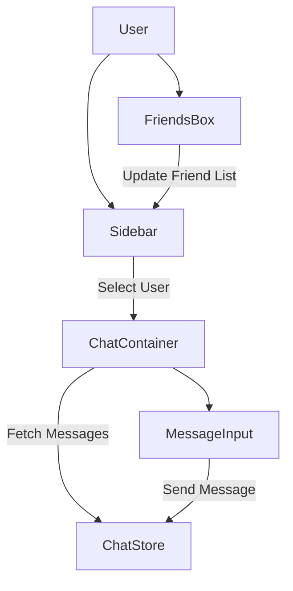

# UI Components

The `shinychat` frontend is built with a modular component architecture using React and Tailwind CSS. The interface is divided into several key areas that manage user discovery, relationship management, and real-time communication.

## Component Architecture

The following diagram illustrates the relationship between the primary UI components and how user interaction flows through the interface.

## Core Components Breakdown

### 1. Sidebar
The `Sidebar` serves as the primary navigation hub for selecting conversations. It integrates with both `useChatStore` and `useAuthStore` to provide real-time presence indicators.

- **Functionality**:
    - **Friend Listing**: Renders a list of all established friends.
    - **Online Filtering**: A toggle allows users to filter the list to show only users currently online.
    - **User Selection**: Clicking a user updates the `selectedUser` state in the global store, which triggers the `ChatContainer` to load specific messages.
- **Key Implementation**: Uses a conditional CSS class to hide the sidebar on mobile devices once a user is selected, maximizing screen real estate for the chat.

### 2. ChatContainer
The `ChatContainer` is the central orchestration component for the active conversation. It manages the lifecycle of messages and the visual layout of the chat thread.

- **Key Features**:
    - **Real-time Synchronization**: Utilizes `useEffect` to subscribe to message updates and unsubscribe on component unmount.
    - **Auto-Scrolling**: Employs a `useRef` hook (`messageEndRef`) combined with `scrollIntoView` to ensure the latest message is always visible.
    - **Message Rendering**: Dynamically assigns `chat-start` or `chat-end` classes based on whether the `senderId` matches the `authUser._id`.
    - **Loading States**: Integrates a `MessageSkeleton` to provide visual feedback during data fetching.

### 3. MessageInput
The `MessageInput` component handles the composition and transmission of messages, supporting both text and multimedia.

- **Capabilities**:
    - **Image Preview**: Uses the `FileReader` API to generate a Base64 preview of images before they are uploaded.
    - **Validation**: Prevents empty submissions if neither text nor an image is present.
    - **State Management**: Local state manages the current input text and image preview, which are cleared upon successful transmission via `sendMessage`.

### 4. FriendsBox
The `FriendsBox` is a modal interface dedicated to relationship management. It uses a tabbed navigation system to separate different request states.

- **Tabs Layout**:
    - **Friends**: Lists current friends with an option to remove them.
    - **Pending**: Displays incoming requests with "Accept" or "Reject" actions.
    - **Sent**: Tracks outgoing requests that have not yet been answered.
- **User Discovery**: Includes a form to send new friend requests using a username or email identifier.

## State Integration Summary

| Component | Store Dependency | Primary Action |
| :--- | :--- | :--- |
| **Sidebar** | `useChatStore`, `useAuthStore` | `setSelectedUser()` |
| **ChatContainer** | `useChatStore`, `useAuthStore` | `getMessages()`, `subscribeToMessages()` |
| **MessageInput** | `useChatStore` | `sendMessage()` |
| **FriendsBox** | `useChatStore` | `sendFriendRequest()`, `acceptFriendRequest()` |