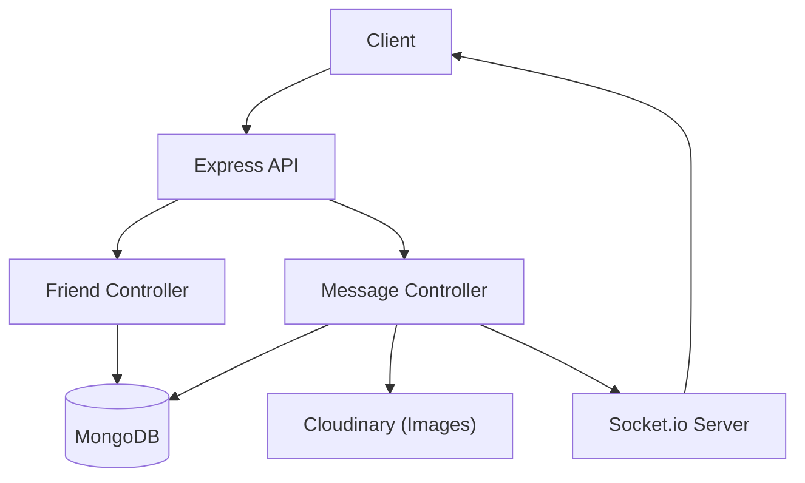

# Node.js Messaging & Social Logic

This section covers the implementation of the social graph and real-time communication systems within the Shinychat backend. The architecture relies on Express.js for RESTful API endpoints and Socket.io for instantaneous message delivery.

## System Architecture

The social logic is split into two primary domains: **Friendship Management**, which handles the relationship state between users, and **Messaging**, which manages the exchange of text and media.




## Friendship Management

The friendship system utilizes a request-response pattern to prevent unsolicited additions. User relationships are tracked via three arrays in the `User` model: `friends`, `sentRequests`, and `friendRequests`.

### Request Lifecycle

1.  **Initiation**: `sendFriendRequest` allows users to find others via username or email. It validates that the receiver exists, is not the sender, and that no prior friendship or pending request exists.
2.  **Resolution**: The receiver can either `acceptFriendRequest` (moving both users into each other's `friends` list) or `rejectFriendRequest` (removing the request from both parties).
3.  **Termination**: `removeFriend` symmetrically removes user IDs from both users' `friends` arrays.

### Friend API Endpoints

| Method | Endpoint | Description |
| :--- | :--- | :--- |
| `POST` | `/request/send/` | Sends request using `identifier` (username/email) |
| `POST` | `/request/accept/:senderId` | Accepts a pending request |
| `POST` | `/request/reject/:senderId` | Rejects a pending request |
| `DELETE`| `/remove/:friendId` | Removes a user from the friends list |
| `GET` | `/list` | Retrieves populated list of friends |
| `GET` | `/requests/pending` | Retrieves requests received |
| `GET` | `/requests/sent` | Retrieves requests sent |

## Messaging System

The messaging logic supports persistent storage for chat history and real-time updates for active sessions.

### Message Flow and Media Handling

When a message is sent via `sendMessage`, the controller performs the following steps:

1.  **Media Processing**: If an image is provided in the request body, it is uploaded to **Cloudinary**. The resulting secure URL is then stored in the database.
2.  **Persistence**: The `Message` document is saved to MongoDB with `senderId`, `receiverId`, `text`, and the `image` URL.
3.  **Real-time Delivery**: The system retrieves the `receiverSocketId` from the socket mapping. If the receiver is online, the message is emitted immediately via `io.to(socketId).emit("newMessage", newMessage)`.

### Messaging API Endpoints

| Method | Endpoint | Description |
| :--- | :--- | :--- |
| `GET` | `/users` | Fetches all users except the current user for the sidebar |
| `GET` | `/:id` | Retrieves the bidirectional chat history between two users |
| `POST` | `/send/:id` | Sends a text/image message to a specific user |

## Implementation Details

### Bidirectional Querying
To retrieve a conversation between two users regardless of who sent the message, the `getMessages` controller uses the MongoDB `$or` operator:

```javascript
const messages = await Message.find({
    $or: [
        { senderId: myId, receiverId: userToChatId },
        { senderId: userToChatId, receiverId: myId }
    ]
});
```

### Data Population
To optimize frontend rendering, friend and request lists are populated using Mongoose `.populate()`, selecting only necessary fields (`username`, `email`, `profilePic`, `_id`) to reduce payload size and enhance security.