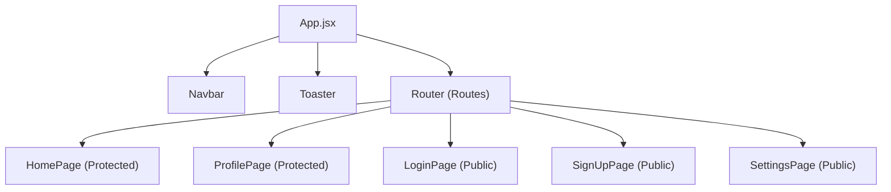

# Frontend Implementation

The `shinychat` frontend is a modern Single Page Application (SPA) built with **React 18** and **Vite**. It leverages a decoupled state management approach and a utility-first styling system to provide a responsive, real-time chat experience.

## Technical Stack

- **Core Framework**: React 18
- **Build Tool**: Vite
- **Routing**: React Router DOM v7
- **State Management**: Zustand
- **Styling**: Tailwind CSS & DaisyUI
- **Communication**: Axios (REST) & Socket.io-client (WebSockets)
- **UI Components**: Lucide-react & React-icons

## Component Hierarchy

The application follows a centralized routing pattern where `App.jsx` acts as the primary orchestrator for authentication guards and global layout.

## State Management

The application utilizes **Zustand** for lightweight, scalable state management, avoiding the boilerplate of Redux. The state is split into two primary stores:

### 1. Authentication Store (`useAuthStore`)
This store manages the user's session and real-time presence.
- **State**: 
    - `authUser`: The currently authenticated user object.
    - `isCheckingAuth`: A boolean flag to prevent "flash of unauthenticated content" during initial load.
    - `onlineUsers`: A list of currently active users synchronized via Socket.io.
- **Actions**: 
    - `checkAuth()`: Validates the session with the backend on application mount.

### 2. Theme Store (`useThemeStore`)
Handles the visual appearance of the application.
- **State**: `theme` (e.g., 'light', 'dark', 'cupcake').
- **Integration**: The theme is applied globally via the `data-theme` attribute on the root `div` in `App.jsx`, which integrates directly with **DaisyUI** themes.

## Routing & Guard Logic

The application implements conditional routing to ensure a secure user experience. In `App.jsx`, routes are guarded based on the `authUser` state:

| Route | Access | Redirect If Condition Met |
| :--- | :--- | :--- |
| `/` | Authenticated | $\rightarrow$ `/login` |
| `/profile` | Authenticated | $\rightarrow$ `/login` |
| `/login` | Unauthenticated | $\rightarrow$ `/` |
| `/signup` | Unauthenticated | $\rightarrow$ `/` |
| `/settings` | All | N/A |

## Implementation Details

### Loading State
To ensure a smooth UX, the application implements a global loading screen. While `isCheckingAuth` is true and no `authUser` exists, a centered `Loader` component from `lucide-react` is rendered, preventing the user from seeing a flickering login page during session validation.

### Real-time Integration
The presence of `socket.io-client` in `package.json` and the `onlineUsers` state in the auth store indicates a bidirectional communication layer. This allows the frontend to update user presence indicators in real-time without requiring page refreshes.

### Global Notifications
The `react-hot-toast` library is integrated via the `<Toaster />` component in the root layout, providing a standardized way to trigger success or error alerts across all pages.