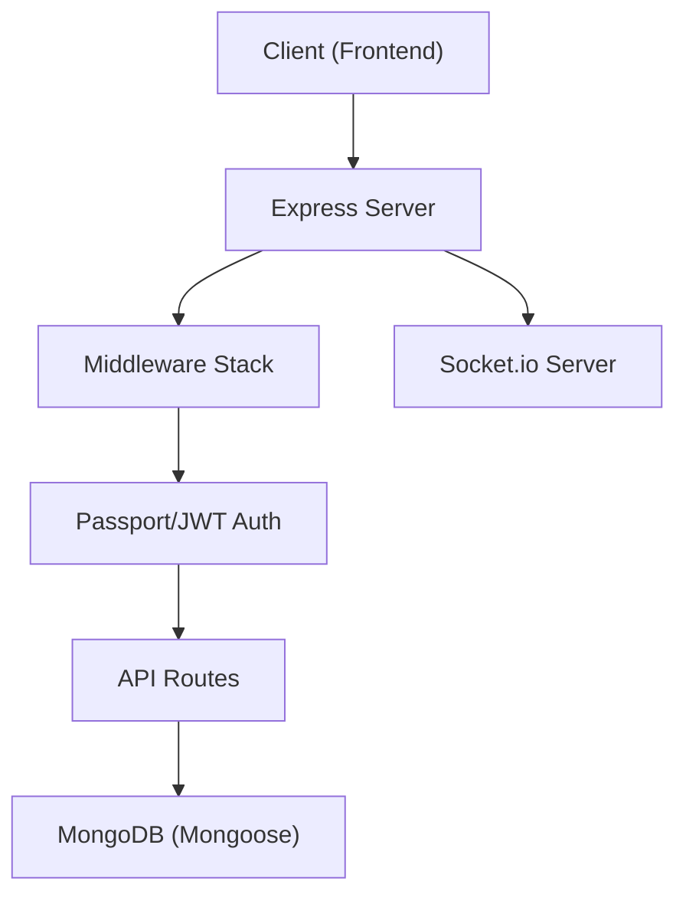

# Node.js Backend Architecture

The `shinychat` backend is built on a robust Node.js environment using **Express.js**, providing a scalable REST API combined with real-time capabilities via Socket.io. The architecture is designed with a focus on secure authentication, session management, and efficient data persistence.

## System Overview

The backend serves as the orchestration layer between the MongoDB database and the frontend client. It handles user authentication, friendship management, and messaging persistence.




## Core Server Implementation

The entry point (`backend/src/index.js`) initializes the application, configures security middleware, and mounts the routing system.

### Middleware Pipeline
The server utilizes a sequential middleware stack to process incoming requests:

| Middleware | Purpose | Configuration |
| :--- | :--- | :--- |
| `cookie-parser` | Parses Cookie header | Standard |
| `express.json` | Parses JSON bodies | Limit: `2mb` |
| `cors` | Cross-Origin Resource Sharing | Credentials enabled, specific origin |
| `express-session` | Session management | `httpOnly` cookies, secure in production |
| `passport` | Authentication strategy | Initialize and session-based |

### Route Mapping
The API is modularized into specific domains for maintainability:

- `GET/POST /api/auth` $\rightarrow$ User registration and authentication.
- `GET/POST /api/messages` $\rightarrow$ Chat history and message retrieval.
- `GET/POST /api/friends` $\rightarrow$ Friend requests and contact management.

## Authentication Strategy

The system employs a dual-layered approach to identity management, combining **Passport.js** for session handling and **JSON Web Tokens (JWT)** for stateless verification.

### JWT Implementation
The `generateToken` utility in `backend/src/lib/utils.js` ensures secure token delivery:

```javascript
export const generateToken = (userId, res) => {
    const token = jwt.sign({userId}, process.env.JWT_SECRET, {expiresIn: "7d"});

    res.cookie("jwt", token, {
        maxAge: 7 * 24 * 60 * 60 * 1000, 
        httpOnly: true,
        sameSite: "strict",
        secure: process.env.NODE_ENV !== "development",
    });
    return token;
};
```

**Security Features:**
- **HttpOnly:** Prevents Cross-Site Scripting (XSS) by making the cookie inaccessible to client-side JavaScript.
- **SameSite Strict:** Mitigates Cross-Site Request Forgery (CSRF) attacks.
- **Environment Awareness:** The `secure` flag is automatically toggled based on the `NODE_ENV` setting.

## Database Integration

Data persistence is handled via **Mongoose**, providing a schema-based solution for MongoDB.

The connection logic is encapsulated in `backend/src/lib/db.js`:

```javascript
export const connectDB = async () => {
  try {
    const conn = await mongoose.connect(process.env.MONGODB_URI);
    console.log(`MongoDB connected: ${conn.connection.host}`);
  } catch(error) {
    console.log("MongoDB connection error: ", error);
  }
}
```

## Production Deployment

In production mode (`NODE_ENV === "production"`), the Express server is configured to serve the frontend as a static asset, eliminating the need for a separate web server for the client:

1. **Static Assets:** Serves files from `../frontend/dist`.
2. **SPA Routing:** A wildcard route (`*`) ensures that all non-API requests are routed to `index.html`, allowing the frontend router (e.g., React Router) to handle client-side navigation.