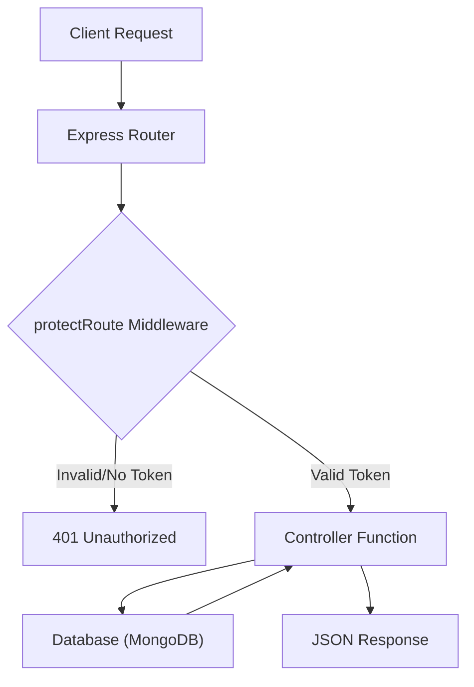

# Node.js API and Controllers

The backend of ShinyChat is built on Node.js and Express, utilizing a controller-middleware-route architecture to ensure a clean separation of concerns. This section details the implementation of authentication, authorization, and messaging routing.

## Request Lifecycle

The following diagram illustrates how a request is processed, specifically for protected routes like messaging or profile updates.



## Authentication Controller

The `auth.controller.js` manages the user lifecycle, including registration, session management via JWT, and OAuth integration.

### Core Functions

| Function | Endpoint | Method | Description |
| :--- | :--- | :--- | :--- |
| `signup` | `/signup` | `POST` | Validates user input, hashes passwords using `bcryptjs`, and creates a new user record. |
| `login` | `/login` | `POST` | Verifies credentials and issues a JWT via cookies. |
| `logout` | `/logout` | `POST` | Clears the JWT cookie to terminate the session. |
| `checkAuth` | `/check-auth` | `GET` | Returns the currently authenticated user's profile data. |
| `updateProfile` | `/update-profile` | `PUT` | Updates username and profile picture (integrated with Cloudinary). |

### Key Implementation Details

#### Input Validation
The `signup` controller enforces strict validation rules before database insertion:
- **Username**: Minimum 3, maximum 20 characters.
- **Password**: Minimum 6 characters.
- **Uniqueness**: Checks both email and username to prevent duplicates.

#### Profile Management
The `updateProfile` function handles conditional updates. It ensures that if a username is changed, it is not already claimed by another user (using the `$ne` operator in MongoDB), and handles image uploads via Cloudinary.

## Authorization Middleware

The `protectRoute` middleware acts as a security gatekeeper for private endpoints.

### Logic Flow:
1. **Token Extraction**: Retrieves the `jwt` from the request cookies.
2. **Verification**: Uses `jwt.verify` with the `JWT_SECRET` to decode the payload.
3. **User Hydration**: Fetches the user from the database by the decoded `userId`, explicitly excluding the password field (`.select("-password")`).
4. **Context Attachment**: Attaches the user object to `req.user`, making it available to subsequent controllers.

## Messaging API Routes

Messaging functionality is decoupled into specific routes that require authentication. All routes in `message.route.js` are wrapped with the `protectRoute` middleware.

### Endpoints

#### 1. Get Sidebar Users
`GET /users`
Fetches a list of available users to populate the chat sidebar.

#### 2. Get Chat History
`GET /:id`
Retrieves the message history between the authenticated user and the user identified by the `:id` parameter.

#### 3. Send Message
`POST /send/:id`
Sends a new message to the specified user.

```javascript
// Route mapping example
router.post("/send/:id", protectRoute, sendMessage);
```

## Error Handling

The controllers utilize `try-catch` blocks to ensure server stability. 
- **400 Bad Request**: Used for validation failures or existing users.
- **401 Unauthorized**: Used when tokens are missing or invalid.
- **404 Not Found**: Used when a requested user does not exist in the database.
- **500 Internal Server Error**: Catch-all for unexpected server-side failures.