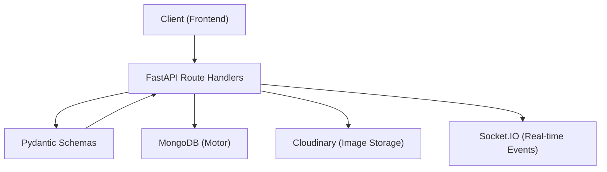

# Python API & Schemas

The `shinychat` backend is built with **FastAPI**, leveraging **Pydantic** for strict data validation and **Motor** for asynchronous MongoDB interactions. This layer handles authentication, profile management, and the orchestration of messaging between users.

## System Architecture

The following diagram illustrates the data flow between the client, the API layer, and the supporting infrastructure.




---

## Authentication API

All authentication routes are handled via `auth.py`. The system uses JWT tokens stored in `httponly` cookies for secure session management.

### Endpoints

| Method | Endpoint | Description | Auth Required |
| :--- | :--- | :--- | :--- |
| `POST` | `/signup` | Registers a new user via email and password. | No |
| `POST` | `/login` | Authenticates user and issues a JWT cookie. | No |
| `POST` | `/logout` | Clears the JWT session cookie. | No |
| `GET` | `/check` | Validates the current session and returns user info. | Yes |
| `PUT` | `/update-profile` | Updates username and profile picture. | Yes |
| `GET` | `/check-username/{username}` | Checks if a specific username is available. | Yes |
| `GET` | `/google` | Initiates Google OAuth2 flow. | No |
| `GET` | `/google/callback` | Handles OAuth2 callback and session creation. | No |

### Implementation Details
- **Password Security**: Passwords are hashed using `bcrypt` before storage.
- **Session Management**: Tokens are set with a 7-day expiration and `Samesite=Lax` attributes.
- **OAuth2**: The Google integration handles automatic account creation if the email does not exist in the database.

---

## Messaging API

Messaging routes in `messages.py` handle the retrieval of chat history and the initial trigger for sending messages.

### Endpoints

| Method | Endpoint | Description | Auth Required |
| :--- | :--- | :--- | :--- |
| `GET` | `/users` | Fetches all registered users for the sidebar. | Yes |
| `GET` | `/{user_to_chat_id}` | Retrieves chat history between current user and target. | Yes |
| `POST` | `/send/{receiver_id}` | Sends a text/image message and emits a socket event. | Yes |

### Real-time Integration
When a message is sent via `POST /send/{receiver_id}`, the API:
1. Persists the message to MongoDB.
2. Uploads images to Cloudinary if provided.
3. Resolves the `receiver_id` to a `socket_id`.
4. Emits a `newMessage` event via **Socket.IO** to the recipient for instant delivery.

---

## Data Schemas

Pydantic schemas ensure type safety and seamless conversion between MongoDB's BSON format and JSON responses.

### User Schemas (`user.py`)

The `PyObjectId` class is a custom type used to handle the conversion between MongoDB's `ObjectId` and standard strings.

| Schema | Purpose | Key Fields |
| :--- | :--- | :--- |
| `UserCreate` | Registration payload | `username`, `email`, `password` |
| `UserLogin` | Authentication payload | `email`, `password` |
| `UserInDB` | MongoDB Document representation | `_id`, `friends`, `authProvider`, `googleId` |
| `UserResponse` | Public API User object | `_id`, `username`, `profilePic`, `authProvider` |

### Message Schemas (`message.py`)

| Schema | Purpose | Key Fields |
| :--- | :--- | :--- |
| `MessageCreate` | New message payload | `text`, `image` |
| `MessageInDB` | MongoDB Message document | `_id`, `senderId`, `receiverId`, `createdAt` |
| `MessageResponse` | API response for a message | Inherits from `MessageInDB` |

### Core Schema Configuration
To support MongoDB's `_id` field while exposing it as `id` in the API, the schemas utilize:
```python
model_config = ConfigDict(populate_by_name=True, arbitrary_types_allowed=True)
```
This allows Pydantic to map the alias `_id` during database instantiation and serialization.