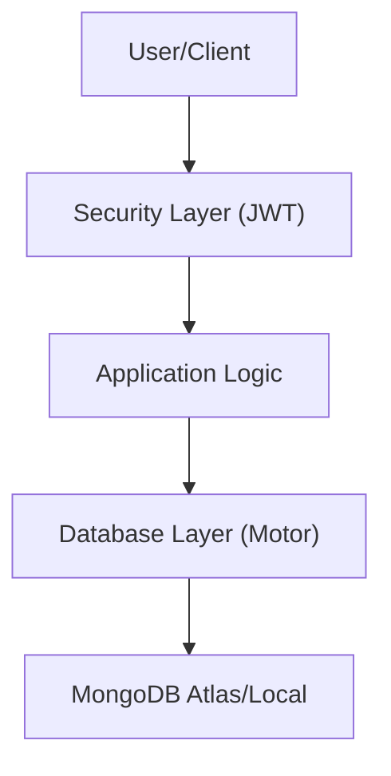

# Python Data & Security

This section details the implementation of the data persistence layer and security utilities within the Python backend of Shinychat. The system leverages asynchronous MongoDB connectivity and industry-standard cryptographic practices to ensure secure user authentication and efficient data retrieval.

## Architecture Overview

The Python backend acts as a secure bridge between the client and the MongoDB instance, enforcing token-based authentication before granting database access.




## Authentication & Security

The security module (`app.core.security`) provides utilities for identity management and session persistence, ensuring parity with the Node.js implementation of the platform.

### Password Management
Password security is handled using the `bcrypt` library, which incorporates a salt to protect against rainbow table attacks.

| Function | Description | Implementation Detail |
| :--- | :--- | :--- |
| `hash_password` | Transforms plain text passwords into secure hashes. | Uses `bcrypt.gensalt(rounds=10)`. |
| `verify_password` | Validates a plain password against a stored hash. | Performs a constant-time comparison. |

### JSON Web Tokens (JWT)
Session management is stateless, utilizing JWTs signed with a secret key defined in the application settings.

- **Algorithm**: `HS256`
- **Expiration**: 7 Days
- **Payload**: Contains the `userId` as a string.

#### Token Lifecycle
1. **Creation**: `create_access_token(user_id)` generates a signed token.
2. **Verification**: `verify_access_token(token)` decodes the token and validates the expiration signature. If the token is expired or tampered with, it returns `None`.

## Database Connectivity

The backend utilizes `motor`, an asynchronous Python driver for MongoDB, to prevent blocking the event loop during I/O operations.

### Connection Management
The database is managed via a singleton pattern through the `Database` class and `db_instance`.

- **`connect_to_mongo()`**: Initializes the `AsyncIOMotorClient` using the URI provided in the settings. It performs a `ping` command to ensure the connection is alive before proceeding.
- **`get_db()`**: A helper function that returns the active database instance for use in repositories and services.
- **`close_mongo_connection()`**: Ensures a graceful shutdown of the client connection.

### Data Access Pattern
```python
from app.db.database import get_db

async def fetch_data():
    db = get_db()
    collection = db.get_collection("messages")
    # Perform async operations...
```

## Logging Infrastructure

The system employs `loguru` for structured, asynchronous-friendly logging. The logger is configured to provide high visibility into the application's state during development and production.

### Configuration Details
The logger is customized to replace the default handler with a formatted stdout stream:

- **Format**: `YYYY-MM-DD HH:mm:ss | LEVEL | module:function:line - message`
- **Features**: 
    - **Colorization**: Different levels are color-coded for rapid scanning.
    - **Diagnostics**: `backtrace=True` and `diagnose=True` are enabled to provide detailed stack traces during exceptions.
    - **Level**: Set to `INFO` by default.