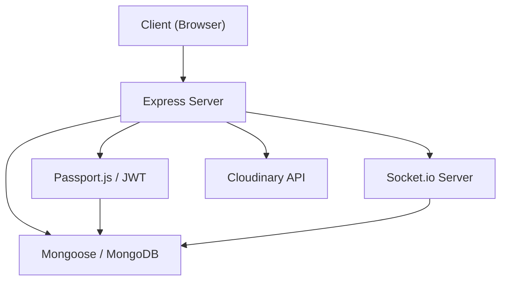

# Node.js Backend

The `shinychat` backend is a robust Node.js application built on **Express** and **Socket.io**, designed to handle real-time communication, user authentication, and data persistence. It employs a modular architecture to separate routing, database configuration, and real-time event handling.

## Architecture Overview

The backend serves as the orchestrator between the MongoDB database and the React frontend, providing both a RESTful API for CRUD operations and a WebSocket layer for instantaneous messaging.



## Core Technical Stack

| Dependency | Purpose |
| :--- | :--- |
| **Express** | Web framework for routing and middleware. |
| **Socket.io** | Enables bidirectional, real-time communication for chat. |
| **Mongoose** | MongoDB object modeling for structured data. |
| **Passport.js** | Authentication middleware supporting local and Google OAuth 2.0. |
| **JWT & bcryptjs** | Secure token-based authorization and password hashing. |
| **Cloudinary** | External cloud storage for image and media uploads. |

## Implementation Details

### 1. Server Configuration
The entry point `src/index.js` initializes the server with several critical middleware configurations:
- **CORS**: Configured to allow requests from `http://localhost:5173` with credentials enabled.
- **Session Management**: Uses `express-session` with a `SESSION_SECRET` and secure cookies (HTTPS) in production.
- **Request Parsing**: Supports JSON and URL-encoded payloads with a `2mb` limit to prevent denial-of-service attacks via oversized payloads.

### 2. Database Connectivity
The application uses a singleton connection pattern via `src/lib/db.js`. It connects to MongoDB using an environment variable `MONGODB_URI`, ensuring that database credentials are kept out of the source code.

### 3. Routing Structure
The API is segmented into three primary domains for maintainability:
- `/api/auth`: Handles user registration, login, and authentication.
- `/api/messages`: Manages the retrieval and storage of chat history.
- `/api/friends`: Handles friend requests and contact list management.

### 4. Production Deployment
The server is designed for unified deployment. When `NODE_ENV` is set to `production`, the backend:
1. Serves static assets from the `../frontend/dist` directory.
2. Uses a wildcard route (`*`) to serve `index.html`, enabling client-side routing for the Single Page Application (SPA).

## Environment Variables

To run the backend, the following environment variables are required in a `.env` file:

```env
PORT=5000
MONGODB_URI=mongodb+srv://...
SESSION_SECRET=your_secret_key
NODE_ENV=development # or production
```

## Execution Commands

```bash
# Install dependencies
npm install

# Development mode (with nodemon)
npm run dev

# Production start
npm start