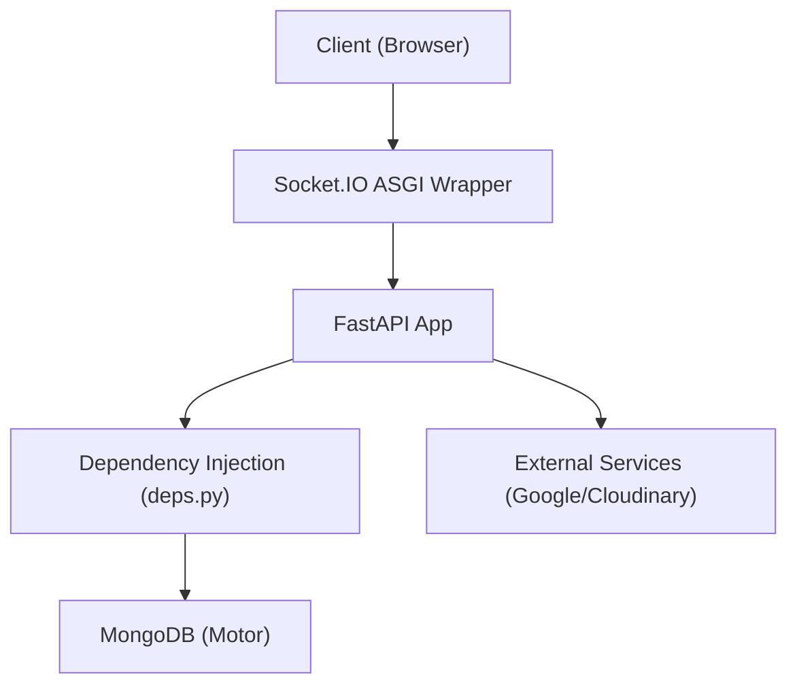

# Python Backend Architecture

The `shinychat` backend is built with **FastAPI**, providing a high-performance, asynchronous framework for handling RESTful API requests and real-time communication via **Socket.IO**. The architecture emphasizes strict typing, centralized configuration, and a modular dependency injection system.

## System Overview

The backend serves as the orchestrator between the frontend client, the MongoDB database, and third-party integrations (Google OAuth and Cloudinary). To support real-time messaging, the FastAPI application is wrapped within a Socket.IO ASGI application.




## Core Configuration

Configuration is managed using `pydantic-settings`, ensuring that environment variables are validated at startup. All settings are centralized in `app.core.config.py`.

### Environment Variables
The `Settings` class maps system environment variables to typed Python fields using `validation_alias`. Key configuration areas include:

- **Database**: `MONGODB_URI` for the asynchronous Motor client.
- **Security**: `JWT_SECRET` for token signing and `SESSION_SECRET` for session management.
- **Authentication**: Google OAuth credentials (`GOOGLE_CLIENT_ID`, `GOOGLE_CLIENT_SECRET`).
- **Storage**: Cloudinary API keys for media uploads.
- **Deployment**: `NODE_ENV` to toggle between development and production behaviors.

## Application Lifecycle and Middleware

The application entry point (`app/main.py`) utilizes a `lifespan` async context manager to handle the startup and shutdown of critical resources.

### Resource Management
1. **Startup**: The `connect_to_mongo()` function is called to establish a connection pool with MongoDB.
2. **Shutdown**: The `close_mongo_connection()` function ensures all database handles are released gracefully.

### Middleware and Routing
- **CORS**: Configured to allow requests from the `FRONTEND_URL` with credentials enabled, mirroring the security requirements of the frontend.
- **Routing**: The API is split into modular routers: `/api/auth`, `/api/messages`, and `/api/friends`.
- **Production Static Serving**: When `NODE_ENV` is set to `production`, the app mounts the frontend `dist` folder and implements a catch-all route to support Single Page Application (SPA) routing.

## Dependency Injection and Security

FastAPI's dependency injection system is used to enforce authentication and provide database access across different endpoints.

### Authentication Flow: `get_current_user`
The `get_current_user` dependency in `app/api/deps.py` acts as a security guard for protected routes. It follows a three-step verification process:

1. **Token Extraction**: Retrieves the JWT from the request cookies. If missing, it raises a `401 Unauthorized` error.
2. **Token Verification**: Validates the JWT using `verify_access_token`. If the token is expired or tampered with, it returns a `401 Unauthorized` error.
3. **User Validation**: Queries MongoDB using the extracted `user_id`. If the user no longer exists in the database, it raises a `404 Not Found` error.

```python
# Example usage in a route
@router.get("/profile")
async def read_profile(current_user: dict = Depends(get_current_user)):
    return current_user
```

## Integration with Socket.IO

To enable bidirectional, real-time communication without sacrificing the REST API's structure, the application uses `socketio.ASGIApp`.

```python
sio_app = socketio.ASGIApp(sio, other_asgi_app=app)
```

In this setup, `sio_app` acts as the primary entry point. It intercepts Socket.IO traffic and forwards all other HTTP requests to the FastAPI `app`. This allows the backend to maintain a single port for both standard API calls and WebSocket connections.