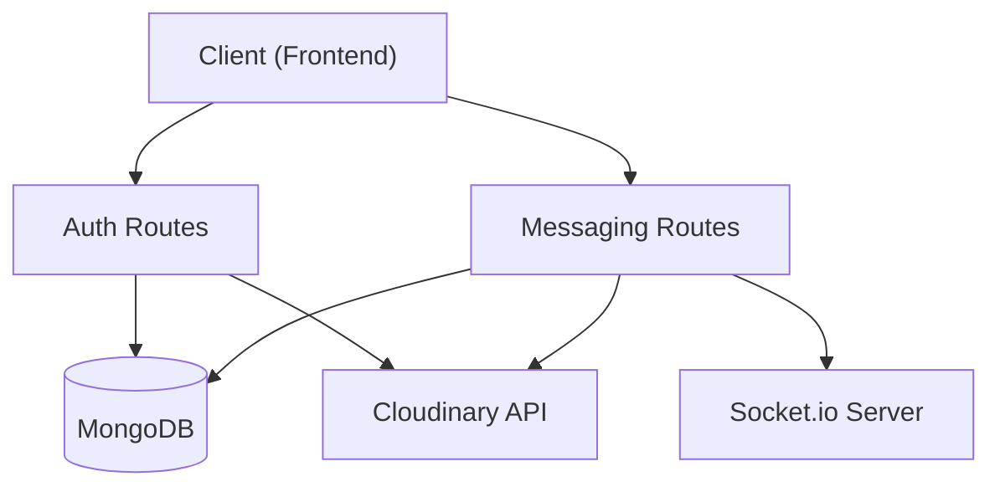

# Python API Endpoints

This section provides a comprehensive technical analysis of the Python REST API implementation for Shinychat. The backend is built using **FastAPI**, utilizing **Motor** for asynchronous MongoDB interactions and **Pydantic** for strict data validation.

## API Architecture Overview

The API is divided into functional modules to separate authentication concerns from messaging logic. Authentication is handled via JWTs stored in `HttpOnly` cookies to mitigate XSS attacks.

## Authentication API

The authentication module manages user lifecycle, session persistence, and OAuth2 integration with Google.

### Endpoints

| Endpoint | Method | Description | Auth |
| :--- | :--- | :--- | :--- |
| `/signup` | `POST` | Registers a new user and initializes a session. | No |
| `/login` | `POST` | Validates credentials and sets a JWT cookie. | No |
| `/logout` | `POST` | Clears the JWT cookie. | No |
| `/check` | `GET` | Validates the current session and returns user data. | Yes |
| `/update-profile` | `PUT` | Updates username or profile picture. | Yes |
| `/check-username/{username}` | `GET` | Checks if a specific username is available. | Yes |
| `/google` | `GET` | Redirects to Google OAuth2 consent screen. | No |
| `/google/callback` | `GET` | Handles OAuth2 callback and creates/logs in user. | No |

### Technical Implementation Details

- **Session Management**: The API uses `response.set_cookie` with `httponly=True` and `samesite="lax"`. The `secure` flag is dynamically set based on the `node_env` configuration.
- **Password Security**: Passwords are never stored in plain text; they are processed via `hash_password` and `verify_password` utilities.
- **OAuth2 Flow**: The `/google` route constructs a request to Google's API, and the `/google/callback` route exchanges the authorization code for an access token to fetch user profiles.

## Messaging API

The messaging module handles the retrieval of user lists and the persistence of chat histories.

### Endpoints

| Endpoint | Method | Description | Auth |
| :--- | :--- | :--- | :--- |
| `/users` | `GET` | Fetches a list of all registered users for the sidebar. | Yes |
| `/{user_to_chat_id}` | `GET` | Retrieves the conversation history between two users. | Yes |
| `/send/{receiver_id}` | `POST` | Sends a text/image message and triggers a socket event. | Yes |

### Technical Implementation Details

- **Conversation Retrieval**: Uses a MongoDB `$or` query to find all messages where the `senderId` and `receiverId` match either the current user or the target user, sorted by `createdAt`.
- **Real-time Integration**: When a message is successfully persisted via `/send/{receiver_id}`, the API retrieves the receiver's active socket ID and emits a `newMessage` event via `sio.emit`.
- **Media Handling**: Images are uploaded to Cloudinary via the `upload_image` utility before the message document is saved to the database.

## Data Validation Schemas

Shinychat employs Pydantic models to ensure type safety and data integrity between the MongoDB BSON format and the JSON API responses.

### PyObjectId Custom Type
Since MongoDB uses `ObjectId` and JSON uses `string`, a custom `PyObjectId` class is implemented to handle the conversion automatically during serialization and deserialization.

### Core User Schemas

#### `UserCreate`
Used during registration to validate incoming payload:
- `username`: String (3-20 characters).
- `email`: Valid email format.
- `password`: Optional string (minimum 6 characters).

#### `UserLogin`
Used for authentication attempts:
- `email`: Required.
- `password`: Optional (to support OAuth-only users).

#### `UserResponse`
The sanitized object returned to the client to avoid leaking sensitive data (like hashed passwords):
- `_id`: The MongoDB ObjectId cast to a string.
- `username`: The user's display name.
- `profilePic`: URL to the hosted image.
- `authProvider`: Enum (`email` or `google`).

### Message Schemas

#### `MessageCreate`
Validates the content of a new message:
- `text`: The message body.
- `image`: An optional base64 string or URL for image uploads.