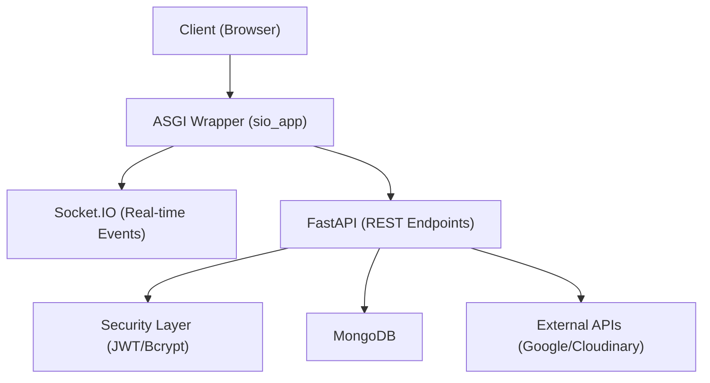

# Python Backend

The Python backend provides a high-performance alternative to the Node.js implementation, leveraging **FastAPI** for RESTful APIs and **python-socketio** for real-time communication. This implementation is designed to be a drop-in replacement, maintaining compatibility with the existing frontend and database schema.

## Architecture Overview

The backend utilizes an ASGI wrapper to merge the FastAPI application with the Socket.IO server, allowing both HTTP and WebSocket traffic to be handled by a single process.



## Core Configuration

Configuration is managed via `pydantic-settings`, ensuring type safety and automatic validation of environment variables. The system loads settings from a `.env` file or system environment variables.

### Environment Variables

| Variable | Type | Default | Description |
| :--- | :--- | :--- | :--- |
| `PORT` | `int` | `5001` | The port the server listens on. |
| `MONGODB_URI` | `str` | Required | Connection string for MongoDB. |
| `JWT_SECRET` | `str` | Required | Secret key used for signing access tokens. |
| `GOOGLE_CLIENT_ID` | `str` | Required | Google OAuth 2.0 Client ID. |
| `GOOGLE_CLIENT_SECRET`| `str` | Required | Google OAuth 2.0 Client Secret. |
| `GOOGLE_CALLBACK_URL` | `str` | Required | Redirect URI for Google OAuth. |
| `SESSION_SECRET` | `str` | Required | Secret for session management. |
| `CLOUDINARY_CLOUD_NAME`| `str` | Required | Cloudinary account cloud name. |
| `CLOUDINARY_API_KEY` | `str` | Required | Cloudinary API key. |
| `CLOUDINARY_API_SECRET`| `str` | Required | Cloudinary API secret. |
| `FRONTEND_URL` | `str` | `http://localhost:5173` | URL of the frontend application for CORS. |
| `NODE_ENV` | `str` | `development` | Deployment environment (`development` or `production`). |

## Security Implementation

The security layer handles user authentication and data integrity using industry-standard libraries.

### Password Hashing
Passwords are never stored in plain text. The backend uses `bcrypt` with a cost factor of 10 rounds to secure user credentials.

```python
# Simplified logic from security.py
def hash_password(password: str) -> str:
    salt = bcrypt.gensalt(rounds=10)
    return bcrypt.hashpw(password.encode("utf-8"), salt).decode("utf-8")
```

### JWT Authentication
Access tokens are implemented using JSON Web Tokens (JWT) with the `HS256` algorithm. To ensure seamless migration from the Node.js backend, tokens are configured to expire after **7 days**.

- **Payload**: Contains the `userId` and the expiration timestamp (`exp`).
- **Verification**: The `verify_access_token` function validates the signature and expiration before granting access to protected routes.

## Application Lifecycle

The `main.py` entry point defines the application behavior and integrates various components.

### Lifespan Management
Using FastAPI's `lifespan` context manager, the application ensures that database connections are established on startup and gracefully closed upon shutdown.

### Middleware and Routing
- **CORS**: Configured to allow requests from the `FRONTEND_URL`, ensuring the browser permits cross-origin API calls.
- **API Routes**: Modular routers are used to organize endpoints:
    - `/api/auth`: Authentication and User Management.
    - `/api/messages`: Chat history and message operations.
    - `/api/friends`: Friendship and contact management.

### Production Static Serving
When `NODE_ENV` is set to `production`, the backend serves the compiled frontend assets. It mounts the `frontend/dist` directory and implements a "catch-all" route to support Single Page Application (SPA) routing, redirecting all non-API requests to `index.html`.

## Execution

The application must be started using an ASGI server like `uvicorn`. Because the FastAPI app is wrapped within the Socket.IO ASGI app, you must point the server to `sio_app`.

```bash
uvicorn app.main:sio_app --port $PORT